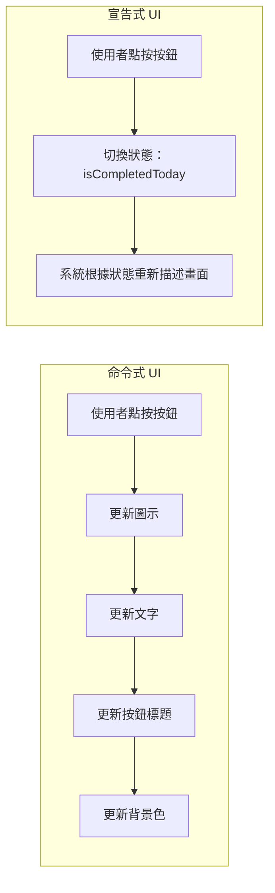
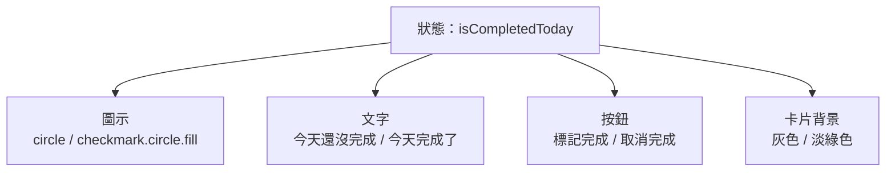
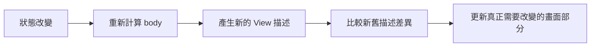

# 第 01 章 先懂 SwiftUI：宣告式 UI 到底在想什麼

## 章首摘要

### 這章你會學到什麼

- 什麼是宣告式 UI，以及它和命令式 UI 的根本差異。
- 為什麼 SwiftUI 會強調狀態，而不是強調手動更新畫面。
- `View` 與 `body` 在 SwiftUI 中真正扮演的角色。
- 哪些程式應該放在畫面描述中，哪些不應該。

### 你會完成哪一段功能

- 為主線專案「習慣養成 App」做出第一張可互動的習慣卡片。
- 讓卡片能根據完成狀態切換圖示、文字、顏色與按鈕標題。

### 需要的前置知識

- 看得懂基本 Swift 語法，例如 `struct`、變數、條件運算子與函式。
- 知道如何在 Xcode 中建立並執行一個基本的 SwiftUI 專案。

## 為什麼這一章重要

很多人在第一次接觸 SwiftUI 時，並不是卡在元件名稱太多，也不是卡在語法本身太陌生，而是卡在一種更根本的不適應：明明每一行程式碼都看得懂，卻仍然不知道整個畫面究竟是如何被組合出來的。

這種不適應很常來自思考方式的落差。如果你過去主要接觸的是命令式 UI，你很自然會想知道：

- 畫面要更新時，我應該去改哪一個元件？
- `body` 為什麼會一直重算？這樣不是很浪費嗎？
- `View` 到底是一個真正存在的畫面物件，還是一段描述畫面的程式？

這一章的任務，就是先把這些問題釐清。因為 SwiftUI 最重要的門檻，往往不在於你還沒背熟多少 API，而在於你是否已經開始用 SwiftUI 的語言思考畫面。這也是我很想先陪讀者跨過的一道坎：不是先記更多東西，而是先想通你現在到底在描述什麼。只要這一層想通，後面談到狀態、資料流、動畫、非同步處理與架構設計時，你才會真正知道自己在做什麼。

## 開場：當一個按鈕牽動整張畫面

先想像一個很小的需求。你的 App 裡有一張習慣卡片，使用者今天完成某個習慣後，可以按一下按鈕打卡。當他按下按鈕時，畫面需要同時出現幾個變化：

- 圖示從空心圓改成打勾。
- 提示文字從「今天還沒完成」變成「今天完成了」。
- 按鈕標題從「標記完成」改成「取消完成」。
- 卡片背景顏色稍微變亮，提供明確的操作回饋。

如果你習慣用命令式方式思考，很可能會立刻把問題拆成一連串步驟：

1. 找到圖示並修改它。
2. 找到文字並更換內容。
3. 找到按鈕並調整標題。
4. 最後再補上背景顏色的更新。

這樣的想法並沒有錯，它在許多 UI 系統裡都相當合理。但在 SwiftUI 中，我們更常採取的做法不是「逐一修改畫面」，而是先回答另一個問題。我很喜歡把這一步看成一次小小的轉向：

`當今天已完成，畫面應該長成什麼樣子？當今天未完成，畫面又應該長成什麼樣子？`

也就是說，我們關注的不是更新步驟，而是狀態與結果之間的對應關係。很多人一旦在這裡轉過來，後面整個 SwiftUI 會突然順很多。

> **觀念提醒**
> 在 SwiftUI 中，先問「現在是什麼狀態」，再問「這個狀態下畫面應該長成什麼樣子」。這個順序會決定你後面寫出來的是可維護的畫面，還是只能勉強運作的畫面。

**圖 1-1 命令式 UI 與宣告式 UI 的思考流程對照**



圖 1-1 告訴我們，命令式 UI 把重心放在更新步驟；宣告式 UI 則把重心放在狀態改變後，畫面應呈現的結果。

## 第一個範例：不要一開始就看完整卡片

如果這本書是寫給新手讀者的，那麼第 1 章最不應該做的事，就是一開始就丟出一大段完整程式碼，然後期待讀者自己把它拆開。

所以這裡我們換一個更友善的做法：同一張卡片，用三步慢慢長出來。

第一輪閱讀時，請你先只盯著三件事：

- 現在畫面裡有哪些元素
- 哪一個值在改變
- 改變之後，哪些地方跟著變

其他像 modifier、字型、顏色和圓角，先不要急著全部理解。

### 第一步：先做一張不會動的卡片

先不要管狀態，也不要急著管按下去之後會發生什麼事。我們只先把畫面的骨架搭起來。

```swift
import SwiftUI

struct HabitCheckInCard: View {
    var body: some View {
        VStack(alignment: .leading, spacing: 12) {
            Text("晨間伸展")
                .font(.headline)

            Text("今天還沒完成")
                .font(.subheadline)
                .foregroundStyle(.secondary)

            Button("標記完成") {
            }
            .buttonStyle(.borderedProminent)
        }
        .padding()
    }
}
```

到這一步為止，這張卡片其實還不會動，但它已經把畫面的三個主要區塊立起來了：

- 習慣名稱
- 狀態文字
- 操作按鈕

這一步的目的很單純：先讓你看懂 SwiftUI 的 `body` 真的是在描述畫面，而不是在偷偷做很多其他事情。

如果你是第一次看 SwiftUI，先不要急著把整段程式碼從頭解讀到尾。你可以先只抓住下面三個入口：

- `struct HabitCheckInCard: View`
- `var body: some View`
- `VStack { ... }`

它們分別代表三件事：

- 這裡定義了一個叫做 `HabitCheckInCard` 的 SwiftUI 畫面元件。
- `body` 是這個元件拿來描述畫面內容的地方。
- `VStack` 表示裡面的內容會由上往下排列。

剩下的 `Text` 與 `Button`，你可以先把它們理解成最直觀的意思：

- `Text` 用來顯示文字。
- `Button` 用來放一個可以被點按的操作。

先看懂這一層就夠了。第 1 章的任務不是把每個 modifier 都背起來，而是建立「這段程式正在描述畫面」的直覺。

### 第二步：再讓它真的跟著狀態改變

現在我們才加入本章最重要的角色：狀態。

```swift
struct HabitCheckInCard: View {
    @State private var isCompletedToday = false

    var body: some View {
        VStack(alignment: .leading, spacing: 12) {
            Text("晨間伸展")
                .font(.headline)

            Text(isCompletedToday ? "今天完成了" : "今天還沒完成")
                .font(.subheadline)
                .foregroundStyle(.secondary)

            Button(isCompletedToday ? "取消完成" : "標記完成") {
                isCompletedToday.toggle()
            }
            .buttonStyle(.borderedProminent)
        }
        .padding()
    }
}
```

這一版比上一版只多做了一件真正重要的事：加入 `isCompletedToday`。

但一旦這個值加入進來，畫面裡已經有兩個地方開始跟著它變：

- 狀態文字
- 按鈕標題

這就是 SwiftUI 很值得新手提早感受到的地方：你不是先去改文字，再去改按鈕；你只是改了一個狀態，畫面就跟著換樣子。

如果你現在只看懂這三行，也已經非常夠了：

```swift
@State private var isCompletedToday = false
Text(isCompletedToday ? "今天完成了" : "今天還沒完成")
isCompletedToday.toggle()
```

因為這三行幾乎就是本章最核心的骨架：有一個狀態、畫面讀它、互動改它。

### 第三步：最後才補上完整的視覺回饋

當你已經看懂「狀態一變，畫面就跟著變」之後，我們再把圖示、背景與按鈕顏色補回來。這時候程式碼雖然比較長，但你比較不會被它嚇到，因為你知道它其實還是在做同一件事。

```swift
import SwiftUI

struct HabitCheckInCard: View {
    @State private var isCompletedToday = false

    var body: some View {
        VStack(alignment: .leading, spacing: 12) {
            HStack {
                Image(systemName: isCompletedToday ? "checkmark.circle.fill" : "circle")
                    .font(.title2)
                    .foregroundStyle(isCompletedToday ? .green : .secondary)

                VStack(alignment: .leading, spacing: 4) {
                    Text("晨間伸展")
                        .font(.headline)

                    Text(isCompletedToday ? "今天完成了" : "今天還沒完成")
                        .font(.subheadline)
                        .foregroundStyle(.secondary)
                }

                Spacer()
            }

            Button(isCompletedToday ? "取消完成" : "標記完成") {
                isCompletedToday.toggle()
            }
            .buttonStyle(.borderedProminent)
            .tint(isCompletedToday ? .green : .blue)
        }
        .padding()
        .background(isCompletedToday ? Color.green.opacity(0.12) : Color.gray.opacity(0.08))
        .clipShape(RoundedRectangle(cornerRadius: 20))
        .animation(.snappy, value: isCompletedToday)
    }
}

#Preview {
    HabitCheckInCard()
        .padding()
}
```

這時候你再回頭看，應該會比較容易抓住：整張卡片其實還是在回答同一個問題，`isCompletedToday` 現在到底是 `true` 還是 `false`？

當它是 `false` 時：

- 圖示顯示空心圓。
- 文字顯示「今天還沒完成」。
- 按鈕顯示「標記完成」。
- 卡片背景偏灰。

當它變成 `true` 時：

- 圖示改成綠色打勾。
- 文字改成「今天完成了」。
- 按鈕改成「取消完成」。
- 卡片背景轉為淡綠色。

也就是說，後面看起來像是多出來的那些字型、顏色、背景與動畫，其實都只是同一個狀態在不同畫面元素上的延伸結果。

在這整個過程中，我們沒有逐一命令某個元件去改變自己。我們只改變了狀態，畫面便依照新的狀態重新呈現。這正是宣告式 UI 的起點。

> **延伸實戰**
> 先不要改太多功能，只試著把這個範例中的習慣名稱換成別的文字，例如「晚間散步」或「閱讀 20 分鐘」。如果你能輕鬆替換內容，而且畫面邏輯完全不需要重寫，就表示這個元件已經開始具備重用性。

**圖 1-2 狀態改變如何驅動畫面更新**



圖 1-2 的重點是，一個狀態的改變可以同時影響多個畫面元素。這些元素不是各自被命令更新，而是一起由狀態推導出來。

## 從這個範例看見 SwiftUI 的核心

### 1. 狀態不是附屬品，而是畫面的來源

如果回頭看剛才三步裡真正一路沒有變的核心，你會發現最重要的一行其實一直都是：

```swift
@State private var isCompletedToday = false
```

你可以先把它理解為：「這個 View 自己持有一個會改變的值，而畫面要根據這個值來決定長相。」

初學 SwiftUI 時，最值得建立的直覺不是「我要怎麼把畫面改掉」，而是「哪一個狀態一變，畫面就應該跟著變」。這個差異看似細微，實際上會深刻影響你後面處理清單、表單、動畫、資料同步與架構切分的方式。

> **觀念提醒**
> `@State` 不只是語法標記，它同時在提醒你：這裡有一個會影響畫面的來源值。當你不知道某個 UI 為什麼會變時，先回頭找它是被哪個狀態驅動。

### 2. 宣告式 UI 描述的是結果，不是步驟

如果要用一句話概括宣告式 UI，可以這樣說：

`你描述的是在某個狀態下，畫面應該呈現什麼結果；你不需要逐步命令每一個元件如何變化。`

命令式寫法通常強調過程：

- 先建立一個標題。
- 再建立一個按鈕。
- 使用者操作後，再手動修改每一個受影響的元件。

宣告式寫法則強調條件與結果：

- 如果今天完成了，就呈現完成狀態的畫面。
- 如果今天還沒完成，就呈現未完成狀態的畫面。
- 使用者操作時，負責改變狀態，而不是手動維護整個畫面。

兩種思維最大的差異，不只是寫法風格不同，而是責任分配不同。命令式 UI 需要你自己管理畫面更新的細節；宣告式 UI 則把畫面的組裝工作交回系統，由系統根據狀態重新推導。

### 3. View 比較像藍圖，而不是傳統控制器

SwiftUI 初學者常犯的一個誤會，是把 `View` 想像成一個長期存在、負責控制整個畫面生命週期的物件。這種聯想不難理解，因為在許多舊式 UI 系統中，確實存在這樣的角色。

但在 SwiftUI 裡，更貼近事實的理解是：

`View 是某個時間點、某個狀態下，畫面應該長成什麼樣子的描述。`

這樣想有兩個直接好處。

第一，你會比較能接受 `body` 需要被重新計算。因為對 SwiftUI 來說，重新計算 `body` 並不是在「重建整個世界」，而是在重新取得一份當前畫面的描述。

第二，你會比較自然地避免把太多流程控制或副作用塞進 `View`。當 View 的角色是描述畫面時，它就不應該同時扮演太多不相干的責任。

### 4. `body` 會重算，但這並不等於效能災難

許多人第一次聽到「SwiftUI 會重新計算 `body`」時，會立刻聯想到效能浪費。這個擔憂可以理解，但它往往來自一個不完全正確的想像：彷彿 `body` 一重算，整個畫面就得從零開始重做一次。

更接近實際情況的理解是，`body` 的重算比較像是 SwiftUI 重新拿到一份「此刻畫面應該是什麼樣子」的說明書。接下來，系統會比較新舊描述之間的差異，只更新真正有變動的部分。

因此，在這個階段你最需要建立的觀念不是「避免任何重算」，而是辨認真正的風險通常來自哪裡：

- 狀態放在不合適的位置。
- 身分識別不穩定，導致列表或子視圖更新異常。
- 把副作用寫進畫面描述流程中，造成重複執行。

一句話總結就是：

`重算 View 描述是正常流程；真正需要警覺的是責任混亂。`

**圖 1-3 `body` 重算與實際畫面更新不是同一件事**



這張圖想拆開兩件常被混為一談的事：重新計算 View 描述，與真正更新螢幕上的變動部分。你不需要因為看到 `body` 會重算，就立刻把它等同於效能災難。

### 5. Modifier 的順序會改變結果

SwiftUI 的 modifier 常給人一種「只是往 View 上貼標籤」的錯覺，但實際上，它們會參與最後畫面的形成，因此順序往往十分重要。

請看下面兩段程式碼：

```swift
Text("7 天連續完成")
    .padding()
    .background(.green.opacity(0.2))
```

```swift
Text("7 天連續完成")
    .background(.green.opacity(0.2))
    .padding()
```

第一段的意思比較接近「先讓文字有內距，再對這整塊區域加上背景」；第二段則比較接近「先對文字本身加上背景，再把整體往外推開」。結果都能執行，但視覺感受不同。

這也是學習 SwiftUI 時一個很重要的提醒：不要只記得 modifier 的名稱，還要同時理解它們改變了哪一層描述，以及它們出現的順序如何影響最終結果。

> **常見陷阱**
> 很多人一開始把 modifier 當成純外觀設定，結果在 `padding()`、`background()`、`overlay()` 的順序一換之後，就不知道為什麼畫面變了。SwiftUI 的 modifier 是組合畫面的一部分，不是後期補妝。

### 6. `body` 負責描述畫面，不負責偷偷做副作用

理解 `body` 的角色後，另一個同樣重要的問題是：哪些事不應該出現在 `body` 裡？

先看下面這個反例：

```swift
struct HabitsView: View {
    @State private var habits: [Habit] = []

    var body: some View {
        let _ = loadHabits()

        return List(habits) { habit in
            Text(habit.name)
        }
    }

    func loadHabits() {
        // 讀取資料、打 API、寫入狀態
    }
}
```

這段程式在語法上或許能通過，但概念上卻出了問題。因為 `body` 可能會被計算多次，只要它一重算，就可能再次呼叫 `loadHabits()`。結果便是資料載入時機失控，甚至出現重複請求、畫面閃動、狀態覆蓋等後續問題。

請先把下面這三句話牢牢記住：

- `body` 用來描述畫面。
- 載入資料、寫入檔案、發送網路請求，都是副作用。
- 副作用必須放在更合適的觸發時機，而不是藏在畫面描述裡。

後面的章節談到狀態管理與非同步資料時，我們會再回來處理這個問題。但在第一章，你只需要先建立對責任邊界的敏感度。

> **常見陷阱**
> 如果你把載入資料、寫檔或網路請求偷偷塞進 `body`，程式一開始也許看起來能跑，但只要畫面重算次數一多，問題就會一起浮出來。這類錯誤最麻煩的地方，往往不是立刻壞掉，而是偶爾才壞，讓你更難查。

## 接回主線專案：習慣養成 App 的第一塊拼圖

本書的主線專案是一個「習慣養成 App」。在第一章，我們刻意不急著做完整的列表、資料儲存或架構設計，而是只完成一張最小可互動的習慣卡片。這麼安排的原因有兩個。

第一，它能讓讀者在一開始就看見這本書不是只談觀念，而是會一路做出真正的 App。

第二，它的規模剛好足以承載 SwiftUI 最核心的思想：狀態、畫面、互動三者之間的關係。

如果你回頭看 `HabitCheckInCard`，會發現它其實已經預告了後面整本書會反覆出現的模式：

- 狀態決定畫面。
- 互動改變狀態。
- 視覺回饋來自狀態變化，而不是零碎的手動修補。

換句話說，這張卡片雖然很小，卻已經是整本書方法論的縮影。

> **延伸實戰**
> 如果你想把這章再往前推一步，可以替這張卡片加上一列小字，例如「目前連續完成 3 天」。先不要急著做資料持久化，只要試著思考：這個數字應該由哪個狀態決定？

## 本章重點整理

- SwiftUI 的核心不是如何手動更新畫面，而是如何根據狀態描述畫面。
- `View` 更接近畫面藍圖，而不是傳統意義上的控制器。
- `body` 的重算屬於正常流程，不能單憑它是否重算來判斷效能好壞。
- modifier 的順序會影響結果，因此不能只背名稱而忽略組合方式。
- 把副作用藏進 `body`，往往會讓資料時機與畫面更新變得不可控。

## 本章小結

如果只用一句話概括本章，我希望你帶走的是：

`在 SwiftUI 中，畫面是狀態的結果。`

這句話看似簡單，卻是後續所有主題的起點。你之後會學到如何管理列表資料、如何設計表單、如何同步遠端資料、如何整理專案架構，但這些能力之所以能夠成立，都是因為你先接受了一件事：畫面不是靠手動維護，而是靠狀態推導。

當你開始習慣先問「現在的狀態是什麼」，再問「在這個狀態下，畫面應該如何呈現」，你就已經真正踏進 SwiftUI 的入口。

## 練習題

1. 基礎題：將 `HabitCheckInCard` 的習慣名稱改為可從外部傳入，讓同一個元件可以顯示不同內容。
2. 進階題：新增 `streakCount` 狀態，讓卡片顯示「已連續完成幾天」。
3. 延伸題：把完成與未完成兩種樣貌拆成不同子視圖，並比較這樣做與條件判斷留在同一個 View 中，各自的優缺點。

## 寫作備註

- 可在章中加入一個小專欄：從 UIKit 轉到 SwiftUI 時，最需要刻意調整的三個習慣。
- 本章適合搭配兩到三張流程圖，幫助讀者建立狀態與畫面的對應感。
