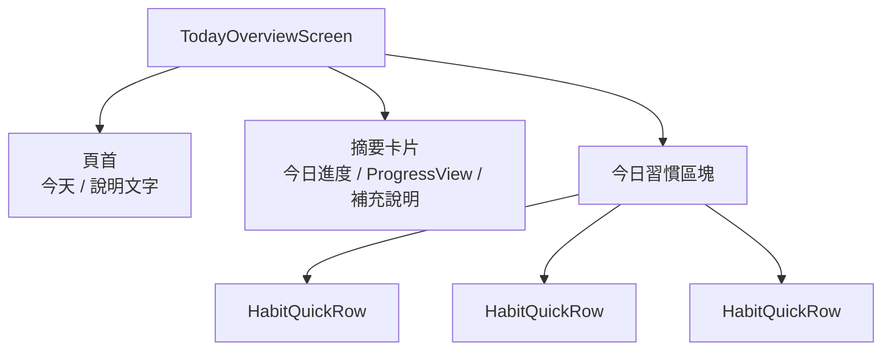
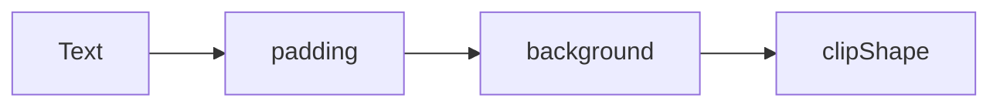
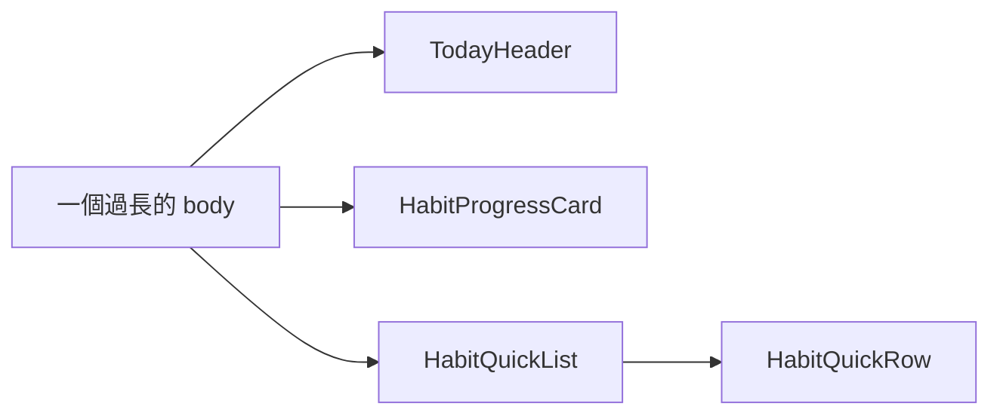

# 第 02 章 版面配置與畫面組合：從 Stack 到自訂版面

## 章首摘要

### 這章你會學到什麼

- `VStack`、`HStack`、`ZStack`、`Spacer`、`padding`、`frame` 在版面中的真正角色。
- 為什麼版面配置的核心不是「把元件放上去」，而是建立清楚的資訊階層與閱讀路徑。
- modifier 的順序為什麼會直接改變畫面結果。
- 什麼時候該把長長的 `body` 拆成有語意的子視圖，讓你開始擁有自己的版面系統。

### 你會完成哪一段功能

- 為主線專案做出首頁的摘要卡片與今日習慣區塊。
- 讓畫面從單張卡片，長成一個更像首頁的閱讀節奏。
- 把一段過長的版面程式，整理成可讀、可重用的子視圖。

### 需要的前置知識

- 已理解第 01 章的宣告式 UI 與 `View` 組合觀念。
- 看得懂基本 SwiftUI 語法與簡單 modifier 的寫法。

## 為什麼這一章重要

很多人第一次做 SwiftUI 版面時，會有一種很奇怪的挫折感：明明 `VStack`、`HStack`、`Spacer` 都知道怎麼用，畫面卻還是看起來很亂。

這種亂，很多時候不是因為你不會排版元件，而是因為你還沒有開始用「閱讀」的方式看畫面。

例如你可能遇過這些情況：

- 畫面所有資訊都在，但不知道哪一塊應該先被看見。
- 哪裡不對勁時，就一直補 `Spacer()`，結果版面更難控制。
- modifier 一層一層加上去，最後連自己也不知道哪個背景是包在哪個範圍。
- `body` 越寫越長，但每一段似乎又沒有清楚名字。

這一章要處理的，其實不是「SwiftUI 版面怎麼寫得出來」，而是更重要的一件事：

`當畫面開始變大時，你能不能讓它還保持清楚、穩定，而且像人真的會讀的東西。`

因為後面的狀態、資料流、表單與架構，最後都要落在畫面上。如果版面本身沒有建立好閱讀秩序，後面的每一章都會變得更重。

## 開場：同一份資訊，排法不同，感受就完全不同

延續上一章的主線專案，我們現在已經有了一張能互動的習慣卡片。接下來，這個 App 不可能永遠只靠一張卡片存在。我們很自然會想把它往下一步推：

- 首頁上方有今天的摘要
- 中間有進度卡片
- 下方有今日習慣清單

也就是說，我們要處理的已經不再是一個元件，而是一整段畫面。

這時很多人第一個反應會是：「我要不要先加背景色、陰影、圓角和更漂亮的圖示？」這個反應很自然，但順序通常不太對。因為如果連最基本的資訊階層都還沒站穩，越早美化，後面往往越難救。

真正比較穩的順序通常是：

1. 先決定閱讀順序。
2. 再決定區塊分組。
3. 再決定間距與對齊。
4. 最後才替每個區塊補上表面風格。

也就是說，版面配置真正回答的第一個問題不是「它好不好看」，而是：

`使用者第一眼應該先讀到什麼，第二眼應該看哪裡，哪些資訊本來就應該被放在一起。`

> **觀念提醒**
> 版面不是把元件排進去而已。版面真正的任務，是替資訊建立閱讀路徑。

## 第一個範例：先用 Stack 搭出首頁骨架

先看一個最小但完整的首頁骨架。這個範例刻意不做太多互動，而是把重點放在版面本身，因為本章要先處理的是「畫面怎麼站起來」。

```swift
import SwiftUI

struct HabitSnapshot: Identifiable {
    let id = UUID()
    let name: String
    let note: String
    let isCompletedToday: Bool
}

struct TodayOverviewScreen: View {
    private let habits: [HabitSnapshot] = [
        HabitSnapshot(name: "晨間伸展", note: "起床後 5 分鐘", isCompletedToday: true),
        HabitSnapshot(name: "閱讀 20 分鐘", note: "晚餐後完成", isCompletedToday: false),
        HabitSnapshot(name: "喝水 2000ml", note: "分 6 次喝完", isCompletedToday: false)
    ]

    var completedCount: Int {
        habits.filter(\.isCompletedToday).count
    }

    var body: some View {
        ScrollView {
            VStack(alignment: .leading, spacing: 20) {
                VStack(alignment: .leading, spacing: 8) {
                    Text("今天")
                        .font(.largeTitle.bold())

                    Text("先完成最重要的習慣，讓今天有一個穩定開場。")
                        .font(.subheadline)
                        .foregroundStyle(.secondary)
                }

                HabitProgressCard(
                    completedCount: completedCount,
                    totalCount: habits.count
                )

                VStack(alignment: .leading, spacing: 12) {
                    Text("今日習慣")
                        .font(.headline)

                    ForEach(habits) { habit in
                        HabitQuickRow(habit: habit)
                    }
                }
            }
            .padding(20)
        }
        .background(Color(uiColor: .systemGroupedBackground))
    }
}

struct HabitProgressCard: View {
    let completedCount: Int
    let totalCount: Int

    var body: some View {
        VStack(alignment: .leading, spacing: 12) {
            HStack(alignment: .firstTextBaseline) {
                Text("今日進度")
                    .font(.headline)

                Spacer()

                Text("\(completedCount) / \(totalCount)")
                    .font(.title3.weight(.semibold))
            }

            ProgressView(value: Double(completedCount), total: Double(max(totalCount, 1)))

            Text("每完成一項習慣，首頁會立刻更新今天的完成情況。")
                .font(.subheadline)
                .foregroundStyle(.secondary)
        }
        .frame(maxWidth: .infinity, alignment: .leading)
        .padding(20)
        .background(Color.blue.opacity(0.08))
        .clipShape(RoundedRectangle(cornerRadius: 24, style: .continuous))
    }
}

struct HabitQuickRow: View {
    let habit: HabitSnapshot

    var body: some View {
        HStack(spacing: 12) {
            Image(systemName: habit.isCompletedToday ? "checkmark.circle.fill" : "circle")
                .font(.title3)
                .foregroundStyle(habit.isCompletedToday ? .green : .secondary)

            VStack(alignment: .leading, spacing: 4) {
                Text(habit.name)
                    .font(.headline)

                Text(habit.note)
                    .font(.subheadline)
                    .foregroundStyle(.secondary)
            }

            Spacer()

            Text(habit.isCompletedToday ? "已完成" : "待完成")
                .font(.subheadline.weight(.medium))
                .foregroundStyle(habit.isCompletedToday ? .green : .secondary)
        }
        .padding(16)
        .background(Color(uiColor: .secondarySystemBackground))
        .clipShape(RoundedRectangle(cornerRadius: 20, style: .continuous))
    }
}

#Preview {
    TodayOverviewScreen()
}
```

這段程式碼最值得你先注意的，不是它用了幾層 `VStack`，而是每一層 Stack 都有很清楚的責任：

- 最外層 `VStack` 決定整頁的垂直閱讀順序
- 第一個內層 `VStack` 負責標題與說明
- `HabitProgressCard` 是一個完整摘要區塊
- 最後一個 `VStack` 負責「今日習慣」標題與列項群組

也就是說，我們不是先想到「我要用幾個 Stack」，而是先回答：

- 哪些資訊應該在同一組
- 哪些組和哪些組之間應該有更大的距離
- 哪些資訊是標題，哪些只是補充說明

只要這條線站穩，畫面通常就會比你想像中更快變清楚。

**圖 2-1 先用 Stack 建立閱讀路徑，再補上卡片表面**



圖 2-1 想強調的是，版面組合的第一步通常不是風格，而是先用清楚的群組把閱讀路徑搭出來。

## 從這個範例看見版面配置的核心

### 1. Stack 的任務不是堆元件，而是表達閱讀順序

很多初學者學 `VStack`、`HStack` 時，會把它們理解成「上下排」和「左右排」。這樣的理解不算錯，但還不夠。因為真正讓版面變穩的，不是你知道元件往哪裡排，而是你知道它們為什麼應該排在一起。

在剛才的首頁骨架裡：

- 頁首標題和說明文字放在一起，是因為它們屬於同一段介紹
- 進度數字、進度條和補充說明放在同一張卡片，是因為它們在描述同一件事
- 「今日習慣」標題和每列項目被放進同一組，是因為它們構成一個清楚的列表區塊

這個思路非常重要。因為當你開始用這種方式看版面時，Stack 就不再只是排版工具，而會變成表達結構的語言。

> **觀念提醒**
> `VStack` 和 `HStack` 真正有價值的地方，不是「可以往上排」或「可以往左排」，而是它能替你把同一層資訊包成一組。

### 2. `ZStack` 的價值在於疊層，而不是取代所有排版容器

雖然這一章的主角主要還是 `VStack` 與 `HStack`，但摘要裡提到的 `ZStack` 也很值得先建立一個正確直覺。

`ZStack` 最適合做的事情通常不是「把所有東西都堆在一起」，而是處理明確的前後層關係，例如：

- 背景色塊和前景內容
- 角落 badge 疊在卡片上
- 圖片上再疊一層文字或漸層

換句話說，`VStack` 和 `HStack` 比較像在安排閱讀順序，`ZStack` 比較像在安排視覺層次。

這個差別很重要，因為很多初學者一看到畫面想要「包一層背景」，就會直覺改用 `ZStack`。但在 SwiftUI 裡，很多這類需求其實用：

```swift
.background(...)
```

或：

```swift
.overlay(...)
```

就已經足夠，而且語意通常也更清楚。

所以這一章先不用急著把 `ZStack` 當成主力武器。更穩的做法是先記住：

- 排列順序，優先想 `VStack` / `HStack`
- 疊層關係，再考慮 `ZStack`

### 3. 對齊與間距，決定使用者怎麼讀這張畫面

很多畫面看起來亂，不一定是缺少大改，而是對齊和間距還沒形成節奏。

例如在範例裡，我們刻意做了幾個看似不起眼、但其實很關鍵的決定：

- 最外層主要區塊都採用 `.leading` 對齊
- 頁首內文和摘要卡片之間留 `20`
- 卡片內部標題、進度條與說明採較小的 `12`
- 列項中的主標與副標採 `4`，讓它們看起來明顯屬於同一筆資訊

這些數字本身不是唯一答案，但它們代表一個更重要的觀念：

`相關的資訊要靠近，不同層級的區塊要拉開。`

如果這個節奏做反了，例如：

- 標題和副標距離太遠
- 區塊之間反而黏在一起
- 每一層都用差不多的間距

那畫面就很容易變成「資訊都有，但沒有重點」。

### 4. `Spacer` 和 `frame` 在解決不同問題

很多初學者只要哪裡排不動，就會開始加 `Spacer()`。這有時候能解決問題，但也很容易讓版面越來越不可預測。

在 SwiftUI 裡，`Spacer` 比較適合做的事情是：

- 把同一個 Stack 裡的兩組內容推向兩端
- 讓中間保留彈性空間

例如在 `HabitProgressCard` 裡：

```swift
HStack(alignment: .firstTextBaseline) {
    Text("今日進度")

    Spacer()

    Text("\(completedCount) / \(totalCount)")
}
```

這裡只需要一個 `Spacer()`，就能把左邊標題和右邊數字自然推開。這是一個很典型、也很合理的用法。

但 `frame` 解決的是另一件事。像這一行：

```swift
.frame(maxWidth: .infinity, alignment: .leading)
```

它不是在「把內容放大」，而是在告訴這個卡片：

- 盡量撐滿可用寬度
- 內容仍然靠左對齊

也就是說：

- `Spacer` 比較像在同一排元素之間分配剩餘空間
- `frame` 比較像在調整某個 View 希望佔據的空間範圍與內容對齊方式

> **常見陷阱**
> 哪裡不對就一直加 `Spacer()`，通常表示你正在用空白補結構，而不是先把結構理清楚。

### 5. modifier 的順序不是裝飾，而是結果的一部分

到了這一步，幾乎每個 SwiftUI 初學者都一定會撞到同一件事：明明 modifier 都會寫，結果畫面和自己想的不一樣。

最常見的原因，就是 modifier 的順序。

先看下面這兩段程式：

```swift
Text("今天完成 2 / 5")
    .background(Color.blue.opacity(0.12))
    .padding(16)
```

```swift
Text("今天完成 2 / 5")
    .padding(16)
    .background(Color.blue.opacity(0.12))
```

它們看起來只差一行順序，但畫面結果完全不同。

第一段的意思比較像：

1. 先替文字本身加背景
2. 再把整塊內容往外留白

所以背景只會包住文字，不會包住後來補上的那圈 padding。

第二段則是：

1. 先替文字建立內距
2. 再用背景把整塊有內距的範圍一起包起來

這也是為什麼卡片類元件最常見的順序通常會是：

```swift
Text("今天完成 2 / 5")
    .padding(16)
    .background(Color.blue.opacity(0.12))
    .clipShape(RoundedRectangle(cornerRadius: 16, style: .continuous))
```

因為這樣你才是在說：

- 先給內容呼吸空間
- 再替整塊內容上表面
- 最後把表面裁成你要的形狀

**圖 2-2 modifier 是一層包一層，順序不同，包住的範圍就不同**



圖 2-2 想傳達的是，modifier 更像一層一層往外包的結構。順序改變後，被包起來的範圍也會跟著改變。

### 6. 真正的「自訂版面」，很多時候不是先學新 API，而是先學會替群組命名

本章標題叫做「從 Stack 到自訂版面」，但我想特別提醒讀者一件事：

這裡的「自訂版面」，不是要你現在立刻跳進更重的版面協定或複雜排版技巧。對目前這本書的節奏來說，更重要的自訂版面能力其實是：

`你能不能把一組畫面群組成有語意的區塊，並替它取出清楚名字。`

例如剛才的範例裡：

- `HabitProgressCard`
- `HabitQuickRow`

它們不是因為「拆成檔案比較漂亮」才存在，而是因為它們各自都已經代表一個完整的小區塊。

這種命名能力一旦出現，你就不再只是「用 Stack 排版」，而是開始建立自己的版面語言。後面不管做首頁、列表、表單還是統計頁，這個能力都會一直幫你減重。

## 第二個範例：把過長的 `body` 拆成有語意的畫面區塊

很多版面一開始都不是故意要變亂的。它通常只是很自然地一路長大，最後整頁東西都塞在同一個 `body`。

先看一段常見的早期寫法：

```swift
import SwiftUI

struct TodayOverviewScreen: View {
    private let habits: [HabitSnapshot] = [
        HabitSnapshot(name: "晨間伸展", note: "起床後 5 分鐘", isCompletedToday: true),
        HabitSnapshot(name: "閱讀 20 分鐘", note: "晚餐後完成", isCompletedToday: false),
        HabitSnapshot(name: "喝水 2000ml", note: "分 6 次喝完", isCompletedToday: false)
    ]

    var completedCount: Int {
        habits.filter(\.isCompletedToday).count
    }

    var body: some View {
        ScrollView {
            VStack(alignment: .leading, spacing: 20) {
                Text("今天")
                    .font(.largeTitle.bold())

                Text("先完成最重要的習慣，讓今天有一個穩定開場。")
                    .font(.subheadline)
                    .foregroundStyle(.secondary)

                HStack {
                    Text("今日進度")
                        .font(.headline)

                    Spacer()

                    Text("\(completedCount) / \(habits.count)")
                        .font(.title3.weight(.semibold))
                }

                ProgressView(value: Double(completedCount), total: Double(max(habits.count, 1)))

                Text("每完成一項習慣，首頁會立刻更新今天的完成情況。")
                    .font(.subheadline)
                    .foregroundStyle(.secondary)

                Text("今日習慣")
                    .font(.headline)

                ForEach(habits) { habit in
                    HStack(spacing: 12) {
                        Image(systemName: habit.isCompletedToday ? "checkmark.circle.fill" : "circle")

                        VStack(alignment: .leading, spacing: 4) {
                            Text(habit.name)
                            Text(habit.note)
                        }

                        Spacer()

                        Text(habit.isCompletedToday ? "已完成" : "待完成")
                    }
                    .padding(16)
                    .background(Color(uiColor: .secondarySystemBackground))
                    .clipShape(RoundedRectangle(cornerRadius: 20, style: .continuous))
                }
            }
            .padding(20)
        }
    }
}
```

這段程式其實不是不能讀，但它已經開始暴露幾個訊號：

- 首頁有哪些主要區塊，不夠一眼看清楚
- 進度卡片的邏輯和整頁結構混在一起
- 習慣列項一旦要重用，會很麻煩
- 後面如果要加狀態與互動，重量會快速增加

比較穩的改法，不是硬拆檔案，而是先把結構抽成有語意的單位：

```swift
import SwiftUI

struct TodayOverviewScreen: View {
    private let habits: [HabitSnapshot] = [
        HabitSnapshot(name: "晨間伸展", note: "起床後 5 分鐘", isCompletedToday: true),
        HabitSnapshot(name: "閱讀 20 分鐘", note: "晚餐後完成", isCompletedToday: false),
        HabitSnapshot(name: "喝水 2000ml", note: "分 6 次喝完", isCompletedToday: false)
    ]

    var completedCount: Int {
        habits.filter(\.isCompletedToday).count
    }

    var body: some View {
        ScrollView {
            VStack(alignment: .leading, spacing: 20) {
                TodayHeader()

                HabitProgressCard(
                    completedCount: completedCount,
                    totalCount: habits.count
                )

                HabitQuickList(habits: habits)
            }
            .padding(20)
        }
        .background(Color(uiColor: .systemGroupedBackground))
    }
}

struct TodayHeader: View {
    var body: some View {
        VStack(alignment: .leading, spacing: 8) {
            Text("今天")
                .font(.largeTitle.bold())

            Text("先完成最重要的習慣，讓今天有一個穩定開場。")
                .font(.subheadline)
                .foregroundStyle(.secondary)
        }
    }
}

struct HabitQuickList: View {
    let habits: [HabitSnapshot]

    var body: some View {
        VStack(alignment: .leading, spacing: 12) {
            Text("今日習慣")
                .font(.headline)

            ForEach(habits) { habit in
                HabitQuickRow(habit: habit)
            }
        }
    }
}
```

這樣一來，畫面本身突然就清楚很多。不是因為程式變短而已，而是因為每個區塊都終於有自己的名字。

也就是說，這裡真正被改善的不是字數，而是可讀性。

> **觀念提醒**
> 拆子視圖時，最值得問的不是「這段程式是不是超過 30 行」，而是「這一段畫面是不是已經代表一個有名字的區塊」。

**圖 2-3 拆分子視圖不是把程式分散，而是替畫面群組建立名字與邊界**



圖 2-3 想傳達的是，子視圖拆分的核心不是分檔案，而是替原本混在一起的畫面群組建立清楚邊界。

## 從這個拆分過程看見畫面組合能力

### 1. 不是每段畫面都要拆，但有語意的區塊很值得拆

很多人一學會拆子視圖，就會走到另一個極端：什麼都想拆。

這時又會產生新的問題：

- 檔案變很多
- 跳來跳去很難看
- 每個 View 名稱都很抽象

比較穩的判斷方式通常是：

- 如果它只是很短、而且沒有清楚語意的局部排版，可以先留著
- 如果它已經是一段完整區塊，例如頁首、卡片、列項、表單段落，就很適合拆出來
- 如果它未來很可能被重用，也值得提早命名

### 2. 畫面拆分，其實是在為後面章節減重

這件事到第 03 章會變得很明顯。因為一旦畫面開始需要狀態與資料流，你就會發現：

- 哪個區塊只需要讀值
- 哪個區塊需要接收 `Binding`
- 哪個區塊只是純顯示

如果在這一章還是把所有東西混成一大塊，後面狀態一進來，整頁會變得非常重。反過來說，如果版面先被整理成有語意的區塊，後面每一條資料流都會比較好站位置。

### 3. 自訂版面感，來自一致的節奏，不只是特殊技巧

很多人一想到「自訂版面」，會以為一定要有非常炫的技巧。但對大多數真實產品來說，自訂版面感更常來自下面這些事情：

- 一致的卡片圓角
- 穩定的內距節奏
- 清楚的標題、副標與區塊層級
- 同類型列項有相同的排列方式

這些東西一旦穩定下來，畫面就會開始長出自己的語言。對讀者來說，這也是最值得先練的能力，因為它比花俏版型更常出現在真實專案裡。

> **常見陷阱**
> 還沒先把資訊階層排清楚，就急著補漸層、陰影和更多裝飾，最後通常只會把原本已經混亂的結構包得更漂亮一點。

## 接回主線專案：讓首頁先變得可讀，再讓它開始動起來

回到「習慣養成 App」這條主線，這一章完成之後，專案的變化其實非常關鍵。因為現在它不再只是一張會切換狀態的卡片，而是開始擁有真正像首頁的閱讀節奏：

- 上方先說明今天的主題
- 中間用摘要卡片快速告訴使用者目前進度
- 下方再列出今日習慣，讓使用者知道接下來可以做什麼

這件事的價值很大，因為它會直接替下一章鋪路。

到了第 03 章，我們就要開始讓：

- 習慣完成狀態
- 首頁摘要數字
- 列表列項畫面

一起跟著資料變動而更新。

如果這一章沒有先把版面群組站穩，下一章的狀態一進來，你很容易就會分不清楚：

- 哪一塊只負責顯示
- 哪一塊該接收資料
- 哪一塊應該擁有狀態

所以表面上看，這一章是在談 Stack、間距和 modifier；但實際上，它是在替後面的資料流與架構準備一個能承載變化的畫面骨架。

> **延伸實戰**
> 試著替首頁再加一個「本週提醒」小卡片。先不要急著想動畫或資料來源，只回答兩個問題：它應該放在首頁的哪一層？它和摘要卡片應該是同一組，還是不同組？

## 本章重點整理

- 版面配置的核心不是堆元件，而是建立資訊階層與閱讀路徑。
- `VStack`、`HStack` 與 `ZStack` 真正的價值，在於表達群組關係與排列意圖。
- `Spacer` 和 `frame` 解決的是不同問題，不應混用來補救結構。
- modifier 的順序會改變被包住的範圍，因此會直接改變視覺結果。
- 拆子視圖的重點不是行數，而是畫面群組是否已經有清楚語意與邊界。

## 本章小結

如果第 01 章讓你先理解的是「SwiftUI 會根據狀態描述畫面」，那這一章接著補上的就是：

`當你知道畫面要被描述時，你還必須知道怎麼把資訊排成一個人真的看得懂的樣子。`

版面配置真正困難的地方，不在於背多少 Stack 的名字，而在於你是否開始用結構、節奏與閱讀順序在思考畫面。只要這一層想通，後面不管是狀態、資料流、表單還是架構，都會比較容易找到自己的位置。

下一章我們會接著往下走，看看當首頁摘要與列表列項都已經站穩之後，資料該由誰持有、誰讀取、誰修改，才能讓整個畫面一起穩定更新。

## 練習題

1. 基礎題：替首頁再加一段副標說明，並調整頁首區塊的間距，讓它仍然保持清楚層級。
2. 進階題：把 `HabitQuickRow` 再拆成「左側資訊區」與「右側狀態文字」兩部分，觀察這樣的拆分是否真的讓可讀性提高。
3. 延伸題：找一段你自己的 SwiftUI 畫面程式，檢查它是不是把太多區塊塞在同一個 `body` 裡，然後試著只根據語意重新命名與拆分，不先改任何功能。

## 寫作備註

- 可補一個小專欄：為什麼這章刻意不先談更進階的排版 API，而是先強調閱讀路徑與群組能力。
- 第 03 章可直接承接這裡的 `HabitProgressCard` 與 `HabitQuickRow`，讓它們開始接收真正的狀態與資料流。
- 這章最重要的不是 modifier 清單，而是幫讀者建立版面其實是在安排資訊閱讀的直覺。
