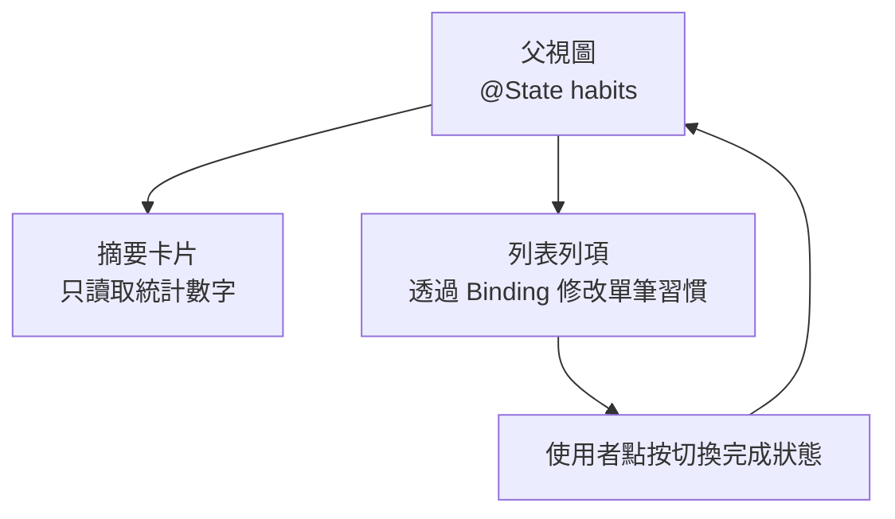
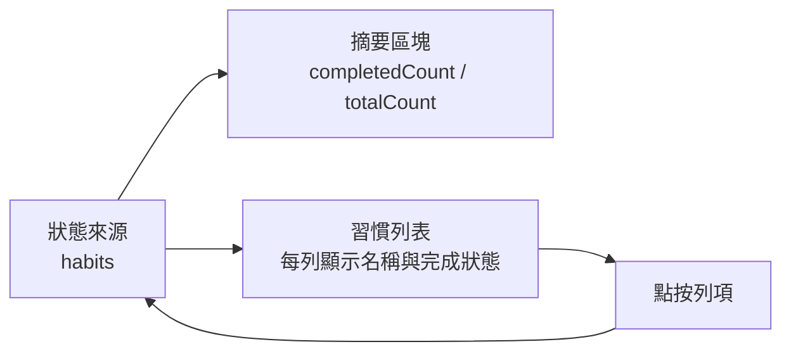

# 第 03 章 狀態與資料流：讓畫面跟著資料走

## 章首摘要

### 這章你會學到什麼

- 為什麼 SwiftUI 專案最常出問題的地方，往往不是版面，而是狀態與資料流。
- 一份資料應該由誰持有、誰讀取、誰修改。
- 什麼情況下應該傳值，什麼情況下應該傳 `Binding`。
- 如何分辨本地狀態、共享狀態與衍生狀態。

### 你會完成哪一段功能

- 讓主線專案中的習慣列表可以切換完成狀態。
- 讓首頁的完成統計與清單項目同步更新。
- 建立一條清楚的父子視圖資料流，為後面表單與持久化打底。

### 需要的前置知識

- 已理解第 01 章的宣告式 UI 思維。
- 看得懂基本 SwiftUI View 組合方式與簡單的狀態宣告。

## 為什麼這一章重要

很多 SwiftUI 初學者會以為，真正困難的地方在動畫、非同步或架構。但實際上，許多畫面更新異常、資料不同步、列表顯示怪異、畫面一改全身動的問題，最早都來自同一個根源：狀態與資料流沒有想清楚。

你可能也遇過這樣的情況：

- 清單上的勾選狀態改了，但統計數字沒有跟著變。
- 某個子視圖看起來能更新，但一回到父視圖又變回原樣。
- 為了讓畫面能動，每個地方都偷偷存了一份資料，結果越改越亂。

這一章的目標，就是把這個核心問題拆開。因為在 SwiftUI 裡，畫面之所以能穩定更新，不是因為你學會了幾個特殊元件，而是因為你知道資料從哪裡來、應該流向哪裡、又該由誰來負責改變。如果說第 01 章是在幫你換掉看畫面的方式，那第 03 章其實是在幫你換掉維護資料的直覺。

## 開場：為什麼一個勾選會牽動兩個地方

延續前面的主線專案，現在我們不只要顯示一張習慣卡片，而是要讓首頁上出現一組習慣清單，並在上方顯示今天的完成統計。

假設畫面長這樣：

- 上方有一個摘要區塊，顯示「今天完成 2 / 5」。
- 下方有一串習慣列表，例如「晨間伸展」、「閱讀 20 分鐘」、「喝水 2000ml」。
- 使用者點一下某一列，就能切換今天是否完成。

這個需求表面上看起來很普通，但它有一個很關鍵的特徵：同一個操作，會同時影響兩個不同位置的畫面。

當使用者把「晨間伸展」從未完成切成已完成時：

- 該列的圖示與文字要更新。
- 上方的完成統計也要一起更新。

這時你真正要回答的，不是「我要怎麼通知兩個地方一起改」，而是另一個更根本的問題。也是我認為 SwiftUI 初學者最值得提早養成的問題意識：

`這份資料到底應該存在哪裡，才可以讓兩個地方自然地一起變。`

> **觀念提醒**
> 在 SwiftUI 裡，畫面能不能穩定同步，往往不取決於你寫了多少更新邏輯，而取決於你是否讓真正的資料只存在一個可信來源。

**圖 3-1 父視圖持有狀態，子視圖依責任接收資料**



圖 3-1 的重點是，真正被持有的資料只有一份。摘要區塊只是讀取它，列表列項則透過明確的連結修改它。這種乾淨感，往往就是後面專案能不能穩的起點。

## 第一個範例：讓清單與統計一起更新

先看一個最小但完整的例子。這段程式碼示範了三件事：

- 父視圖持有習慣資料。
- 摘要卡片只讀取結果。
- 列表列項透過 `Binding` 修改單筆資料。

```swift
import SwiftUI

struct Habit: Identifiable {
    let id = UUID()
    var name: String
    var isCompletedToday: Bool
}

struct HabitsDashboardView: View {
    @State private var habits: [Habit] = [
        Habit(name: "晨間伸展", isCompletedToday: true),
        Habit(name: "閱讀 20 分鐘", isCompletedToday: false),
        Habit(name: "喝水 2000ml", isCompletedToday: false)
    ]

    var completedCount: Int {
        habits.filter(\.isCompletedToday).count
    }

    var body: some View {
        VStack(alignment: .leading, spacing: 16) {
            ProgressSummaryCard(
                completedCount: completedCount,
                totalCount: habits.count
            )

            ForEach($habits) { $habit in
                HabitRow(habit: $habit)
            }
        }
        .padding()
    }
}

struct ProgressSummaryCard: View {
    let completedCount: Int
    let totalCount: Int

    var body: some View {
        VStack(alignment: .leading, spacing: 8) {
            Text("今日進度")
                .font(.headline)

            Text("今天完成 \(completedCount) / \(totalCount)")
                .font(.title3.weight(.semibold))
        }
        .frame(maxWidth: .infinity, alignment: .leading)
        .padding()
        .background(Color.blue.opacity(0.08))
        .clipShape(RoundedRectangle(cornerRadius: 20))
    }
}

struct HabitRow: View {
    @Binding var habit: Habit

    var body: some View {
        Button {
            habit.isCompletedToday.toggle()
        } label: {
            HStack {
                Image(systemName: habit.isCompletedToday ? "checkmark.circle.fill" : "circle")
                    .foregroundStyle(habit.isCompletedToday ? .green : .secondary)

                Text(habit.name)
                    .foregroundStyle(.primary)

                Spacer()

                Text(habit.isCompletedToday ? "已完成" : "待完成")
                    .font(.subheadline)
                    .foregroundStyle(.secondary)
            }
            .padding()
            .background(Color.gray.opacity(0.08))
            .clipShape(RoundedRectangle(cornerRadius: 16))
        }
        .buttonStyle(.plain)
    }
}

#Preview {
    HabitsDashboardView()
        .padding()
}
```

這個範例真正重要的，不是它用到幾個元件，而是資料關係很乾淨。

- `habits` 這份資料由父視圖持有。
- `ProgressSummaryCard` 只讀取 `completedCount` 和 `totalCount`。
- `HabitRow` 需要修改資料，所以接收 `@Binding var habit`。
- 當列項切換完成狀態時，父視圖的 `habits` 被更新，摘要與清單自然一起變化。

> **延伸實戰**
> 先不要急著加新功能，只試著把習慣數量從 3 筆改成 5 筆，或新增一個「晚間散步」項目。觀察一下：摘要數字和列表互動，是否完全不需要額外同步邏輯就能維持一致。

**圖 3-2 單一狀態如何同時驅動多個畫面區塊**



圖 3-2 想強調的是，當資料流路徑清楚時，統計與列表不是彼此通知，而是一起讀取同一份資料。

## 從這個範例看見狀態與資料流的核心

### 1. 一份資料，應該只有一個可信來源

這一章最重要的觀念，可以濃縮成一句話：

`同一份真實資料，最好只由一個地方持有。`

在剛才的範例裡，`habits` 就是那份真正的資料。它不是同時散落在摘要卡片、列表列項、或其他任何地方，而是明確地由 `HabitsDashboardView` 持有。這種做法通常被稱為 single source of truth，也就是「單一可信資料來源」。

這個原則的好處非常直接：

- 你知道真正的資料在哪裡。
- 你不需要手動同步多個副本。
- 當畫面顯示不一致時，排查方向會清楚得多。

只要你發現同一個值被多個地方各自保存，通常就該停下來問自己：這裡是不是已經產生了兩份真相？

> **觀念提醒**
> 「能跑」不代表資料流正確。很多 SwiftUI 問題在初期看起來只是偶爾不同步，真正原因卻是同一份資料被複製成了多份版本。

### 2. 子視圖只讀時傳值，需要修改時傳 `Binding`

父子視圖之間傳遞資料時，一個很好記的原則是：

- 子視圖只需要顯示資料時，傳值就夠了。
- 子視圖需要改動父視圖擁有的資料時，再傳 `Binding`。

因此在剛才的例子裡：

- `ProgressSummaryCard` 只負責顯示摘要，所以它收到的是普通值。
- `HabitRow` 需要切換 `isCompletedToday`，所以它收到的是 `Binding`。

這樣的分工，會讓每個視圖的責任變得非常清楚。

如果你把所有資料都一律用 `Binding` 往下傳，畫面雖然也許能動，但每個子視圖的修改權限會變得過大；反過來，如果你明明需要修改，卻只傳值不傳 `Binding`，你又很容易在子視圖裡偷偷開一份新的本地狀態，最後讓資料路徑變得混亂。

你可以先把這條規則當作初學 SwiftUI 的安全扶手：`能讀就傳值，要改才傳 Binding。`

### 3. 衍生狀態不一定要再存一份

在範例中，`completedCount` 並不是另一個 `@State`，而是一個根據 `habits` 即時計算出來的結果：

```swift
var completedCount: Int {
    habits.filter(\.isCompletedToday).count
}
```

這樣的資料，我們可以把它稱為「衍生狀態」。也就是說，它不是一份需要獨立維護的真實資料，而是可以從其他資料推導出來的結果。

這裡很容易犯一個錯：

```swift
@State private var completedCount = 0
```

如果你另外再存一份 `completedCount`，接下來每次切換習慣狀態時，你都得記得同步更新它。只要哪一次忘了，摘要數字就會和真實列表脫鉤。

所以一個很有用的判斷方式是：

- 如果某個值本來就能從既有資料推導出來，先不要急著把它再存一份。
- 先問自己：這是原始資料，還是結果資料？

> **常見陷阱**
> 初學者很常把方便顯示的結果值也當成狀態存起來，例如完成數、百分比、排序後清單。這樣短期看起來省事，長期卻會讓同步成本越來越高。

### 4. 狀態放錯地方，畫面就會開始互相背叛

現在來看一個常見反例。假設你這樣寫列表列項：

```swift
struct HabitRow: View {
    let habit: Habit
    @State private var isCompletedToday = false

    var body: some View {
        Button {
            isCompletedToday.toggle()
        } label: {
            HStack {
                Image(systemName: isCompletedToday ? "checkmark.circle.fill" : "circle")
                Text(habit.name)
            }
        }
    }
}
```

這段程式最大的問題在於：列項畫面顯示的完成狀態，已經不再來自父視圖持有的 `habit.isCompletedToday`，而是來自它自己偷偷保留的一份本地狀態。

這樣一來，問題就出現了：

- 列項圖示可能變了。
- 但父視圖的 `habits` 並沒有真的更新。
- 上方摘要也就不知道有任何事情發生。

於是你會得到一個很典型、也很痛苦的畫面：列表看起來改了，但統計數字沒改；或是畫面重新整理後，又突然變回原狀。

這不是因為 SwiftUI 難懂，而是因為資料的擁有權已經被切碎了。

> **常見陷阱**
> 當你發現某個子視圖「自己看起來會動」，但整體資料卻沒有一致更新時，很可能就是子視圖偷偷把本該由父層持有的狀態收成自己的 `@State` 了。

**圖 3-3 狀態放錯位置時，畫面容易產生兩份真相**

```mermaid
flowchart TD
    A["父視圖<br/>habits"]
    B["子視圖<br/>@State isCompletedToday"]
    A --> C["摘要區塊顯示父層統計"]
    B --> D["列項圖示顯示子層狀態"]
    C -.不同步. D
```

圖 3-3 示範的不是語法錯誤，而是責任錯誤。當同一個意思的資料分別存在父層和子層時，畫面很容易出現彼此背離的狀態。

### 5. 如何分辨本地狀態、共享狀態與衍生狀態

到這裡，你可以開始把常見狀態分成三類：

#### 本地狀態

只影響某一個局部畫面，通常由該視圖自己持有，例如：

- 某張卡片是否展開。
- 一個輸入欄位目前的草稿文字。
- 一個彈窗是否顯示。

#### 共享狀態

會同時影響多個畫面區塊，或需要被多個視圖共同觀察與修改，例如：

- 習慣清單本身。
- 使用者目前選到的篩選條件。
- 登入狀態或整體設定。

#### 衍生狀態

可以由其他資料推算出來，不必單獨保存，例如：

- 今日完成數。
- 完成百分比。
- 依條件篩選後的顯示清單。

這三類一旦分清楚，你在做狀態配置時就會輕鬆很多。因為很多混亂其實不是資料太多，而是不同性質的資料被用同一種方式處理。

> **觀念提醒**
> 不是每一個會變的值都應該被共享。真正該共享的是會影響多個地方、而且必須保持一致的資料。

### 6. 先讓資料路徑簡單，再談更大的架構

當讀者開始理解狀態與資料流後，很容易下一步就想問：那我是不是該立刻引進更完整的架構？是不是該先拆很多層、建立很多抽象？

先不要急。

在這個階段，比「看起來很完整的架構」更重要的，是讓資料路徑保持簡單、清楚、可預測。只要你能明確回答下面三個問題，很多中小型 SwiftUI 畫面就已經會穩很多：

1. 這份資料真正由誰持有？
2. 哪些視圖只需要讀取它？
3. 哪些視圖真的需要修改它？

如果這三個問題還沒答清楚，就算你先引進更大的架構，也只會把原本的混亂包裝得更像一套系統而已。

## 接回主線專案：讓列表、摘要與互動站上同一條資料線

回到本書的主線專案，這一章完成之後，我們的「習慣養成 App」會產生一個很重要的變化：它不再只是幾個能顯示的靜態畫面，而是開始有了一條真正能支撐後續功能的資料路徑。

現在，當使用者切換某個習慣的完成狀態時：

- 列項本身會更新。
- 上方摘要會更新。
- 後續若加入篩選、排序、表單或持久化，大家也都能沿著同一份資料走。

這件事看起來不像動畫那樣顯眼，但它其實是整本書後半段很多功能是否會穩的分水嶺。

> **延伸實戰**
> 試著在摘要卡片中再加上一行文字，例如「完成率 67%」。先不要新增新的 `@State`，而是從既有的 `habits` 與 `completedCount` 推算出來。

## 本章重點整理

- SwiftUI 畫面能否穩定更新，核心往往在狀態與資料流，而不是元件數量。
- 一份真正的資料最好只由一個地方持有。
- 子視圖只讀取時傳值，需要修改時再傳 `Binding`。
- 可以推導出來的結果，通常不必再存成新的狀態。
- 狀態放錯地方時，畫面最常出現的問題就是「看起來有改，但整體不同步」。

## 本章小結

如果第 01 章帶你建立的是「畫面是狀態的結果」這個入口，那麼第 03 章要補上的，就是另一半關鍵：

`狀態不只要存在，還要放在對的地方。`

很多 SwiftUI 的挫折，其實不是因為語法難，而是因為資料在不同視圖之間流動時，擁有權與修改權限沒有被想清楚。只要你開始習慣先問「這份資料由誰持有」、「誰只需要讀」、「誰真的要改」，整個專案的可讀性與穩定性都會明顯提升。

後面的表單、導航、持久化與架構設計，其實都會回到同一條線上：讓資料沿著清楚的路徑流動，讓畫面只是誠實地反映它。

## 練習題

1. 基礎題：在 `ProgressSummaryCard` 中新增一行完成率顯示，例如 `67%`，並確保它是由既有資料推導出來，而不是額外保存的新狀態。
2. 進階題：替 `HabitsDashboardView` 加上一個「只看未完成」的篩選開關，先思考這個篩選條件應該算本地狀態、共享狀態還是衍生狀態。
3. 延伸題：嘗試把 `HabitRow` 改成只接收值而不接收 `Binding`，改用回呼把切換事件往上傳。比較這種做法與 `Binding` 寫法，各自在哪些情境下比較適合。

## 寫作備註

- 可在章中補一個小專欄：`Binding` 和「事件往上傳」兩種做法的比較。
- 之後若補圖，可再加一張「本地狀態 / 共享狀態 / 衍生狀態」三分類對照表。
- 這章最好讓讀者覺得「資料流終於清楚了」，而不是只學會兩個屬性包裝器名稱。
