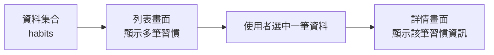
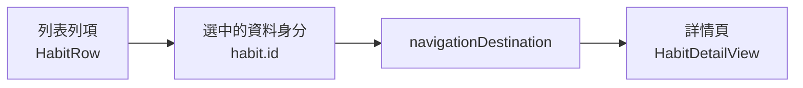
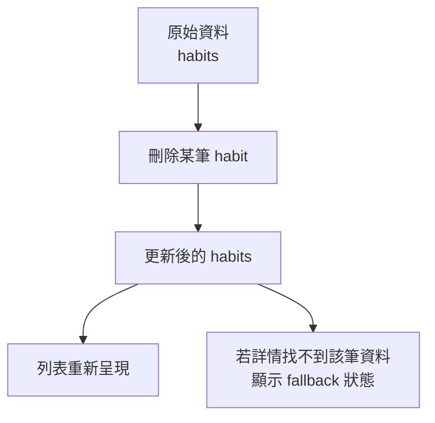

# 第 04 章 清單、導航與資訊流

## 章首摘要

### 這章你會學到什麼

- `List` 與 `ForEach` 在 SwiftUI 裡為什麼不只是「把很多列排出來」而已。
- `NavigationStack` 在畫面流程中扮演什麼角色。
- 為什麼導航不是單純跳頁，而是資訊流的一部分。
- 如何用穩定的資料識別，讓列表更新與導航行為保持一致。

### 你會完成哪一段功能

- 為主線專案做出「習慣列表頁 -> 習慣詳情頁」的完整導覽流程。
- 讓使用者可以從列表點進單筆習慣，查看更完整的資訊。
- 加入刪除互動，並觀察資料更新後 UI 如何自然反映。

### 需要的前置知識

- 已理解第 01 章的宣告式 UI 思維。
- 已理解第 03 章的狀態與資料流觀念，特別是單一可信資料來源與 `Binding` 的基本角色。

## 為什麼這一章重要

很多 SwiftUI 教學在談列表與導航時，常常只停在 API 操作層面，例如：

- 用 `List` 把資料列出來。
- 用 `NavigationLink` 點一下跳到下一頁。
- 用 `navigationTitle` 補上標題。

這些當然都重要，但如果只停在這一層，讀者通常還是很容易卡住。因為真實 App 裡的問題通常不是「怎麼跳頁」，而是：

- 列表到底代表的是哪一份資料？
- 點進去的那一頁，拿到的是哪一筆資料？
- 當列表內容變動、刪除或排序時，導航是否還能指向正確的內容？

也就是說，導航其實從來都不是單純的畫面效果，而是資料在不同層級之間被閱讀、追蹤與定位的方式。

## 開場：為什麼列表點進去，不能只想成「跳頁」

延續主線專案，現在我們的「習慣養成 App」已經有了可以更新的習慣清單。接下來的需求很自然：使用者在首頁看到多筆習慣時，應該能點進其中一筆，查看更完整的資訊，例如：

- 習慣名稱
- 今日是否完成
- 連續完成天數
- 補充說明或提醒文字

從畫面上看，這只是很常見的一個操作流程：點一列，進到詳情頁。

但如果從資料流角度來看，這其實是在做一件更精準的事：

`使用者從一組資料集合中，選中其中一筆，並把閱讀焦點移到那一筆資料上。`

換句話說，導航不是「從 A 畫面跳到 B 畫面」這麼簡單，而是「從一組資料中，帶著某個明確的資料身分，走向更深入的一層資訊」。

> **觀念提醒**
> 如果你只把導航想成畫面切換，很容易忽略資料身分與來源；但如果你把導航想成「沿著某筆資料往下閱讀」，很多設計判斷就會自然清楚起來。

**圖 4-1 列表、選擇與詳情其實是一條資訊流**



圖 4-1 的重點是，導航並不是把畫面任意串起來，而是沿著某筆被選中的資料往更深入的內容前進。

## 第一個範例：從習慣列表進入習慣詳情

先看一個最小但完整的例子。不過這一章我不想一開始就把所有東西一次丟給讀者，所以我們先拆成兩小段來看：

- 第一段先站穩列表與導航骨架。
- 第二段再補上詳情頁與資料定位。

這樣你比較容易先看懂「一組資料怎麼被列出來」，再看懂「選中的那一筆是怎麼被往下帶走的」。

### 第一步：先把列表與導航骨架搭起來

```swift
import SwiftUI

struct Habit: Identifiable, Hashable {
    let id: UUID
    var name: String
    var streakCount: Int
    var note: String
    var isCompletedToday: Bool

    init(
        id: UUID = UUID(),
        name: String,
        streakCount: Int,
        note: String,
        isCompletedToday: Bool
    ) {
        self.id = id
        self.name = name
        self.streakCount = streakCount
        self.note = note
        self.isCompletedToday = isCompletedToday
    }
}

struct HabitsListView: View {
    @State private var habits: [Habit] = [
        Habit(name: "晨間伸展", streakCount: 6, note: "起床後先活動肩頸與下背", isCompletedToday: true),
        Habit(name: "閱讀 20 分鐘", streakCount: 12, note: "晚餐後閱讀，不滑手機", isCompletedToday: false),
        Habit(name: "喝水 2000ml", streakCount: 3, note: "上午與下午各完成一半", isCompletedToday: false)
    ]

    var body: some View {
        NavigationStack {
            List {
                Section("今天的習慣") {
                    ForEach(habits) { habit in
                        NavigationLink(value: habit.id) {
                            HabitListRow(habit: habit)
                        }
                    }
                }
            }
            .navigationTitle("習慣")
        }
    }
}

struct HabitListRow: View {
    let habit: Habit

    var body: some View {
        HStack(spacing: 12) {
            Image(systemName: habit.isCompletedToday ? "checkmark.circle.fill" : "circle")
                .foregroundStyle(habit.isCompletedToday ? .green : .secondary)
                .font(.title3)

            VStack(alignment: .leading, spacing: 4) {
                Text(habit.name)
                    .font(.headline)

                Text("已連續完成 \(habit.streakCount) 天")
                    .font(.subheadline)
                    .foregroundStyle(.secondary)
            }

            Spacer()
        }
        .padding(.vertical, 4)
    }
}

#Preview {
    HabitsListView()
}
```

如果你現在只看這一段，最值得抓住的其實只有三件事：

- `habits` 是真正的資料來源。
- `List` 負責把這組資料表現成可閱讀、可互動的集合。
- `NavigationLink` 帶出去的不是一個模糊的跳頁指令，而是明確的資料身分 `habit.id`。

也就是說，到這一步為止，我們先不要急著想「詳情頁裡要顯示什麼」。先確認自己真的看懂了：列表裡每一列代表的是哪一筆資料，以及點下去時系統往下帶的是哪個值。

### 第二步：再補上詳情頁與刪除後的定位

當列表骨架站穩之後，我們再把真正的詳情頁接上去。這時候多補兩件事就夠了：

- 用 `navigationDestination(for:)` 根據 `id` 找到被選中的資料。
- 補上刪除互動，觀察資料變動後列表與詳情怎麼一起回到正確狀態。

```swift
struct HabitsListView: View {
    @State private var habits: [Habit] = [
        Habit(name: "晨間伸展", streakCount: 6, note: "起床後先活動肩頸與下背", isCompletedToday: true),
        Habit(name: "閱讀 20 分鐘", streakCount: 12, note: "晚餐後閱讀，不滑手機", isCompletedToday: false),
        Habit(name: "喝水 2000ml", streakCount: 3, note: "上午與下午各完成一半", isCompletedToday: false)
    ]

    var body: some View {
        NavigationStack {
            List {
                Section("今天的習慣") {
                    ForEach(habits) { habit in
                        NavigationLink(value: habit.id) {
                            HabitListRow(habit: habit)
                        }
                        .swipeActions {
                            Button(role: .destructive) {
                                deleteHabit(id: habit.id)
                            } label: {
                                Label("刪除", systemImage: "trash")
                            }
                        }
                    }
                }
            }
            .navigationTitle("習慣")
            .navigationDestination(for: UUID.self) { habitID in
                if let habit = habits.first(where: { $0.id == habitID }) {
                    HabitDetailView(habit: habit)
                } else {
                    ContentUnavailableView("找不到這個習慣", systemImage: "exclamationmark.triangle")
                }
            }
        }
    }

    private func deleteHabit(id: UUID) {
        habits.removeAll { $0.id == id }
    }
}

struct HabitDetailView: View {
    let habit: Habit

    var body: some View {
        ScrollView {
            VStack(alignment: .leading, spacing: 16) {
                Text(habit.name)
                    .font(.largeTitle.bold())

                Label(
                    habit.isCompletedToday ? "今天已完成" : "今天尚未完成",
                    systemImage: habit.isCompletedToday ? "checkmark.circle.fill" : "circle"
                )
                .foregroundStyle(habit.isCompletedToday ? .green : .secondary)

                Text("目前連續完成 \(habit.streakCount) 天")
                    .font(.title3.weight(.semibold))

                Text(habit.note)
                    .foregroundStyle(.secondary)
            }
            .frame(maxWidth: .infinity, alignment: .leading)
            .padding()
        }
        .navigationTitle("習慣詳情")
        .navigationBarTitleDisplayMode(.inline)
    }
}
```

到這裡，整個「列表進詳情」流程才算真正完整。這時候再回頭看，你會比較容易理解：

> **延伸實戰**
> 試著把範例中的 3 筆習慣改成 6 筆，或調整它們的順序。觀察一下：只要每筆資料的 `id` 穩定，列表與導航就仍然能找到正確的內容。

**圖 4-2 導航攜帶的不是畫面指令，而是資料身分**



圖 4-2 想強調的是，導航真正帶著往下走的，通常不是「某一格 UI」，而是某筆資料的可識別身分。

## 從這個範例看見清單、導航與資訊流的核心

### 1. `List` 顯示的不是很多列，而是一組有身分的資料

初學者看 `List` 時，最容易把它想成「一個幫你把多個 row 排好看的容器」。這樣理解不能說錯，但還不夠完整。

在 SwiftUI 裡，`List` 真正有價值的前提是：你給它的是一組可以被識別的資料。也就是說，系統不只是看到三列畫面，而是知道這三列各自代表哪一筆資料。

這也是為什麼 `Habit` 需要遵守 `Identifiable`。因為當畫面更新、排序改變、資料刪除或新增時，SwiftUI 需要知道：

- 哪一列是原本那一列。
- 哪一列是新加入的。
- 哪一列是被移除的。

如果資料沒有穩定身分，畫面更新就會變得模糊，甚至開始出現錯位、動畫不自然、狀態跑錯列等問題。

> **觀念提醒**
> `List` 之所以能穩，是因為它在管理「一組有身分的資料」，不是因為它只是幫你把很多 View 疊起來。

### 2. 導航不是跳頁，而是選中某筆資料之後往下走

在範例中，我們用的是：

```swift
NavigationLink(value: habit.id)
```

這個寫法表面上像是在設定點下去之後要去哪裡，但更好的理解方式是：

`當使用者選中這一列時，將這筆資料的身分往更深一層畫面傳遞。`

接著在 `navigationDestination(for: UUID.self)` 裡，我們再根據這個 `id` 找出對應的 `Habit`，交給詳情頁顯示。

這樣做有兩個好處：

- 列表與詳情之間的連結很明確。
- 導航綁定的是資料身分，而不是一個容易因排序或刪除而改變的位置。

如果你把導航想成「使用者選中某筆資料之後，系統帶著它的身分往下閱讀」，很多寫法就會比單純把它當成跳頁按鈕更容易理解。

### 3. 為什麼用 `id` 比用索引更穩

很多人剛開始寫列表導航時，很容易想到另一種做法：既然這是列表，那我可不可以直接用索引值，例如第 0 筆、第 1 筆、第 2 筆，來代表被選中的項目？

短期看起來也許可以，但一旦列表支援以下操作，就會開始出現風險：

- 刪除
- 排序
- 篩選
- 插入新資料

因為索引代表的是「目前排在第幾個位置」，而不是「這筆資料本身是誰」。只要列表順序變了，索引就會變；但資料身分不應該因為它換了位置就改變。

這也是為什麼在真實 App 裡，導航值綁定資料的穩定身分，通常會比綁定索引更可靠。

> **常見陷阱**
> 索引可以描述位置，但位置不等於身分。當列表支援刪除、排序或篩選後，如果導航仍然依賴索引，畫面就很容易打開錯的資料。

### 4. 詳情頁收到的是一筆資料，不是一格畫面

在範例裡，`HabitDetailView` 收到的是：

```swift
let habit: Habit
```

這件事看起來理所當然，但它背後其實在提醒一個很重要的觀念：詳情頁關心的是被選中的那筆資料，而不是「列表中某個 row 被點到了」這個 UI 事件本身。

當你這樣思考時，詳情頁的責任就會更清楚：

- 它不是列表畫面的延長。
- 它不是某個 row 被放大。
- 它是對同一筆資料的另一層閱讀視角。

這也是為什麼導航應該和資料模型一起思考，而不是只和視圖結構一起思考。

### 5. 刪除列表項目時，UI 為什麼會自然更新

在範例中，我們加入了刪除操作：

```swift
private func deleteHabit(id: UUID) {
    habits.removeAll { $0.id == id }
}
```

當某筆習慣被刪掉時，我們沒有手動要求列表少一列，也沒有手動刷新畫面。原因很簡單：`List` 本來就是根據 `habits` 這份資料在渲染。只要資料來源改了，畫面就會跟著變。

這件事再次呼應前兩章反覆建立的觀念：

- 畫面是資料的結果。
- 一份資料只要來源清楚，很多 UI 變化都會變得很自然。

更有意思的是，這裡也再次提醒我們：列表、刪除、導航，其實沒有一件事是孤立的。它們都圍繞著同一份資料在運作。

**圖 4-3 資料刪除後，列表與導覽會一起回到正確狀態**



圖 4-3 想傳達的是，刪除不是一個單純的 UI 特效，而是資料來源變了之後，列表與詳情都必須跟著一起回到正確狀態。

### 6. 導航也是資訊流的一部分

到這裡，你可以開始把導航看成一條資訊流，而不是一個單純的轉場效果。

在這章的例子裡，資訊流大致長這樣：

1. 父視圖持有 `habits`。
2. 列表把 `habits` 顯示成多筆可選項目。
3. 使用者選中其中一筆資料。
4. 系統把該筆資料的身分帶到下一層。
5. 詳情頁根據這個身分取得正確內容。

一旦你這樣理解導航，後面做以下功能時會清楚很多：

- 點進詳情後編輯資料
- 從通知直接打開某一筆內容
- 在深層畫面中回到列表後維持正確狀態

因為這些功能的核心，始終都不是「怎麼跳頁」，而是「怎麼沿著正確的資料路徑走到正確的位置」。

> **觀念提醒**
> 只要畫面牽涉到選中某筆資料再往下深入，導航就已經不只是版面問題，而是資料定位問題。

### 7. 先把閱讀流程做好，再談編輯流程

這一章刻意讓 `HabitDetailView` 先保持唯讀，只顯示一筆習慣的詳情，而不直接在裡面修改資料。這不是因為詳情頁不能編輯，而是因為我們此刻想先把兩件事拆開：

- 第一步，確保列表與詳情之間的資料定位是清楚的。
- 第二步，才是處理詳情頁如何修改這筆資料。

後者會牽涉到更進一步的資料擁有權與表單流程，這會在下一章變得更重要。

很多專案之所以在導航與表單交會處開始變亂，正是因為還沒先把「我現在看的是哪一筆資料」這件事講清楚，就急著在深層畫面裡直接改很多值。

## 接回主線專案：讓首頁不只是能看，還能走進去

回到「習慣養成 App」這條主線，本章完成之後，首頁終於開始有了真正像 App 的流動感。

現在的使用者不只是看到一串資料而已，他可以：

- 在列表中辨識每一個習慣。
- 點進其中一筆查看更多內容。
- 刪除某個習慣，並立即看到列表自然更新。

更重要的是，這條流程已經把後面幾章最需要的基礎鋪好了：

- 第 05 章的表單編輯會需要知道「現在在編哪一筆資料」。
- 第 09 章的持久化會需要知道「哪筆資料被新增、修改或刪除」。
- 第 10 章談架構時，也會回到「列表、詳情、資料來源」之間如何切責任。

> **延伸實戰**
> 試著在詳情頁再加上一個區塊，例如「最近 7 天完成狀況」的占位內容。先不處理真實資料，只要思考：這塊資訊應該從列表列項直接帶進來，還是由詳情頁根據該筆資料再延伸顯示？

## 本章重點整理

- `List` 管理的是一組有身分的資料，而不只是很多列 UI。
- 導航的本質不是跳頁，而是沿著被選中的資料往更深一層閱讀。
- 導航值綁定穩定的資料身分，通常比綁定索引更可靠。
- 詳情頁收到的應該是一筆資料的上下文，而不是某個 row 的畫面殘影。
- 刪除、排序、篩選與導航，本質上都圍繞同一份資料來源在運作。

## 本章小結

如果前一章讓你理解的是「畫面要跟著資料走」，那這一章要再往前推一步：

`當使用者從列表走向詳情時，帶著一起往前走的，也應該是資料本身。`

很多導航設計之所以後面會亂，不是因為 API 太多，而是因為一開始就把導航當成純畫面行為，而沒有把它當成資料定位的一部分來思考。只要你開始習慣問「現在選中的是哪一筆資料」、「下一層畫面怎麼取得它」，列表、導航與後續編輯流程就會順很多。

下一章我們會接著往下走，走到另一個更真實的需求：當使用者不只是想看，而是想新增與修改資料時，畫面與資料流又該怎麼安排。

## 練習題

1. 基礎題：在 `HabitDetailView` 中再加入一個欄位，例如「建立提醒時間」，並讓它顯示在詳情內容中。
2. 進階題：替列表加上一個簡單的篩選條件，例如只顯示未完成習慣，並觀察篩選後導航是否仍能指向正確內容。
3. 延伸題：試著把導航值從 `UUID` 改成整個 `Habit`，比較這兩種做法在資料一致性、畫面更新與後續編輯需求上的差異。

## 寫作備註

- 可補一個小專欄：為什麼「用索引當導航值」在一開始看似方便，後面卻容易出錯。
- 第 05 章可直接承接本章的詳情頁，進一步加入編輯與表單流程。
- 這章最重要的不是 API 完整度，而是讓讀者真的開始把導航看成資料流的一部分。
