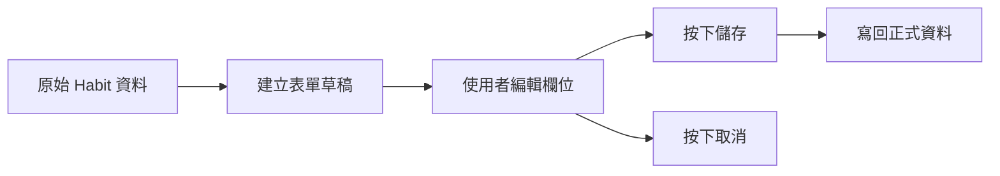
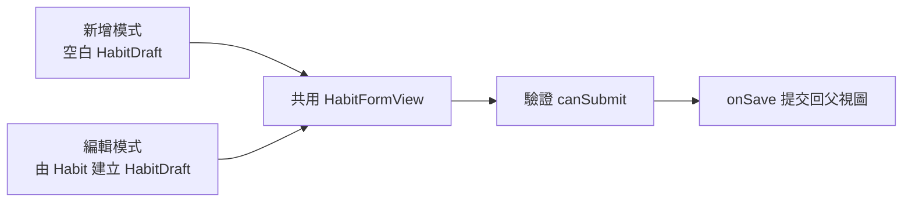
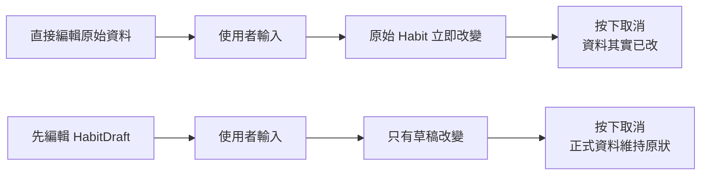

# 第 05 章 表單、輸入與資料編輯

## 章首摘要

### 這章你會學到什麼

- 為什麼表單不只是把 `TextField`、`Toggle` 和 `Stepper` 排進畫面。
- 新增資料與編輯資料，為什麼通常應該共用同一份表單結構。
- 為什麼編輯時要先改草稿，再決定是否提交到原始資料。
- 驗證應該放在哪裡，才能讓表單邏輯清楚又不容易失控。

### 你會完成哪一段功能

- 為主線專案加入「新增習慣」流程。
- 為詳情頁加入「編輯習慣」流程。
- 建立一份可同時支援新增與編輯的共用表單。
- 在送出前檢查必填欄位，並讓取消操作真正能取消。

### 需要的前置知識

- 已理解第 03 章的狀態與資料流觀念。
- 已理解第 04 章的列表與詳情導覽流程。

## 為什麼這一章重要

當 App 開始不只要顯示資料，而是要讓使用者輸入、建立、修改資料時，專案的複雜度會突然上升一個層級。因為這時你面對的，已經不只是「現在資料是什麼」，而是：

- 使用者目前正在輸入什麼？
- 哪些值還只是草稿？
- 哪些值已經真正寫回資料來源？
- 如果使用者按了取消，哪些東西應該消失，哪些不該被保留？

很多表單一開始都看起來不難：加幾個欄位、綁幾個 state、按下儲存。但真正讓人頭痛的，通常是之後才浮現的問題：

- 明明按了取消，原始資料卻已經被改掉了。
- 驗證規則散落在各個欄位裡，越加越亂。
- 新增表單一套、編輯表單又一套，最後功能重複又難維護。

這一章的目標，就是先建立一種穩定的表單思維：輸入中的資料和真正提交的資料，不一定要是同一份。

## 開場：為什麼「取消」其實很考驗資料設計

延續前一章，我們現在已經可以從習慣列表進入詳情頁。接下來，讀者很自然會期待一個功能：既然可以看習慣詳情，那是不是也應該能修改這筆資料？

例如使用者可能想改：

- 習慣名稱
- 每週目標次數
- 備註說明
- 是否開啟提醒

從畫面上看，這只是多了一個表單。但一旦你讓使用者編輯資料，就會立刻碰到一個關鍵問題：

`如果使用者改了一半，最後按的是取消，那這些變更到底算不算真的發生過？`

這個問題看起來很小，卻幾乎能立刻測出你的資料設計是否穩定。

如果你在表單中直接修改原始資料，那麼：

- 使用者每打一個字，原始資料就跟著變。
- 就算最後按取消，真正的資料也早已被改動。
- 你只能再想辦法「回復原狀」，而不是單純不提交。

相反地，如果你先編輯的是一份草稿：

- 使用者可以放心修改。
- 只有按下儲存時，變更才正式寫回。
- 取消操作也才真正有意義。

> **觀念提醒**
> 表單中的輸入值，不一定等於已提交的資料。把這兩者分清楚，是表單穩定性的第一步。

**圖 5-1 表單其實在處理兩層資料：草稿與正式資料**



圖 5-1 想傳達的是，表單操作通常不是直接碰原始資料，而是先經過一層草稿。

## 第一個範例：用一份草稿同時支援新增與編輯

先看一個最小但完整的例子。這段程式碼示範了四件事：

- 用 `Form` 建立輸入流程。
- 用 `HabitDraft` 暫存編輯中的值。
- 用同一份表單同時支援新增與編輯。
- 只在按下儲存時才真正更新資料來源。

```swift
import SwiftUI

struct Habit: Identifiable, Hashable {
    let id: UUID
    var name: String
    var weeklyTarget: Int
    var note: String
    var reminderEnabled: Bool
    var isCompletedToday: Bool

    init(
        id: UUID = UUID(),
        name: String,
        weeklyTarget: Int,
        note: String,
        reminderEnabled: Bool,
        isCompletedToday: Bool = false
    ) {
        self.id = id
        self.name = name
        self.weeklyTarget = weeklyTarget
        self.note = note
        self.reminderEnabled = reminderEnabled
        self.isCompletedToday = isCompletedToday
    }
}

struct HabitDraft {
    var name: String = ""
    var weeklyTarget: Int = 3
    var note: String = ""
    var reminderEnabled: Bool = false

    init() {}

    init(habit: Habit) {
        self.name = habit.name
        self.weeklyTarget = habit.weeklyTarget
        self.note = habit.note
        self.reminderEnabled = habit.reminderEnabled
    }

    var trimmedName: String {
        name.trimmingCharacters(in: .whitespacesAndNewlines)
    }

    var canSubmit: Bool {
        !trimmedName.isEmpty
    }

    func asHabit(id: UUID? = nil, isCompletedToday: Bool = false) -> Habit {
        Habit(
            id: id ?? UUID(),
            name: trimmedName,
            weeklyTarget: weeklyTarget,
            note: note.trimmingCharacters(in: .whitespacesAndNewlines),
            reminderEnabled: reminderEnabled,
            isCompletedToday: isCompletedToday
        )
    }
}

enum HabitFormMode {
    case create
    case edit(Habit)

    var navigationTitle: String {
        switch self {
        case .create:
            return "新增習慣"
        case .edit:
            return "編輯習慣"
        }
    }
}

struct HabitsManageView: View {
    @State private var habits: [Habit] = [
        Habit(name: "晨間伸展", weeklyTarget: 5, note: "起床後先活動肩頸", reminderEnabled: true),
        Habit(name: "閱讀 20 分鐘", weeklyTarget: 4, note: "晚餐後閱讀", reminderEnabled: false)
    ]

    @State private var isPresentingCreateForm = false
    @State private var editingHabit: Habit?

    var body: some View {
        NavigationStack {
            List {
                ForEach(habits) { habit in
                    VStack(alignment: .leading, spacing: 4) {
                        Text(habit.name)
                            .font(.headline)

                        Text("每週目標 \(habit.weeklyTarget) 次")
                            .font(.subheadline)
                            .foregroundStyle(.secondary)
                    }
                    .contentShape(Rectangle())
                    .onTapGesture {
                        editingHabit = habit
                    }
                }
            }
            .navigationTitle("習慣")
            .toolbar {
                ToolbarItem(placement: .topBarTrailing) {
                    Button("新增") {
                        isPresentingCreateForm = true
                    }
                }
            }
            .sheet(isPresented: $isPresentingCreateForm) {
                HabitFormView(mode: .create) { draft in
                    habits.append(draft.asHabit())
                }
            }
            .sheet(item: $editingHabit) { habit in
                HabitFormView(mode: .edit(habit)) { draft in
                    updateHabit(id: habit.id, using: draft)
                }
            }
        }
    }

    private func updateHabit(id: UUID, using draft: HabitDraft) {
        guard let index = habits.firstIndex(where: { $0.id == id }) else { return }

        let current = habits[index]
        habits[index] = draft.asHabit(
            id: current.id,
            isCompletedToday: current.isCompletedToday
        )
    }
}

struct HabitFormView: View {
    let mode: HabitFormMode
    let onSave: (HabitDraft) -> Void

    @Environment(\.dismiss) private var dismiss
    @State private var draft: HabitDraft

    init(mode: HabitFormMode, onSave: @escaping (HabitDraft) -> Void) {
        self.mode = mode
        self.onSave = onSave

        switch mode {
        case .create:
            _draft = State(initialValue: HabitDraft())
        case .edit(let habit):
            _draft = State(initialValue: HabitDraft(habit: habit))
        }
    }

    var body: some View {
        NavigationStack {
            Form {
                Section("基本資訊") {
                    TextField("習慣名稱", text: $draft.name)

                    Stepper("每週目標 \(draft.weeklyTarget) 次", value: $draft.weeklyTarget, in: 1...7)
                }

                Section("補充設定") {
                    Toggle("開啟提醒", isOn: $draft.reminderEnabled)

                    TextField("備註", text: $draft.note, axis: .vertical)
                        .lineLimit(3...6)
                }
            }
            .navigationTitle(mode.navigationTitle)
            .navigationBarTitleDisplayMode(.inline)
            .toolbar {
                ToolbarItem(placement: .topBarLeading) {
                    Button("取消") {
                        dismiss()
                    }
                }

                ToolbarItem(placement: .topBarTrailing) {
                    Button("儲存") {
                        onSave(draft)
                        dismiss()
                    }
                    .disabled(!draft.canSubmit)
                }
            }
        }
    }
}

#Preview {
    HabitsManageView()
}
```

這個範例真正重要的，不是欄位有幾個，而是責任切得很清楚：

- `habits` 是正式資料來源。
- `HabitDraft` 是輸入中的暫存資料。
- `HabitFormView` 只負責編輯草稿與決定何時送出。
- 只有按下儲存時，父視圖才會真正更新 `habits`。

這也表示：

- 使用者在輸入過程中不會直接污染原始資料。
- 按下取消時，不需要「還原資料」，因為原始資料根本還沒被改。
- 新增與編輯可以共用同一份表單結構，只是初始值不同。

> **延伸實戰**
> 試著替表單再加一個欄位，例如「習慣分類」或「提醒時間占位文字」。先不要急著碰資料儲存，先觀察共用表單結構是否仍然清楚。

**圖 5-2 新增與編輯共用同一份表單，只是起點不同**



圖 5-2 想強調的是，新增與編輯不需要兩套完全不同的表單；很多時候，它們只是表單的初始狀態不同。

## 從這個範例看見表單、輸入與資料編輯的核心

### 1. 表單本質上在管理一段尚未提交的狀態

很多人第一次寫表單時，會直覺地覺得：「既然畫面上輸入的就是資料，那我就直接綁到真正的資料好了。」但一旦你有了取消、驗證、暫存或多步驟輸入，這種寫法很快就會變得脆弱。

更穩的理解方式是：

`表單通常不是在直接編輯最終資料，而是在管理一段尚未提交的狀態。`

也就是說，在使用者按下儲存之前，畫面上那份資料更像是一份編輯中的草稿。只有當使用者確認送出後，它才正式成為資料來源的一部分。

這種想法有一個很大的好處：它讓表單流程和資料提交流程被清楚拆開。你可以放心讓使用者編輯、清空、反覆修改，而不用擔心每一個字都已經即時污染正式資料。

> **觀念提醒**
> 當你不知道表單資料該放哪裡時，先問自己：這個值現在只是「正在輸入」，還是「已經生效」？這個判斷通常就會告訴你它該不該直接回寫原始資料。

### 2. 直接綁原始資料，取消通常會失去意義

來看一個常見但危險的簡化版本：

```swift
struct HabitFormView: View {
    @Binding var habit: Habit

    var body: some View {
        Form {
            TextField("習慣名稱", text: $habit.name)
            Toggle("開啟提醒", isOn: $habit.reminderEnabled)
        }
    }
}
```

這段程式並不是永遠不能用。在某些非常簡單、沒有取消需求、也不介意即時提交的小型編輯情境裡，它可能足夠。

但只要你的畫面有以下需求，風險就會立刻升高：

- 使用者可以取消
- 你想做欄位驗證
- 你想讓新增與編輯共用同一份表單
- 你想在儲存前先檢查或轉換資料

因為這時只要欄位一改，原始資料就被改了。取消按鈕就會變得很尷尬：它只能關閉畫面，卻不能真正取消已經發生的變更。

> **常見陷阱**
> 很多表單一開始「看起來能用」，是因為還沒測取消。只要一加上取消，你就會立刻發現直接修改原始資料其實並不是真的可逆。

### 3. 驗證最好集中在送出邏輯附近

在範例裡，我們用了：

```swift
var canSubmit: Bool {
    !trimmedName.isEmpty
}
```

這個設計很簡單，但它透露出一個很值得延續的方向：驗證規則最好能集中在草稿資料或送出判斷附近，而不是散落在每個欄位事件裡。

這樣做的好處是：

- 驗證條件會比較集中。
- 你比較容易知道「目前不能儲存」到底是因為哪一個規則。
- 後面如果規則變複雜，也比較有地方整理。

例如之後你可以很自然地把規則擴充成：

- 名稱不得為空
- 備註不可超過一定長度
- 每週目標必須落在某個合理範圍

而不是把這些條件分散在各個 `onChange` 或按鈕事件裡。

### 4. 共用表單，不代表把所有邏輯塞成一團

這章很容易出現另一種過度修正：既然新增與編輯要共用表單，那我是不是應該把所有情境都塞進同一個超大 View 裡？

不需要。

共用表單真正該共用的，通常是這些東西：

- 欄位結構
- 草稿型別
- 驗證邏輯
- 送出入口

而不一定是把所有模式差異都寫成一堆 `if case` 混在 `body` 裡。範例裡的 `HabitFormMode` 做的事情很簡單：

- 決定標題是「新增習慣」還是「編輯習慣」
- 決定初始草稿從空白開始，還是從既有 `Habit` 建立

這種程度的分工通常就已經夠用了。關鍵不是抽象得多漂亮，而是讓讀者能一眼看懂共用與差異各在哪裡。

> **觀念提醒**
> 好的共用不是把所有東西混成一份，而是把真正共通的結構留下來，把差異留在初始化或提交階段處理。

### 5. 新增與編輯的差別，很多時候只在初始值與提交方式

在範例裡：

- 新增模式的草稿來自 `HabitDraft()`
- 編輯模式的草稿來自 `HabitDraft(habit: habit)`

然後在提交時：

- 新增會 `append`
- 編輯會找到原本那筆 `Habit` 再更新

也就是說，新增與編輯最常見的差異，不一定在表單本身，而是在：

1. 表單開始時拿到什麼初始值
2. 按下儲存後要把資料送去哪裡

一旦你抓住這個結構，後面很多功能都會變得比較容易設計，例如：

- 在詳情頁點編輯
- 在列表頁直接新增
- 之後補上刪除確認或複製一筆資料

### 6. 表單體驗不只關於功能，還關於輸入負擔

這一章也值得稍微提醒讀者：表單設計不只是能不能儲存資料，還包含使用者輸入時的負擔是否合理。

例如：

- 欄位順序是否符合使用者思路
- 必填欄位是否足夠少
- 預設值是否能降低輸入成本
- 長文字輸入是否給了足夠空間

在範例裡，我們讓 `weeklyTarget` 有一個預設值，也讓 `note` 使用較長的多行輸入。這些設計看起來不大，但都會讓表單更接近真實可用的產品，而不是單純的資料輸入口。

### 7. 先把提交流程做好，再慢慢擴充即時反饋

有些讀者會很快想到：表單是不是應該即時驗證？是不是應該在輸入過程中立刻顯示錯誤？答案不是不能做，而是此刻先不要急。

在一本循序漸進的書裡，更重要的是先讓讀者掌握穩定的提交流程：

1. 建立草稿
2. 編輯草稿
3. 驗證是否可送出
4. 儲存時才真正更新資料來源

只要這條線穩了，之後要再加上即時錯誤提示、欄位焦點管理、格式化輸入，才不會建立在一個已經混亂的基礎上。

**圖 5-3 直接編輯原始資料與先編輯草稿，取消結果完全不同**



圖 5-3 想強調的不是哪個 API 比較高級，而是哪種資料流更能支撐取消與驗證這兩件真實需求。

## 接回主線專案：讓詳情頁不只可看，還能真正被修改

回到「習慣養成 App」這條主線，這一章完成之後，專案會出現一個很大的質變：資料不再只是被顯示與閱讀，而是開始能被安全地建立與修改。

現在我們已經具備了這些能力：

- 從列表進入詳情
- 從詳情進入編輯
- 從列表新增一筆習慣
- 在取消時保留原始資料
- 在儲存時才真正提交更新

這條流程會直接影響後面幾章：

- 第 08、09 章談非同步與持久化時，會需要知道何時才算真正提交資料。
- 第 10 章談架構時，也會回到「草稿資料」和「正式資料」的責任切分。
- 第 11 章做 Preview 與測試時，表單會是很值得驗證的高風險區塊。

> **延伸實戰**
> 試著在編輯模式下加上一個刪除按鈕，但先不要真的做刪除邏輯。先思考：刪除應該屬於表單的一部分，還是屬於詳情頁對該筆資料的操作？

## 本章重點整理

- 表單通常在管理一段尚未提交的狀態，而不一定是直接修改正式資料。
- 只要有取消、驗證或編輯需求，先用草稿再提交，通常會比較穩。
- 新增與編輯很多時候可以共用同一份表單，差別只在初始值與提交方式。
- 驗證規則集中在草稿或送出判斷附近，會比散落在各欄位事件裡更容易維護。
- 表單設計不只關於功能正確，也關於輸入負擔是否合理。

## 本章小結

如果前一章讓你理解的是「怎麼沿著某筆資料走到詳情頁」，那這一章要補上的就是：

`當使用者開始修改資料時，畫面中正在變動的值，不一定應該立刻等於正式資料。`

很多表單會失控，不是因為欄位太多，而是因為草稿、驗證、提交、取消這幾件事沒有被拆開來看。只要你開始習慣先讓使用者編輯一份暫存資料，再在確認時提交，很多互動就會變得穩定得多。

下一章我們會接著往下走，把重複出現的表單與畫面片段整理成可重用元件，讓專案開始長出更穩定的結構。

## 練習題

1. 基礎題：替 `HabitFormView` 新增一個欄位，例如「習慣分類」，並讓它一起跟著草稿提交。
2. 進階題：加入一條更明確的驗證規則，例如備註長度不能超過 80 個字，並思考這條規則應該放在草稿哪一層。
3. 延伸題：試著讓 `HabitFormView` 同時支援「從列表新增」與「從詳情頁編輯」，比較這兩個入口共用表單後，哪些責任應該留在父視圖，哪些責任應該留在表單內。

## 寫作備註

- 可補一個小專欄：什麼情況下直接用 `Binding` 編輯原始資料是可以接受的，什麼情況下不建議。
- 第 06 章可以直接承接這裡的表單欄位與按鈕樣式，整理成可重用元件。
- 這章的關鍵不是 `Form` 元件介紹得多完整，而是讓讀者真正理解草稿與正式資料的差別。
