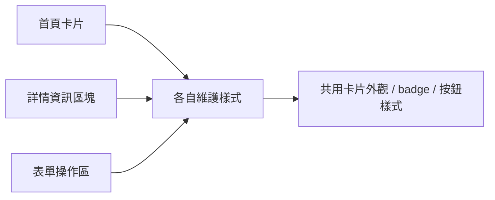
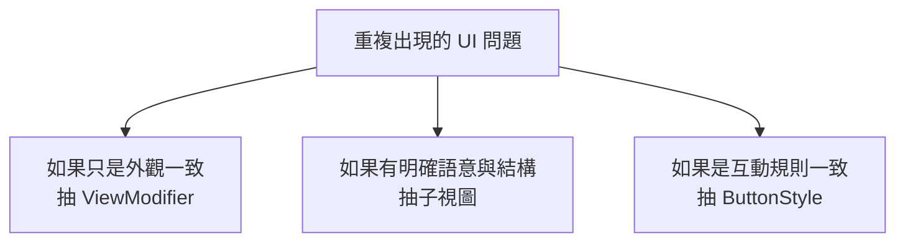
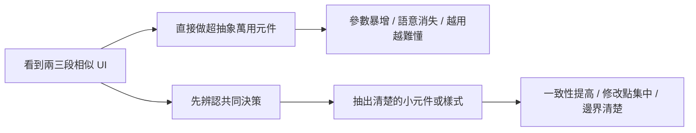

# 第 06 章 元件化：把重複畫面變成可重用系統

## 章首摘要

### 這章你會學到什麼

- 為什麼元件化不是「把重複程式碼拆成很多檔案」這麼簡單。
- 什麼時候應該抽出子視圖，什麼時候只需要抽樣式。
- 如何用小而清楚的可重用元件，讓專案開始長出一致性。
- 為什麼「可重用」不等於「越抽象越好」。

### 你會完成哪一段功能

- 把主線專案中重複出現的卡片外觀、狀態標籤與主要按鈕整理成共用元件。
- 讓列表、詳情與表單開始共用同一套視覺語言。
- 建立一個足夠簡單、但已經能支撐後續章節的 UI 基礎層。

### 需要的前置知識

- 已理解第 03 章的狀態與資料流。
- 已理解第 04 章的列表與導航。
- 已理解第 05 章的表單草稿與提交流程。

## 為什麼這一章重要

當專案走到列表、詳情與表單都開始成形的階段，開發者通常會感受到兩種拉扯。

第一種拉扯是視覺上的。你會發現很多區塊其實長得很像：

- 都有圓角卡片背景
- 都有類似的間距與陰影
- 都有一種主要按鈕的風格
- 都有一種狀態標籤的表達方式

第二種拉扯是結構上的。你會開始不舒服地發現：

- 同樣的卡片殼重複了三四次
- 同樣的狀態 badge 在列表和詳情頁各寫一遍
- 表單底部的主要操作按鈕和首頁 CTA 長得幾乎一樣

如果完全不整理，專案很快就會變成一種很微妙的狀態：每一頁都能跑，但每一頁都在用自己的方式長。結果就是需求一改，你得在四五個地方一起找相似片段，改完還不一定完全一致。

但如果抽得太早、太大、太抽象，專案又會走向另一種混亂：檔案變多、名字變空、每個元件都像萬用盒子，最後反而比複製貼上更難理解。

這一章想做的，不是叫你把所有東西都抽掉，而是幫你建立一個比較穩的判斷方式：什麼值得整理成可重用元件，什麼只需要抽成樣式，什麼現在先不要碰。

## 開場：真正讓專案變亂的，通常不是重複，而是不一致

延續前幾章的主線專案，我們現在已經有：

- 首頁上的摘要卡片
- 習慣列表列項
- 習慣詳情頁的資訊區塊
- 新增與編輯共用的表單

到這個階段，讀者通常會開始注意到一件事：這些畫面雖然功能不同，但有很多相似的視覺語言。

例如：

- 多個區塊都有圓角卡片底
- 狀態完成時都用綠色語氣
- 主要行動按鈕都希望有一致的強調感
- 區塊標題和次標文字常常採用類似的階層

這時最值得整理的，往往不是「出現兩次就一定要抽」，而是：

`哪些東西應該被視為同一種設計決策，因此未來改其中一個時，其他地方也應該一起改。`

如果你只是因為看到重複就抽，最後可能會抽出一堆沒有共同語意的空殼。如果你從「這些畫面是否應該共享同一種決策」來看，元件化通常就會準很多。

> **觀念提醒**
> 真正該被抽出的，不只是重複的程式碼，而是重複的設計意圖。當多個地方其實代表同一種 UI 決策時，才值得開始共用。

**圖 6-1 從零散重複走向一致元件，不是為了少打字，而是為了一起改**



圖 6-1 想強調的是，元件化的價值不只在減少重複，而是在讓未來的調整可以朝同一個方向一起發生。

## 第一個範例：把卡片外觀、狀態標籤與主要按鈕整理出來

先看一個最小但完整的例子。這段程式碼示範了三種不同層次的整理方式：

- 用 `ViewModifier` 抽出純樣式
- 用小型子視圖抽出結構與語意
- 用 `ButtonStyle` 抽出可重複套用的互動風格

```swift
import SwiftUI

struct Habit: Identifiable {
    let id = UUID()
    var name: String
    var weeklyTarget: Int
    var streakCount: Int
    var isCompletedToday: Bool
}

struct CardSurface: ViewModifier {
    func body(content: Content) -> some View {
        content
            .padding(16)
            .background(Color(uiColor: .secondarySystemBackground))
            .clipShape(RoundedRectangle(cornerRadius: 20, style: .continuous))
    }
}

extension View {
    func cardSurface() -> some View {
        modifier(CardSurface())
    }
}

struct HabitStatusBadge: View {
    let isCompletedToday: Bool

    var body: some View {
        Label(
            isCompletedToday ? "今天已完成" : "今天待完成",
            systemImage: isCompletedToday ? "checkmark.circle.fill" : "circle"
        )
        .font(.caption.weight(.semibold))
        .padding(.horizontal, 10)
        .padding(.vertical, 6)
        .foregroundStyle(isCompletedToday ? .green : .secondary)
        .background(
            Capsule()
                .fill(isCompletedToday ? Color.green.opacity(0.12) : Color.gray.opacity(0.12))
        )
    }
}

struct SectionHeader: View {
    let title: String
    let subtitle: String?

    var body: some View {
        VStack(alignment: .leading, spacing: 4) {
            Text(title)
                .font(.headline)

            if let subtitle {
                Text(subtitle)
                    .font(.subheadline)
                    .foregroundStyle(.secondary)
            }
        }
    }
}

struct AppPrimaryButtonStyle: ButtonStyle {
    func makeBody(configuration: Configuration) -> some View {
        configuration.label
            .font(.headline)
            .frame(maxWidth: .infinity)
            .padding(.vertical, 14)
            .background(
                RoundedRectangle(cornerRadius: 16, style: .continuous)
                    .fill(Color.accentColor.opacity(configuration.isPressed ? 0.75 : 1))
            )
            .foregroundStyle(.white)
            .scaleEffect(configuration.isPressed ? 0.98 : 1)
    }
}

struct HabitSummaryCard: View {
    let habit: Habit

    var body: some View {
        VStack(alignment: .leading, spacing: 14) {
            SectionHeader(
                title: habit.name,
                subtitle: "每週目標 \(habit.weeklyTarget) 次"
            )

            HStack {
                HabitStatusBadge(isCompletedToday: habit.isCompletedToday)

                Spacer()

                Text("連續 \(habit.streakCount) 天")
                    .font(.subheadline.weight(.medium))
                    .foregroundStyle(.secondary)
            }
        }
        .cardSurface()
    }
}

struct HabitEditorActions: View {
    let canSave: Bool
    let onSave: () -> Void

    var body: some View {
        Button("儲存變更") {
            onSave()
        }
        .buttonStyle(AppPrimaryButtonStyle())
        .disabled(!canSave)
        .opacity(canSave ? 1 : 0.5)
    }
}

struct ReusableComponentsSampleView: View {
    let habit = Habit(
        name: "晨間伸展",
        weeklyTarget: 5,
        streakCount: 12,
        isCompletedToday: true
    )

    var body: some View {
        VStack(spacing: 20) {
            HabitSummaryCard(habit: habit)

            HabitEditorActions(canSave: true) {
                // 這裡先示意儲存行為
            }
        }
        .padding()
    }
}

#Preview {
    ReusableComponentsSampleView()
}
```

這個範例看起來只是抽出了幾個小元件，但它其實很完整地示範了元件化的三種層級：

- `cardSurface()` 抽的是純外觀風格
- `HabitStatusBadge` 抽的是一個有明確語意的小元件
- `AppPrimaryButtonStyle` 抽的是互動按鈕的共同規則

這幾種抽法雖然都在做「重用」，但它們解決的問題並不一樣。這也是為什麼元件化最重要的，不是拆的數量，而是拆的理由。

> **延伸實戰**
> 試著把前一章的 `HabitFormView` 下方儲存按鈕，改成套用 `AppPrimaryButtonStyle()`。觀察一下：畫面會不會立刻開始和首頁、詳情頁有更一致的語氣？

**圖 6-2 抽結構、抽樣式、抽互動，其實是三種不同決策**



圖 6-2 的重點是，元件化不是單一路線。你要先分辨正在重複的，到底是樣式、結構，還是互動規則。

## 從這個範例看見元件化的核心

### 1. 元件化不是單純拆檔案，而是把責任變清楚

很多人第一次聽到「元件化」，會直覺把它理解成：把一個大 View 拆成很多小 View。這當然可能是結果之一，但不是目的。

真正有價值的元件化，通常會讓下面幾件事變清楚：

- 什麼是某個畫面反覆出現的共同結構
- 什麼只是共同樣式
- 哪些地方應該留給父視圖決定
- 哪些地方可以交給子元件自己封裝

如果你只是把一個長檔案切成五個小檔案，但責任沒有更清楚，讀者只會得到更多檔案，而不是更好的結構。

因此可以先把這句話記住：

`元件化真正帶來的，不是更碎，而是更清楚。`

> **觀念提醒**
> 一個元件值不值得存在，不是看它能不能被搬到別的檔案，而是看它搬出去之後，責任是否因此更明確。

### 2. 抽樣式和抽結構，通常不是同一件事

在範例裡，`cardSurface()` 和 `HabitStatusBadge` 都是可重用，但它們不屬於同一種類型。

`cardSurface()` 比較像是在說：

- 這種卡片表面長相在很多地方都會重複出現
- 但它本身不代表某種特定商業語意
- 所以把它做成 modifier 很自然

而 `HabitStatusBadge` 則是在說：

- 這不只是某個顏色樣式
- 它代表的是「習慣今日完成狀態」這種具體語意
- 所以讓它成為一個小 View，會比把一堆字體和顏色散在各處更清楚

這個差異非常重要。因為很多專案會亂，就是把所有可重用的東西都一律抽成同一種形式，結果樣式、結構和語意全部混在一起。

### 3. 好元件不是最抽象，而是最貼近它的用途

來看兩種不同的命名方向：

- `HabitStatusBadge`
- `FlexibleLabelWithOptionalIconAndCapsuleBackground`

第二種也許看起來更通用，但實際上它通常比較難懂，也更容易一路長成參數過多的萬用元件。

當我們說「可重用」時，不代表元件一定要抽象到能用在所有地方。很多時候，更好的做法反而是保留貼近用途的語意名稱，讓讀者一看就知道它是幹嘛的。

這也是為什麼：

`可重用` 不等於 `最大公約數元件`

你真正該追求的是：

- 名字清楚
- 邊界清楚
- 責任清楚

只要這三件事成立，就算它暫時只在兩三個地方被用到，它也依然可能是一個好的元件。

> **常見陷阱**
> 很多元件之所以越抽越難用，不是因為「抽出來」這件事錯了，而是因為一開始就太急著追求萬用，結果把語意抽掉，只剩下難以理解的參數組合。

### 4. 什麼時候值得抽成元件

這裡有一個很實用的判斷方式。當你看到某段 UI 反覆出現時，可以先問自己四個問題：

1. 這些地方是不是共享同一種設計決策？
2. 未來如果我改其中一個，其它地方是不是也應該一起改？
3. 這段內容是否有清楚的語意邊界？
4. 抽出來之後，會不會比留在原地更好懂？

如果四題裡大多數答案都是「是」，那通常很值得抽。

反過來，如果你只是看到兩段程式長得有點像，但：

- 一個是商業邏輯重的區塊
- 一個只是臨時展示 UI
- 或者抽出來之後名稱反而很難下

那先不要急著抽，通常也沒關係。

### 5. 商業邏輯和樣式邏輯不要纏在一起

元件化時另一個常見問題，是把畫面樣式與業務規則一起塞進元件內部。

例如一個狀態 badge，如果它除了決定顏色和 icon，還在裡面偷偷處理：

- 是否允許點擊完成
- 某種會員權限判斷
- 某段分析事件上報

這個元件很快就會變得既不像單純樣式，也不像純商業元件，而是什麼都摻一點。

更穩的做法通常是：

- 樣式元件只關心畫面如何呈現
- 資料與行為決策留在更外層

這也是為什麼 `HabitEditorActions` 只接 `canSave` 和 `onSave`，而不是自己決定「何時應該能儲存」。它把互動外觀整理起來，但不偷接管驗證邏輯本身。

> **觀念提醒**
> 好元件會幫你收斂責任，而不是偷偷吸走更多責任。當一個元件開始什麼都懂，通常就是邊界要模糊了。

### 6. 元件化應該讓專案更一致，而不是更神祕

做完一輪元件化之後，一個很好的檢查問題是：

`如果一位新同事今天打開這個專案，他會更快看懂，還是更難找到真正的內容？`

如果答案是更難看懂，那表示元件化可能走偏了。因為我們整理元件的目的，不是讓程式看起來更高級，而是讓一致性更好、修改點更集中、理解成本更低。

所以有時候，最好的元件化成果不是「哇，好抽象」，而是：

- 卡片真的長得更一致了
- 按鈕風格不再四散各處
- 狀態標籤的語氣變穩了
- 檔名與元件名一眼就知道用途

### 7. 先整理穩定重複，再整理例外情境

這章也很值得提醒讀者：不要一開始就拿最特殊、最有例外的畫面來做元件設計。

元件化最適合從這些地方下手：

- 最穩定重複的卡片殼
- 最常出現的按鈕風格
- 最清楚的狀態標籤
- 最固定的標題區塊

因為這些地方規律最明顯、語意最穩、收益也最高。

等到這些基礎元件站穩之後，再回頭看那些有很多特例的區塊，你通常會更知道哪些該留在外層、哪些真的值得再抽。

**圖 6-3 抽太早容易變成萬用黑盒；抽得準才會變成清楚系統**



圖 6-3 的重點是，元件化不是比誰抽得早、抽得大，而是比誰抽得準。

## 接回主線專案：讓這個 App 開始有自己的視覺語言

回到「習慣養成 App」這條主線，這一章完成之後，專案會出現一個很重要但很容易被低估的變化：它開始不再只是幾頁功能剛好能跑的 SwiftUI 畫面，而是開始長出自己的共同語言。

現在，我們已經能把一些穩定重複的決策整理起來：

- 卡片都使用相近的表面語言
- 狀態 badge 有一致的表達方式
- 主要行動按鈕有一致的強調層級
- 標題與副標的階層開始穩定

這件事的價值會在後面幾章越來越明顯：

- 第 07 章做動畫時，元件一致性會讓互動回饋更自然
- 第 10 章談架構時，畫面層也會更容易切責任
- 第 11 章做 Preview 時，你可以更容易針對單一元件建立情境

> **延伸實戰**
> 試著回頭看第 4 章的 `HabitDetailView` 和第 5 章的表單頁，把其中一到兩個區塊改用 `cardSurface()` 或 `SectionHeader`。觀察一下：專案是不是開始比較像同一個產品，而不是幾個分開長出來的頁面。

## 本章重點整理

- 元件化的目標不是拆得更多，而是讓責任更清楚。
- 可重用的東西通常分成三類：樣式、結構、互動規則。
- 好元件不一定最抽象，但通常最貼近用途。
- 當多個地方共享同一種設計決策時，最值得整理成共用元件。
- 元件化如果讓理解成本上升，就表示可能抽得太大或太早了。

## 本章小結

如果前一章讓你理解的是「表單中的輸入值不一定等於正式資料」，那這一章要進一步補上的是：

`畫面中的重複，也不一定應該用同一種方式整理。`

有些東西適合抽成樣式，有些適合抽成有語意的小元件，有些則只需要保持一致而不必急著抽。只要你開始從責任、語意與共同決策來看元件化，專案就會慢慢從「很多 SwiftUI 畫面」長成「一個有系統的產品」。

下一章我們會接著往下走，開始替這些畫面加上更真實的動態回饋與互動節奏。

## 練習題

1. 基礎題：把第 4 章或第 5 章裡的一個重複卡片區塊改成套用 `cardSurface()`。
2. 進階題：替專案新增一個共用的次要按鈕樣式，並比較它和 `AppPrimaryButtonStyle` 應該共享什麼、不共享什麼。
3. 延伸題：找出目前專案裡一個「看似重複，但其實不適合抽成同一個元件」的例子，並說明原因。

## 寫作備註

- 可補一個小專欄：什麼時候應該抽 `ViewModifier`，什麼時候應該抽小型子視圖。
- 第 07 章的動畫示例可直接套用這裡的共用元件，讓動態回饋看起來更一致。
- 這章最重要的是建立元件化判斷力，不是列出所有可抽方式。
