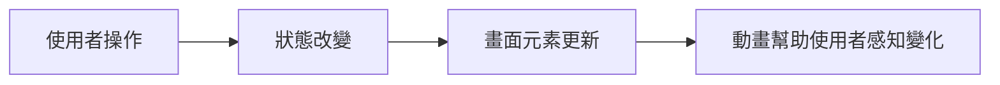
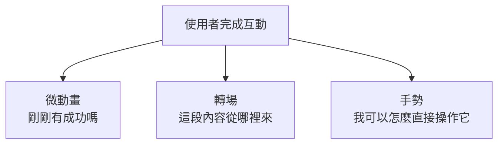
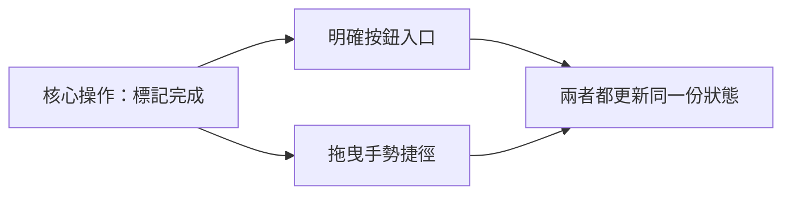

# 第 07 章 動畫、轉場與手勢互動

## 章首摘要

### 這章你會學到什麼

- 為什麼動畫在 SwiftUI 裡本質上是狀態變化的可視化，而不只是效果。
- 什麼情況適合用微動畫，什麼情況適合用轉場。
- 手勢應該如何和資料狀態搭配，而不是和按鈕互相搶責任。
- 為什麼動態回饋要有節奏，而不是越多越好。

### 你會完成哪一段功能

- 為主線專案中的習慣卡片加上完成切換的微動畫。
- 讓卡片可展開更多資訊，並在出現與收起時加入轉場。
- 用拖曳手勢做一個快速完成操作，讓互動更接近真實產品。

### 需要的前置知識

- 已理解第 03 章的狀態與資料流。
- 已理解第 06 章的元件化與共用樣式。

## 為什麼這一章重要

很多人在剛接觸 SwiftUI 動畫時，最容易出現兩種極端。

第一種極端是完全不敢碰動畫，覺得它像是一種很花俏、很後期才需要的東西。第二種極端則剛好相反，看到畫面哪裡能動，就全部加上去，結果整個 App 像在同時表演五種不同節奏。

這兩種做法其實都忽略了一件事：對產品來說，好的動態回饋不是為了炫，而是為了幫助使用者理解「剛剛發生了什麼」。

當使用者打卡完成一個習慣時，他需要知道：

- 這次操作有沒有成功
- 畫面哪裡被影響了
- 哪個區塊是因為他的操作而改變

當使用者展開一張卡片時，他也需要知道：

- 是哪塊內容被打開了
- 新出現的資訊和原本那張卡片有什麼關係
- 畫面不是突然跳掉，而是同一個區塊延伸出更多內容

動畫、轉場與手勢如果用得對，會讓畫面更容易被理解；如果用得太多或綁錯地方，則只會讓理解成本上升。這一章的目標，就是讓讀者先建立「動態回饋是資訊設計的一部分」這個觀念。

## 開場：打卡完成這件事，值得被看見

延續主線專案，現在我們的「習慣養成 App」已經有：

- 列表
- 詳情頁
- 表單
- 共用卡片與按鈕樣式

接下來，我們想讓整個 App 更像一個真正被使用的產品，而不是一組靜態頁面。最自然的切入點，就是習慣完成這個最核心的互動。

想像使用者點下「今天完成」時，如果畫面完全沒有回饋，會很容易產生一種遲疑：

- 我剛剛有按到嗎？
- 這筆資料真的變了嗎？
- 上面的進度有沒有更新？

但如果我們讓卡片有一個短而準的動態回應，例如：

- 完成圖示稍微放大再回穩
- 狀態 badge 從灰色轉成綠色
- 展開區塊有一個柔和的出現節奏

那使用者會比較直覺地感受到：這次操作成功了，而且影響的是這張卡片本身。

> **觀念提醒**
> 好的動畫不是讓畫面「更會動」，而是讓使用者更快看懂哪個狀態剛剛改變了。

**圖 7-1 狀態改變先發生，動畫只是把它說清楚**



圖 7-1 想強調的是，動畫不是一個額外附加的表演，而是狀態更新之後，幫助使用者理解變化的方式。

## 第一個範例：完成切換、卡片展開與拖曳手勢

先看一個最小但完整的例子。這段程式碼示範了三種不同層次的動態回饋：

- 用微動畫回應完成切換
- 用 transition 顯示展開內容
- 用拖曳手勢做快速完成操作

```swift
import SwiftUI

struct Habit: Identifiable {
    let id = UUID()
    var name: String
    var streakCount: Int
    var note: String
    var isCompletedToday: Bool
}

struct HabitInteractiveCard: View {
    @State private var habit = Habit(
        name: "晨間伸展",
        streakCount: 12,
        note: "完成後記得補一杯水，讓早晨節奏更穩。",
        isCompletedToday: false
    )

    @State private var isExpanded = false
    @GestureState private var dragOffset: CGFloat = 0

    var body: some View {
        VStack(alignment: .leading, spacing: 14) {
            HStack(spacing: 12) {
                Image(systemName: habit.isCompletedToday ? "checkmark.circle.fill" : "circle")
                    .font(.title2)
                    .foregroundStyle(habit.isCompletedToday ? .green : .secondary)
                    .scaleEffect(habit.isCompletedToday ? 1.08 : 1)
                    .animation(.snappy(duration: 0.28), value: habit.isCompletedToday)

                VStack(alignment: .leading, spacing: 4) {
                    Text(habit.name)
                        .font(.headline)

                    Text(habit.isCompletedToday ? "今天完成了" : "今天還沒完成")
                        .font(.subheadline)
                        .foregroundStyle(.secondary)
                }

                Spacer()

                Label("連續 \(habit.streakCount) 天", systemImage: "flame.fill")
                    .font(.caption.weight(.semibold))
                    .foregroundStyle(.orange)
            }

            HStack {
                Button {
                    withAnimation(.snappy(duration: 0.3)) {
                        habit.isCompletedToday.toggle()
                    }
                } label: {
                    Text(habit.isCompletedToday ? "取消完成" : "標記完成")
                        .frame(maxWidth: .infinity)
                }
                .buttonStyle(.borderedProminent)
                .tint(habit.isCompletedToday ? .green : .accentColor)

                Button {
                    withAnimation(.smooth(duration: 0.28)) {
                        isExpanded.toggle()
                    }
                } label: {
                    Image(systemName: isExpanded ? "chevron.up" : "chevron.down")
                        .font(.headline)
                        .frame(width: 44, height: 44)
                }
                .buttonStyle(.bordered)
            }

            if isExpanded {
                VStack(alignment: .leading, spacing: 10) {
                    Text("今天的小提醒")
                        .font(.subheadline.weight(.semibold))

                    Text(habit.note)
                        .font(.subheadline)
                        .foregroundStyle(.secondary)

                    Text("向右拖曳卡片超過門檻，也可以快速標記完成。")
                        .font(.caption)
                        .foregroundStyle(.secondary)
                }
                .padding(.top, 4)
                .transition(.move(edge: .top).combined(with: .opacity))
            }
        }
        .padding(16)
        .background(
            RoundedRectangle(cornerRadius: 22, style: .continuous)
                .fill(habit.isCompletedToday ? Color.green.opacity(0.12) : Color(uiColor: .secondarySystemBackground))
        )
        .offset(x: max(dragOffset, 0))
        .gesture(
            DragGesture(minimumDistance: 18)
                .updating($dragOffset) { value, state, _ in
                    if value.translation.width > 0 {
                        state = min(value.translation.width, 90)
                    }
                }
                .onEnded { value in
                    guard value.translation.width > 70 else { return }

                    withAnimation(.snappy(duration: 0.32)) {
                        habit.isCompletedToday = true
                    }
                }
        )
        .animation(.smooth(duration: 0.25), value: dragOffset)
    }
}

#Preview {
    HabitInteractiveCard()
        .padding()
}
```

這個範例真正重要的，不是一次用了多少動畫，而是每一個動態都對應到一個具體的使用者理解需求。

- 完成切換時，圖示放大一點點，是在告訴使用者「這次操作成功了」。
- 展開區塊用 transition 出現，是在告訴使用者「這是同一張卡片延伸出的資訊」。
- 拖曳手勢只有在超過門檻時才觸發，是在避免使用者不小心碰一下就改變資料。

換句話說，動態回饋在這裡服務的不是炫技，而是狀態理解。

> **延伸實戰**
> 試著把拖曳完成的門檻從 `70` 改成 `40`，再改成 `110`。你會很快感覺到：手勢互動不是有就好，門檻設定本身也在決定這個互動到底順不順。

**圖 7-2 微動畫、轉場與手勢，其實分別在回答不同問題**



圖 7-2 想強調的是，動態回饋不是一種單一工具；微動畫、轉場與手勢各自解決的是不同層次的理解問題。

## 從這個範例看見動畫、轉場與手勢的核心

### 1. 動畫應該綁在狀態變化上，而不是隨便綁在畫面上

這一章最重要的觀念之一，就是：

`動畫應該跟著狀態走，而不是跟著想像中的畫面效果走。`

在範例裡，我們不是先想「這個圖示要不要跳一下」，而是先想：

- 什麼狀態變了？
- 使用者需要看見哪個變化？
- 哪個動態最能幫他理解這個變化？

因此圖示放大，不是為了可愛，而是因為 `habit.isCompletedToday` 改變之後，這個圖示正好是最值得被強調的元素。

這也是為什麼 SwiftUI 的動畫通常會自然地和 `value:` 或 `withAnimation` 一起出現。因為動畫真正的來源，不是某個獨立的表演，而是狀態改變之後，畫面正在重新描述自己。

> **觀念提醒**
> 先問「哪個狀態變了」，再問「哪個元素應該被看見」。這個順序會讓動畫更準，也更不容易失控。

### 2. 微動畫最適合處理局部、立即、低成本的回饋

完成圖示放大、顏色切換、按鈕 tint 改變，這些都屬於微動畫。它們的共同特徵通常是：

- 影響範圍小
- 回饋時間短
- 使用者一操作就立刻有感

這類動畫的價值很高，因為它們最能直接補上互動的「手感」。很多 App 不是真的功能有問題，而是操作之後少了一個清楚的瞬間回應，讓人不太確定剛剛那一下到底有沒有被接受。

但微動畫也最容易被過量使用。只要每個 icon、每個文字、每個間距都一起動，原本應該很明確的回饋，反而會被一堆不必要的動作稀釋掉。

### 3. 轉場不是裝飾，而是在交代內容和內容之間的關係

在範例裡，展開區塊使用了：

```swift
.transition(.move(edge: .top).combined(with: .opacity))
```

這個轉場之所以合適，不是因為它看起來比較順，而是因為它在視覺上有一個很清楚的語意：這段內容是從目前這張卡片的下方延伸出來的。

也就是說，好的轉場通常會回答這個問題：

`新出現的內容，和原本畫面之間的關係是什麼？`

如果你只是隨便挑一個很酷的轉場，卻沒有讓它和內容關係對上，畫面雖然會動，但使用者未必更懂。

> **常見陷阱**
> 很多轉場之所以顯得突兀，不是因為 API 不夠漂亮，而是因為它沒有在空間感上交代「這段內容是從哪裡來的」。

### 4. 手勢應該補強原本的互動，不是取代所有互動

拖曳快速完成這個設計，是個很適合說明手勢邊界的例子。

為什麼它在這裡成立？

- 因為它補強的是一個本來就存在的核心操作：標記完成。
- 即使用戶完全不會拖曳，畫面上也仍然有按鈕可用。
- 它是加分的快捷方式，不是唯一入口。

這個判斷很重要。因為很多手勢之所以讓人困惑，不是因為手勢本身不好，而是因為設計者把一個沒有明確提示、沒有替代入口的手勢，當成唯一操作方式。

更穩的原則通常是：

- 核心操作要有明顯入口
- 手勢可以作為更流暢的捷徑
- 不要讓手勢和已有按鈕彼此打架

### 5. 手勢門檻與動畫節奏，本身就是產品判斷

在範例裡，我們設定了拖曳超過 `70` 才會標記完成。這個數字乍看像技術細節，但其實它很像產品設計判斷。

如果門檻太低：

- 使用者很容易誤觸
- 手勢變得不可靠

如果門檻太高：

- 使用者會拖得很吃力
- 手勢失去順暢感

同樣地，動畫時長也不是「越明顯越好」。如果完成打卡的回饋拖太長，使用者反而會覺得操作被卡住；如果太短，又會來不及感受到變化。

也就是說，動態細節不只是技術調參，而是在決定互動是否自然。

> **觀念提醒**
> 動畫時長、拖曳門檻、回彈距離，這些看起來像參數的東西，本質上都在影響使用者是否覺得這個互動可信。

### 6. 不是每個變化都值得被動畫化

這一章也非常值得提醒讀者：不要把「狀態有變」自動等同於「應該加動畫」。

通常更值得動畫的，是這些情境：

- 使用者剛剛主動操作過
- 某個局部區塊需要被強調
- 新內容出現時，需要被交代來源

不那麼值得動畫的，常常是這些情境：

- 每一個次要文字都跟著一起動
- 整個大畫面都在同時變形
- 沒有新資訊，只是單純增加存在感

一個很實用的判斷方式是：

`如果把這個動畫拿掉，使用者真的會比較難理解剛剛發生了什麼嗎？`

如果答案是「不會」，那它很可能只是裝飾，而不是回饋。

### 7. 一致的元件基礎，會讓動態回饋更自然

這也是為什麼第 06 章先談元件化，再來談動畫。因為當卡片、badge、按鈕已經有較一致的基礎之後，動態回饋就比較容易長在「相同的視覺語言」上。

例如：

- 相似卡片用相似的展開節奏
- 相似狀態 badge 用相似的顏色切換
- 相似主要按鈕用相近的壓下反饋

這種一致性很重要。因為如果每一頁都用不同的動態語言，使用者雖然感覺到畫面有在動，卻不一定會感覺到這是一個完整的產品。

**圖 7-3 手勢不應該直接取代按鈕，而應該成為更流暢的捷徑**



圖 7-3 想傳達的是，好的手勢通常是在補強核心操作，而不是把它藏起來。

## 接回主線專案：讓這個 App 開始有節奏感

回到「習慣養成 App」這條主線，這一章完成之後，專案會出現一個很明顯的轉變：畫面不只是會變，還會讓使用者感覺到變化是有方向、有節奏、有因果的。

現在，當使用者完成一個習慣時：

- 他能立刻從圖示和顏色知道操作成功
- 他能透過展開內容感受到這張卡片還有更多資訊
- 他能用拖曳這種更直接的方式快速完成操作

這些看起來像小地方，但它們會直接影響使用者對產品的感受：這個 App 到底只是能用，還是真的有被設計過。

而且這些基礎也會直接影響後面幾章：

- 第 08 章的非同步載入需要更清楚的等待與完成回饋
- 第 11 章的 Preview 會很適合拿來驗證不同動畫狀態
- 第 12 章談效能時，也會回頭檢查哪些動畫值得保留、哪些只是負擔

> **延伸實戰**
> 試著替第 4 章的詳情頁新增一個小型展開區塊，例如「最近 7 天摘要」。先不要急著做複雜動畫，只要選一個能交代來源的 transition，觀察它是否真的讓內容更好懂。

## 本章重點整理

- 動畫最重要的功能，是幫使用者理解狀態變化，而不是讓畫面變熱鬧。
- 微動畫適合處理局部且立即的互動回饋。
- 轉場最適合交代內容如何出現、消失，以及它和原區塊的關係。
- 手勢應該補強既有操作，而不是成為沒有提示的唯一入口。
- 動畫時長與手勢門檻都不是小參數，它們會直接影響互動是否自然。

## 本章小結

如果前一章讓你理解的是「元件該怎麼被整理成一致系統」，那這一章要往前補上的就是：

`當狀態改變時，畫面不只要更新，還要讓使用者感覺到它是怎麼更新的。`

很多產品之所以看起來「有做過設計」，不是因為特效多，而是因為每一個動態都在幫使用者建立理解。只要你開始把動畫、轉場與手勢看成資訊設計的一部分，而不是畫面裝飾，你做出來的 SwiftUI App 就會自然穩很多。

下一章我們會接著往下走，面對另一個真實問題：當資料不再只是本地靜態內容，而是開始從外部非同步進來時，畫面、狀態與回饋又該怎麼重新安排。

## 練習題

1. 基礎題：把完成切換的微動畫時長改成兩種不同節奏，並比較哪一種比較像真實產品中的回饋。
2. 進階題：替 `HabitInteractiveCard` 加上一個「完成後短暫顯示鼓勵文字」的效果，思考這個內容該用 transition 還是單純 opacity 動畫。
3. 延伸題：設計一個你自己的快捷手勢，例如向左拖曳展開更多資訊，但同時說明為什麼它不應該取代原本的主要按鈕入口。

## 寫作備註

- 可補一個小專欄：`withAnimation` 與 `.animation(value:)` 在教學中的講法差異。
- 第 08 章可直接承接這章的「等待、完成、出現」節奏，轉進非同步載入狀態。
- 這章最重要的不是示範很多效果，而是建立動態回饋的判斷力。
