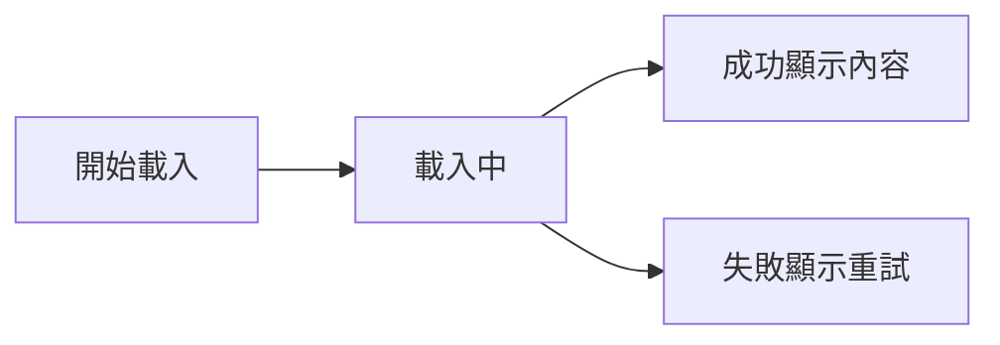
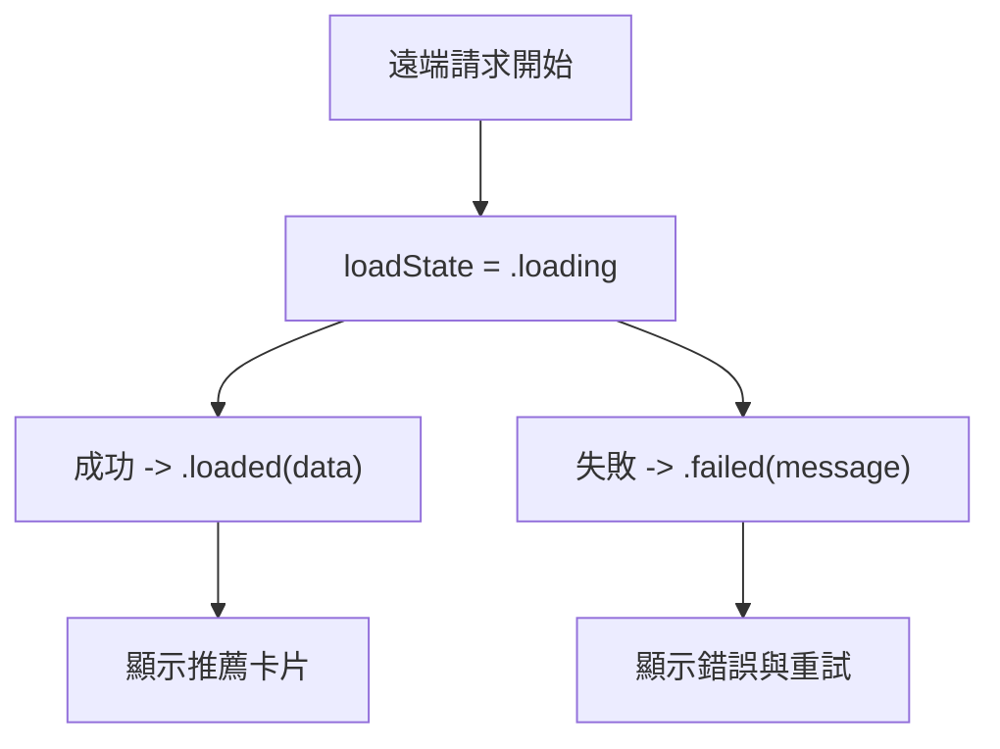
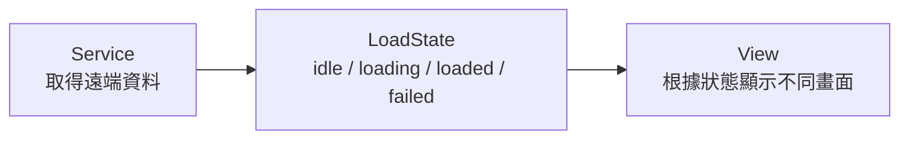

# 第 08 章 非同步資料與網路請求

## 章首摘要

### 這章你會學到什麼

- 為什麼網路請求在 SwiftUI 裡本質上仍然是狀態管理問題。
- 畫面應該如何處理載入中、成功、失敗三種狀態。
- 非同步資料載入應該由哪一層負責，而不是被偷偷塞進畫面描述裡。
- 如何避免重複請求、畫面閃動與只處理成功不處理失敗的常見問題。

### 你會完成哪一段功能

- 為主線專案首頁加入一塊「推薦習慣範本」區塊。
- 讓這塊內容可以從遠端載入，並正確顯示載入中、成功、失敗狀態。
- 加入重試按鈕，讓失敗時不只顯示錯誤，還能讓使用者繼續往前。

### 需要的前置知識

- 已理解第 03 章的狀態與資料流。
- 已理解第 07 章的動態回饋與畫面節奏。

## 為什麼這一章重要

很多人第一次把網路請求接進 SwiftUI 畫面時，會覺得自己正在進入另一個全新的主題，好像從這一章開始，前面談的狀態、資料流、互動節奏都可以先放一邊。

但事實通常正好相反。

當你把遠端資料接進畫面時，你最終還是在回答幾個很熟悉的問題：

- 現在資料還沒來，畫面要顯示什麼？
- 資料來了之後，畫面要怎麼切換成成功狀態？
- 如果請求失敗，使用者看到的是什麼？接下來又能做什麼？

也就是說，非同步處理看似在談「網路」，但對畫面層來說，它首先仍然是狀態變化問題。只是這一次，狀態變化不是來自使用者點按按鈕，而是來自一個需要等待的外部事件。

很多 SwiftUI 專案在這裡開始變亂，通常不是因為 API 太難，而是因為：

- 請求被寫在錯的地方
- 載入中、成功、失敗沒有被明確拆開
- 失敗時只顯示一行錯誤字，卻沒有重試路徑
- 畫面一刷新，就又重打一次請求

這一章的目標，就是先建立一套穩定的理解方式：遠端資料載入不是特殊魔法，而是一種會推動畫面進入不同狀態的流程。

## 開場：一塊遠端內容，就足以改變首頁的節奏

延續主線專案，現在我們想讓首頁多一塊更貼近真實產品的內容：

`推薦習慣範本`

例如，當使用者打開首頁時，我們希望 App 可以從遠端取得幾筆建議：

- 晨間散步
- 晚間閱讀
- 每日補水提醒

這塊內容的價值很高，因為它會讓 App 不再只是顯示本地既有資料，而是開始和外部世界產生連結。

但一旦它是遠端資料，畫面就不再只有「有內容」與「沒內容」兩種狀態。至少會出現三種：

- 還在載入中
- 載入成功
- 載入失敗

這時真正重要的，不是請求程式本身寫得多快，而是你有沒有把這三種畫面狀態說清楚。因為對使用者來說，他不會先看到你的 API client；他先看到的是：

- 為什麼這塊區域現在是空白？
- 是正在等，還是壞掉了？
- 如果壞掉，我能不能再試一次？

> **觀念提醒**
> 網路請求對使用者來說，首先不是技術事件，而是畫面正在經歷的一段等待過程。

**圖 8-1 非同步載入最少會把畫面推進三種狀態**



圖 8-1 想強調的是，遠端資料載入不是一條只有成功終點的直線，而是一段可能進入多種結果的狀態流程。

## 第一個範例：推薦習慣範本的載入流程

先看一個最小但完整的例子。這段程式碼示範了幾件重要的事：

- 用一個明確的 `LoadState` 管理載入中、成功、失敗
- 用 `.task` 在適當時機啟動非同步請求
- 用獨立的 service 處理遠端資料取得
- 失敗時提供重試按鈕，而不是只丟出錯誤文字

```swift
import SwiftUI

struct RecommendedHabitTemplate: Identifiable, Decodable, Hashable {
    let id: UUID
    let title: String
    let summary: String
}

enum RecommendationLoadState {
    case idle
    case loading
    case loaded([RecommendedHabitTemplate])
    case failed(String)
}

struct HabitTemplateService {
    func fetchRecommendedTemplates() async throws -> [RecommendedHabitTemplate] {
        try await Task.sleep(for: .seconds(1.2))

        return [
            RecommendedHabitTemplate(
                id: UUID(),
                title: "晨間散步",
                summary: "起床後先走 10 分鐘，讓身體慢慢醒來。"
            ),
            RecommendedHabitTemplate(
                id: UUID(),
                title: "睡前閱讀",
                summary: "睡前 20 分鐘不看手機，改成閱讀紙本或電子書。"
            ),
            RecommendedHabitTemplate(
                id: UUID(),
                title: "補水提醒",
                summary: "把每天喝水拆成 4 段，降低一次完成的壓力。"
            )
        ]
    }
}

struct RecommendedTemplatesSection: View {
    let service = HabitTemplateService()

    @State private var loadState: RecommendationLoadState = .idle

    var body: some View {
        VStack(alignment: .leading, spacing: 14) {
            Text("推薦習慣範本")
                .font(.headline)

            content
        }
        .padding(16)
        .background(Color(uiColor: .secondarySystemBackground))
        .clipShape(RoundedRectangle(cornerRadius: 20, style: .continuous))
        .task {
            await loadIfNeeded()
        }
    }

    @ViewBuilder
    private var content: some View {
        switch loadState {
        case .idle, .loading:
            HStack(spacing: 10) {
                ProgressView()
                Text("正在載入推薦內容…")
                    .foregroundStyle(.secondary)
            }

        case .loaded(let templates):
            VStack(alignment: .leading, spacing: 12) {
                ForEach(templates) { template in
                    VStack(alignment: .leading, spacing: 4) {
                        Text(template.title)
                            .font(.subheadline.weight(.semibold))

                        Text(template.summary)
                            .font(.subheadline)
                            .foregroundStyle(.secondary)
                    }
                    .frame(maxWidth: .infinity, alignment: .leading)
                    .padding(12)
                    .background(Color.blue.opacity(0.06))
                    .clipShape(RoundedRectangle(cornerRadius: 14, style: .continuous))
                }
            }

        case .failed(let message):
            VStack(alignment: .leading, spacing: 10) {
                Text(message)
                    .font(.subheadline)
                    .foregroundStyle(.secondary)

                Button("重新載入") {
                    Task {
                        await reload()
                    }
                }
                .buttonStyle(.borderedProminent)
            }
        }
    }

    @MainActor
    private func loadIfNeeded() async {
        guard case .idle = loadState else { return }
        await reload()
    }

    @MainActor
    private func reload() async {
        loadState = .loading

        do {
            let templates = try await service.fetchRecommendedTemplates()
            loadState = .loaded(templates)
        } catch {
            loadState = .failed("目前暫時無法載入推薦內容，請稍後再試。")
        }
    }
}

struct HomeView: View {
    var body: some View {
        ScrollView {
            VStack(alignment: .leading, spacing: 20) {
                Text("今天的習慣")
                    .font(.largeTitle.bold())

                RecommendedTemplatesSection()
            }
            .padding()
        }
    }
}

#Preview {
    HomeView()
}
```

這個範例最值得讀者注意的，不是它怎麼打 API，而是它怎麼把非同步流程翻譯成畫面可以理解的狀態。

- `idle` 代表還沒開始
- `loading` 代表正在等待
- `loaded` 代表成功拿到資料
- `failed` 代表這次沒有成功，且畫面需要提供下一步

也就是說，這份遠端資料不是直接塞進畫面裡，而是先經過一條狀態流程，再由畫面根據不同狀態決定要呈現什麼。

> **延伸實戰**
> 試著把 `Task.sleep` 的等待時間改成更短或更長。你會感受到：同樣一個載入畫面，等待時間不同，使用者對「這塊內容是不是卡住了」的體感也會很不一樣。

**圖 8-2 畫面真正管理的，不是請求本身，而是請求結果對應的 UI 狀態**



圖 8-2 想強調的是，對 SwiftUI 畫面來說，請求不只是程式流程，而是會直接驅動畫面切換的狀態來源。

## 從這個範例看見非同步資料與網路請求的核心

### 1. 非同步處理首先是 UI 狀態問題

這一章最重要的觀念，可以濃縮成一句話：

`網路請求對畫面層來說，首先是狀態問題，其次才是傳輸問題。`

當資料來自遠端時，畫面最需要被回答的問題不是「API 細節是什麼」，而是：

- 現在是不是正在等？
- 成功後要長成什麼樣？
- 失敗後還能不能繼續往前？

只要這三個問題沒有被拆清楚，畫面就很容易出現奇怪的空白、閃動或難以理解的錯誤訊息。

這也是為什麼很多成熟的非同步 UI，第一步都不是去談很複雜的 networking 架構，而是先明確把畫面分成：

- loading
- loaded
- failed

只要這三層站穩，後面的擴充通常都會輕鬆很多。

> **觀念提醒**
> 一個畫面能不能穩定處理遠端資料，常常不取決於它用了多高級的網路工具，而取決於它有沒有先把 UI 狀態切清楚。

### 2. 請求應該在適當的生命時機啟動，而不是偷放進 `body`

這一章也一定要再次提醒讀者：非同步請求不能被偷塞進畫面描述流程中。

像這樣的寫法就很危險：

```swift
var body: some View {
    let _ = fetchRecommendedTemplates()

    return Text("推薦內容")
}
```

這種做法的問題不在語法，而在責任。因為 `body` 可能被重算很多次，只要它一重算，就可能再觸發一次請求。結果就是：

- 重複打 API
- 畫面閃動
- 載入狀態來回覆蓋

在範例裡，我們用 `.task` 做這件事，原因很簡單：它比較貼近「這個區塊出現在畫面上時，開始載入資料」這種生命時機。

這也延續了前面幾章反覆建立的原則：

- `body` 用來描述畫面
- 載入資料是副作用
- 副作用應該放在比較合理的觸發點

### 3. 只處理成功，等於其實還沒處理完整

很多非同步範例最容易讓初學者誤解的地方，就是它們只示範成功狀態。讀者照著做完之後，畫面確實會把資料顯示出來，但只要網路慢一點、壞一點、資料格式不對，整個畫面就不知道自己是什麼狀態。

所以真正完整的非同步畫面，至少要回答三件事：

1. 還在等的時候顯示什麼？
2. 成功之後顯示什麼？
3. 失敗之後顯示什麼？

如果你只完成了第 2 題，其實這個功能還只做了一半。

> **常見陷阱**
> 很多 App 的遠端區塊在理想情況下看起來都能跑，但一遇到失敗就變成空白或卡死。這通常不是 API 太複雜，而是失敗狀態從一開始就沒有被設計進畫面。

### 4. 錯誤訊息的重點，不只是告訴使用者出錯了

在範例裡，失敗狀態不是只顯示一行錯誤文字，而是同時給出一個「重新載入」按鈕。

這件事非常重要。因為對使用者來說，知道出錯只是第一步；更重要的是，他接下來能不能繼續做事。

所以失敗畫面的設計通常至少要包含兩個元素：

- 一個使用者看得懂的說明
- 一個合理的下一步

這個下一步可能是：

- 重試
- 返回
- 改看本地預設內容
- 等待自動重新整理

但不管是哪一種，都比單純丟出技術錯誤訊息更有產品意義。

### 5. 避免重複請求，通常比你想像中更重要

在範例裡，我們用了這段邏輯：

```swift
guard case .idle = loadState else { return }
```

它看起來很小，但其實是在避免一個很實際的問題：同一個區塊因為重繪、切換或再次出現時，不必要地重複請求資料。

當然，在真實專案裡，你可能還會有更多策略，例如：

- 加快取
- 拉長重新整理間隔
- 用 `task(id:)` 根據依賴值變化再重抓

但在這本書的這個階段，先建立一個基礎直覺就很重要：

`不是每次畫面出現，都應該毫無判斷地重新打一次請求。`

### 6. service 的存在，是為了讓畫面不要直接扛所有事情

範例裡我們把遠端取得資料的行為放在：

```swift
struct HabitTemplateService
```

這樣做的目的，不是為了提早講很複雜的架構，而是為了幫讀者建立一個簡單但關鍵的分工：

- 畫面決定現在要顯示哪種狀態
- service 負責怎麼拿到資料

只要先把這兩層分開，你後面要做的事情就會容易很多：

- 測試成功與失敗情境
- 替換假資料與真資料
- 調整資料來源而不重寫整個畫面

這種分工不是為了炫技，而是為了讓畫面不要又重新變成一個什麼都知道、什麼都做的巨大 View。

> **觀念提醒**
> service 不一定要很重，但它存在的價值通常很明確：讓畫面專心處理顯示狀態，讓資料取得邏輯有自己的位置。

### 7. 等待中的畫面，也是一種產品體驗

這章最後很值得提醒讀者：載入中的畫面不是過場空檔，而是產品體驗的一部分。

如果載入中的區塊完全空白，使用者很難知道：

- 這塊內容是還沒來
- 還是根本沒有內容
- 還是程式壞掉了

相反地，如果載入中的畫面能清楚交代：

- 正在做什麼
- 大概要等一下
- 成功後會出現哪類內容

那使用者就比較能接受這段等待。

這其實也和前一章談的動態回饋很有關。非同步畫面的等待、出現與錯誤狀態，某種程度上也是一種節奏設計。只是這次節奏不是按鈕按下去的瞬間，而是一段資料尚未回來的時間。

**圖 8-3 service、load state 與畫面顯示，三者最好分層**



圖 8-3 想傳達的是，畫面真正需要管理的是狀態切換，而不是把取得資料、解讀資料、顯示資料全部揉成一團。

## 接回主線專案：讓首頁開始和外部世界接上線

回到「習慣養成 App」這條主線，這一章完成之後，首頁會出現一個非常關鍵的升級：它不再只是呈現本地靜態資料，而是開始有一塊內容能從外部世界流進來。

這個升級很重要，因為它代表專案開始碰到更真實的產品問題：

- 有些資料不是立即就有
- 有些內容可能會失敗
- 有些等待需要被設計

現在，當使用者打開首頁時：

- 他能看見推薦習慣範本正在載入
- 成功時會自然切換成內容
- 失敗時不會只得到空白，而是能再試一次

這些都是非常真實的產品經驗，也會直接影響後面幾章：

- 第 09 章的本地持久化會和這裡形成遠端 / 本地的對照
- 第 11 章做 Preview 時，會很適合用不同載入狀態建立測試情境
- 第 12 章談除錯與效能時，也會回頭處理重複請求與畫面閃動

> **延伸實戰**
> 試著替 `RecommendedTemplatesSection` 加上一個「上次更新於剛剛」的輔助文字。先不用真的做時間格式化，只要思考：這個資訊屬於遠端資料本身，還是屬於畫面載入流程的一部分？

## 本章重點整理

- 非同步處理對畫面層來說，首先是狀態管理問題。
- 載入中、成功、失敗最好一開始就被當成完整功能的一部分設計。
- 請求應該在合理的生命時機啟動，而不是被偷偷寫進 `body`。
- 失敗狀態最好除了顯示錯誤，也提供使用者下一步。
- service 與畫面分層，會讓非同步程式更容易理解與維護。

## 本章小結

如果前一章讓你理解的是「動態回饋要幫助使用者理解狀態變化」，那這一章要進一步補上的就是：

`當資料來自遠端時，等待本身也會把畫面推進不同狀態。`

很多遠端功能之所以難用，不是因為網路一定很慢，而是因為畫面沒有誠實地把等待、成功與失敗說清楚。只要你開始把非同步載入看成一條狀態流程，而不是只看成一次 API 呼叫，SwiftUI 畫面通常就會穩很多。

下一章我們會接著往下走，看看當資料不只來自遠端，還需要被保存在本地時，App 又該怎麼處理「暫時畫面狀態」與「長期資料」之間的分工。

## 練習題

1. 基礎題：替 `RecommendedTemplatesSection` 再加入一種空資料狀態，例如請求成功但沒有推薦內容，並思考它應不應該和錯誤狀態共用同一個畫面。
2. 進階題：把 `RecommendationLoadState` 擴充成能區分 `idle` 與 `refreshing`，比較第一次載入和使用者主動重整時，畫面是否應該完全一樣。
3. 延伸題：試著把 `HabitTemplateService` 換成一個可注入的假 service，讓你可以在 Preview 裡分別展示成功與失敗情境。

## 寫作備註

- 可補一個小專欄：為什麼 `.task` 很適合教學中的首次載入情境，但不代表所有請求都只能用這個入口。
- 第 09 章可直接承接這裡的遠端資料，對照本地持久化的角色。
- 這章最重要的不是 API client 細節，而是讓讀者真正把非同步載入理解成畫面狀態管理。
