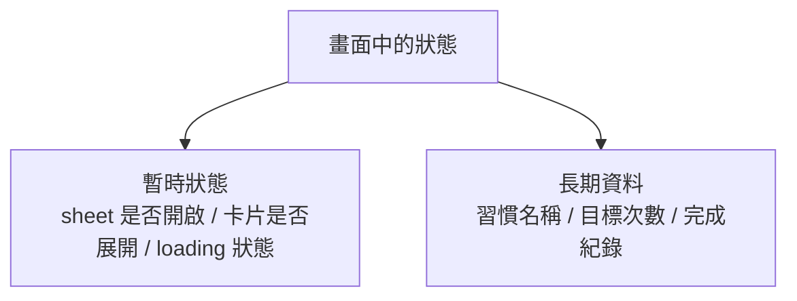
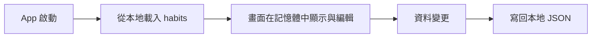
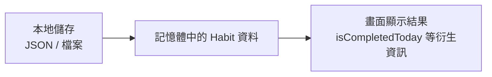

# 第 09 章 本地資料與持久化

## 章首摘要

### 這章你會學到什麼

- 為什麼持久化的核心，不只是把資料存起來，而是分清楚哪些資料值得被長期保存。
- 暫時畫面狀態與長期資料，為什麼應該分開思考。
- 如何用一個清楚的本地儲存層，把習慣資料安全地寫入與讀回。
- 為什麼畫面不應該直接知道太多儲存細節。

### 你會完成哪一段功能

- 讓主線專案中的習慣資料在 App 關掉再開後仍然存在。
- 把完成紀錄一併寫進本地資料，讓打卡結果不只停留在當次畫面。
- 建立一個簡單但清楚的本地儲存層，為後面架構章節打底。

### 需要的前置知識

- 已理解第 03 章的狀態與資料流。
- 已理解第 08 章的載入狀態與 service 分層觀念。

## 為什麼這一章重要

前幾章的主線專案，雖然已經逐漸像一個真正的 App，但其實還有一個很大的產品缺口：如果使用者把 App 關掉再打開，很多資料就會像從來沒存在過一樣消失。

對教學來說，這是一個非常關鍵的分水嶺。因為從這一章開始，我們不再只處理「這一刻畫面上該顯示什麼」，而是要開始思考：

- 哪些資料只在當下畫面有意義？
- 哪些資料應該被留到下次啟動時仍然存在？
- 畫面中的狀態，哪些屬於 UI 暫時狀態，哪些屬於產品真正的長期資料？

如果這三件事沒有拆開，專案很快就會變得很難維護。最常見的情況是：

- 把本該只存在於畫面中的狀態也一起存起來
- 把本該被保存的資料只放在當前記憶體裡
- 讓 View 直接碰檔案路徑、編碼細節與錯誤處理

於是專案會變成一種很尷尬的狀態：表面上可以運作，但資料的生命週期完全不清楚。這一章的目標，就是先把這條線畫出來，讓「畫面狀態」和「長期資料」各自回到合理的位置。

## 開場：App 關掉之後，哪些東西應該留下來

延續主線專案，現在我們已經有：

- 習慣列表
- 習慣詳情
- 新增與編輯表單
- 遠端推薦內容

如果你現在把 App 關掉再重開，你可能會開始問幾個很真實的產品問題：

- 我剛新增的習慣還在嗎？
- 我今天打卡完成的狀態還記得嗎？
- 我的每週目標和備註有沒有留下來？

但同時，也有一些東西其實不該被保留，例如：

- 新增表單是不是目前正開著
- 某張卡片是不是正展開
- 推薦內容區塊剛剛是不是正在 loading

這裡最重要的，不是先選哪個持久化工具，而是先學會分辨：

`哪些資料代表產品本身，哪些狀態只代表這一瞬間的畫面。`

只要這條界線沒畫清楚，存得再快、工具再新，最後專案都還是會亂。

> **觀念提醒**
> 持久化真正要保存的，不是「畫面現在長怎樣」，而是「產品真正需要記住什麼」。

**圖 9-1 暫時畫面狀態與長期資料不要混成一團**



圖 9-1 想強調的是，不是每一個會變的值都值得被持久化。真正該保存的，是對產品本身有長期意義的資料。

## 第一個範例：把習慣資料寫進本地 JSON 檔

這一章我刻意不用太早引入更大型的資料框架，而是先用本地 JSON 檔做示範。原因很簡單：這種做法最能把「載入、編輯、寫回」的責任線清楚畫出來。

先看一個最小但完整的例子。這段程式碼示範了幾件重要的事：

- 用 `HabitLocalStore` 負責本地讀寫
- 用 `Codable` 把資料轉成可保存的格式
- 用 `completedDates` 保存真正的完成紀錄
- 在畫面啟動時載入資料，在每次變更後寫回本地

```swift
import SwiftUI

struct Habit: Identifiable, Codable, Hashable {
    let id: UUID
    var name: String
    var weeklyTarget: Int
    var note: String
    var reminderEnabled: Bool
    var completedDates: [Date]

    init(
        id: UUID = UUID(),
        name: String,
        weeklyTarget: Int,
        note: String,
        reminderEnabled: Bool,
        completedDates: [Date] = []
    ) {
        self.id = id
        self.name = name
        self.weeklyTarget = weeklyTarget
        self.note = note
        self.reminderEnabled = reminderEnabled
        self.completedDates = completedDates
    }

    var isCompletedToday: Bool {
        completedDates.contains { Calendar.current.isDateInToday($0) }
    }

    mutating func markCompletedToday() {
        guard !isCompletedToday else { return }
        completedDates.append(.now)
    }
}

enum HabitsLocalScreenState {
    case idle
    case loading
    case ready
    case failed(String)
}

struct HabitLocalStore {
    private let fileURL = URL.documentsDirectory.appending(path: "habits.json")

    private let encoder: JSONEncoder = {
        let encoder = JSONEncoder()
        encoder.outputFormatting = [.prettyPrinted]
        encoder.dateEncodingStrategy = .iso8601
        return encoder
    }()

    private let decoder: JSONDecoder = {
        let decoder = JSONDecoder()
        decoder.dateDecodingStrategy = .iso8601
        return decoder
    }()

    func loadHabits() throws -> [Habit] {
        guard FileManager.default.fileExists(atPath: fileURL.path) else {
            return []
        }

        let data = try Data(contentsOf: fileURL)
        return try decoder.decode([Habit].self, from: data)
    }

    func saveHabits(_ habits: [Habit]) throws {
        let data = try encoder.encode(habits)
        try data.write(to: fileURL, options: .atomic)
    }
}

struct HabitsPersistentHomeView: View {
    let store = HabitLocalStore()

    @State private var habits: [Habit] = []
    @State private var screenState: HabitsLocalScreenState = .idle
    @State private var persistenceErrorMessage: String?

    var body: some View {
        NavigationStack {
            Group {
                switch screenState {
                case .idle, .loading:
                    ProgressView("正在載入本地資料…")

                case .ready:
                    List {
                        if let persistenceErrorMessage {
                            Section("儲存提醒") {
                                Text(persistenceErrorMessage)
                                    .font(.subheadline)
                                    .foregroundStyle(.secondary)
                            }
                        }

                        Section("你的習慣") {
                            ForEach(habits) { habit in
                                HStack {
                                    VStack(alignment: .leading, spacing: 4) {
                                        Text(habit.name)
                                            .font(.headline)

                                        Text("每週目標 \(habit.weeklyTarget) 次")
                                            .font(.subheadline)
                                            .foregroundStyle(.secondary)
                                    }

                                    Spacer()

                                    Button(habit.isCompletedToday ? "已完成" : "完成") {
                                        Task {
                                            await markCompleted(habit.id)
                                        }
                                    }
                                    .buttonStyle(.borderedProminent)
                                    .tint(habit.isCompletedToday ? .green : .accentColor)
                                }
                            }
                            .onDelete { indexSet in
                                Task {
                                    await deleteHabits(at: indexSet)
                                }
                            }
                        }
                    }

                case .failed(let message):
                    VStack(spacing: 12) {
                        Text(message)
                            .foregroundStyle(.secondary)

                        Button("重新載入") {
                            Task {
                                await loadFromDisk()
                            }
                        }
                        .buttonStyle(.borderedProminent)
                    }
                }
            }
            .navigationTitle("習慣")
            .toolbar {
                ToolbarItem(placement: .topBarTrailing) {
                    Button("加入範例資料") {
                        Task {
                            await addSampleHabit()
                        }
                    }
                }
            }
        }
        .task {
            await loadFromDisk()
        }
    }

    @MainActor
    private func loadFromDisk() async {
        switch screenState {
        case .idle, .failed:
            break
        case .loading, .ready:
            return
        }

        screenState = .loading

        do {
            habits = try store.loadHabits()
            persistenceErrorMessage = nil
            screenState = .ready
        } catch {
            screenState = .failed("目前無法讀取本地資料，請稍後再試。")
        }
    }

    @MainActor
    private func addSampleHabit() async {
        habits.append(
            Habit(
                name: "晨間散步",
                weeklyTarget: 5,
                note: "起床後先走 10 分鐘。",
                reminderEnabled: true
            )
        )

        await persistChanges()
    }

    @MainActor
    private func markCompleted(_ id: UUID) async {
        guard let index = habits.firstIndex(where: { $0.id == id }) else { return }
        habits[index].markCompletedToday()
        await persistChanges()
    }

    @MainActor
    private func deleteHabits(at indexSet: IndexSet) async {
        habits.remove(atOffsets: indexSet)
        await persistChanges()
    }

    @MainActor
    private func persistChanges() async {
        do {
            try store.saveHabits(habits)
            persistenceErrorMessage = nil
        } catch {
            persistenceErrorMessage = "資料已更新，但暫時無法寫回本地，請稍後再試。"
        }
    }
}

#Preview {
    HabitsPersistentHomeView()
}
```

這個範例最值得讀者注意的，不是它用了檔案儲存，而是它怎麼處理資料生命週期。

- `Habit` 是要被長期保存的資料模型。
- `completedDates` 代表真正的完成紀錄，而不是只保存一個畫面上的暫時勾選結果。
- `HabitLocalStore` 負責怎麼讀寫檔案。
- `HabitsPersistentHomeView` 只負責畫面與使用者操作。

換句話說，這裡最重要的不是「存成 JSON」，而是「資料從哪裡進來、在記憶體裡怎麼改、什麼時候寫回去」這條線已經開始清楚了。

> **延伸實戰**
> 試著把 `completedDates` 改成先保存一筆固定測試日期，再重新啟動 Preview。你會更直覺地看出：一旦資料真的被視為長期資料，你就會開始思考它的格式是否足夠支撐未來需求。

**圖 9-2 啟動載入、記憶體編輯、寫回本地，是一條完整循環**



圖 9-2 想強調的是，本地持久化不是單次寫檔而已，而是一條「讀進來、改變、再寫回去」的完整資料循環。

## 從這個範例看見本地資料與持久化的核心

### 1. 暫時畫面狀態和長期資料，應該分開思考

這一章最重要的觀念之一，就是：

`不是每個 state 都值得被保存。`

例如在這個專案裡：

值得被保存的資料包括：

- 習慣名稱
- 每週目標次數
- 備註
- 提醒設定
- 完成日期紀錄

不值得被保存的資料則包括：

- 新增表單目前有沒有打開
- 某張卡片是不是正展開
- 推薦區塊是不是正在 loading
- 某個按鈕剛剛有沒有處於壓下狀態

這個區分非常重要。因為如果你把暫時 UI 狀態也一起持久化，App 重新啟動後很容易出現奇怪的殘留情境；反過來，如果你把真正的產品資料只留在記憶體裡，App 一關掉就會全部消失。

> **觀念提醒**
> 畫面狀態是在幫助當下互動，長期資料則是在幫助產品記住使用者。這兩者的責任不同，保存策略也通常不同。

### 2. 本地持久化首先是在回答「什麼算真正資料」

你會發現，當我們決定要把 `Habit` 存下來時，資料模型也開始需要更誠實。

例如前幾章為了教學方便，我們常常用：

```swift
var isCompletedToday: Bool
```

但一旦要做持久化，你就會開始意識到：如果產品真的要記住歷史，那「今天有沒有完成」比較像是一個可以被推導出來的結果，而不是唯一該保存的真相。

因此在這章裡，我們改成保存：

```swift
var completedDates: [Date]
```

然後再由它推導：

- `isCompletedToday`
- 之後可能的連續完成天數
- 某段時間內的完成率

這種調整很值得讓讀者感受到，因為它說明了一件事：當資料真的要被保存下來時，模型通常會開始更貼近真實世界，而不是只貼近目前畫面最方便顯示的樣子。

### 3. 儲存工具可以後換，但資料邊界最好先清楚

這一章我刻意用 JSON 檔做示範，不是因為它對所有產品都最好，而是因為它有一個很大的教學優點：資料的載入與保存路徑非常透明。

你可以清楚看到：

- 檔案在哪裡
- 資料怎麼被編碼
- 什麼時候讀進來
- 什麼時候寫回去

這條路先看清楚之後，你後面要換成其他工具，例如更完整的本地資料框架，也會比較知道自己在替換的是哪一層責任，而不是整個專案都要重新思考。

所以這章最重要的，不是讓讀者立刻背熟某一種本地資料工具，而是先建立這個直覺：

`儲存策略可以替換，但資料邊界與責任分工最好先站穩。`

> **常見陷阱**
> 很多專案一開始就急著綁死某種持久化工具，結果後面才發現資料模型、保存邊界、畫面責任都還沒想清楚，最後反而很難調整。

### 4. 畫面不該直接碰太多持久化細節

在範例裡，`HabitsPersistentHomeView` 知道的事情其實很有限：

- 需要載入資料
- 需要在變更後保存資料
- 載入或保存失敗時，要顯示什麼狀態

但它不需要知道：

- JSON 怎麼編碼
- 檔案路徑長什麼樣
- 日期是怎麼被序列化的

這些細節被收在 `HabitLocalStore` 裡，原因不是為了提早講很重的架構，而是為了避免畫面重新變成一個什麼都做的巨大 View。

只要先把這條分工站穩，之後你要替換儲存方式、加測試、加 migrate 策略時，成本都會低很多。

### 5. 載入本地資料時，畫面一樣需要狀態

這一章很容易被忽略的一點是：即使資料不是從網路來，而是從本地來，畫面仍然需要處理狀態。

在範例裡，我們仍然保留了：

- `.loading`
- `.ready`
- `.failed`

這是很重要的延續。因為只要畫面還有一段「正在讀資料」或「讀取可能失敗」的過程，它本質上仍然是一個狀態流程，只是資料來源改成了本地。

這也剛好和上一章形成很好的對照：

- 第 08 章處理遠端等待
- 第 09 章處理本地保存

但兩章的底層觀念其實是連在一起的：資料來源不同，畫面仍然需要誠實地顯示自己目前處於哪個階段。

> **觀念提醒**
> 本地資料不代表沒有狀態流程。只要還有載入、失敗或寫回這些過程，畫面就仍然需要清楚的狀態管理。

### 6. 每次變更後立即保存，是一種很實用的起點

在範例裡，我們採取的是一種很直觀的策略：

- 新增後保存
- 刪除後保存
- 打卡完成後保存

這種策略的好處是：

- 心智模型簡單
- 不容易漏存
- 很適合教學與中小型專案起步

當然，真實專案裡你可能會進一步優化：

- 批次保存
- 背景保存
- 避免太頻繁寫檔

但在這本書的這個階段，先讓讀者建立一個穩定且不容易出錯的起點，比提早優化更重要。

### 7. 長期資料與畫面模型，最好不要完全混成同一件事

這一章也可以開始讓讀者感受到另一個更深一層的判斷：一個用來被保存的資料模型，和一個純粹為了某頁畫面顯示方便而存在的畫面模型，未必要完全一樣。

例如在這章裡：

- `completedDates` 比較像真正的保存資料
- `isCompletedToday` 比較像從保存資料推導出來的顯示結果

這個差異一旦理解了，後面章節在談架構時就會輕鬆很多。因為你會開始自然地接受一件事：

`畫面要的資料格式，不一定等於儲存層真正保存的格式。`

這不是增加複雜度，而是在為未來需求預留清楚的邊界。

**圖 9-3 儲存層、記憶體狀態與畫面顯示，最好各有自己的位置**



圖 9-3 想傳達的是，保存格式、記憶體資料與畫面呈現結果雖然彼此有關，但不一定要完全長成同一個樣子。

## 接回主線專案：讓這個 App 真正開始記得使用者

回到「習慣養成 App」這條主線，這一章完成之後，專案會出現一個非常關鍵的升級：它開始不只是「當下能用」，而是開始真的能記住使用者。

現在，當使用者：

- 新增一筆習慣
- 修改目標次數
- 打卡完成今天的進度
- 刪除不需要的習慣

這些變更都不再只是當下畫面的一次表演，而是會被留下來，成為下次打開 App 時仍然存在的內容。

這件事的影響非常大，因為它代表專案真正開始從「畫面練習」往「產品原型」走。

而且這章的成果也會直接影響後面幾章：

- 第 10 章談架構時，會更容易說清楚資料層與畫面層的邊界
- 第 11 章做測試時，本地保存與資料讀寫就會變成高價值驗證點
- 第 12 章談除錯時，也會回頭看持久化失敗、模型不一致等問題

> **延伸實戰**
> 試著替 `Habit` 再加入一個 `createdAt` 欄位。先不要急著讓畫面顯示它，只要思考：這類資訊雖然目前不一定用得上，但為什麼它可能更像長期資料，而不是畫面狀態？

## 本章重點整理

- 持久化首先是在回答「哪些資料值得被長期保留」。
- 暫時畫面狀態與長期資料最好分開思考。
- 即使是本地資料，載入與失敗流程仍然是畫面狀態管理的一部分。
- 儲存工具可以替換，但資料邊界與責任分工最好先站穩。
- 畫面模型與保存模型不一定完全相同，衍生結果可以從長期資料推導出來。

## 本章小結

如果前一章讓你理解的是「遠端資料會把畫面推進不同狀態」，那這一章要進一步補上的就是：

`當資料需要被長期記住時，狀態就不只活在畫面上，還會開始擁有自己的生命週期。`

很多專案之所以難維護，不是因為存資料這件事本身太難，而是因為一開始沒有先分清楚：哪些值只是畫面當下的樣子，哪些值才是產品真正想記住的內容。只要這條線畫清楚，持久化就會從一件很重的事，慢慢變成一條可以被理解、被替換、也能被測試的資料流程。

下一章我們會接著往下走，把前面已經逐漸成形的資料層、畫面層與互動層整理進更穩的專案結構，讓這個 App 更接近一個可持續維護的產品。

## 練習題

1. 基礎題：替 `Habit` 再加入一個 `createdAt` 欄位，並確保它也會一起被寫進本地資料。
2. 進階題：替 `HabitLocalStore` 加上一個 `reset()` 方法，思考它應該屬於資料層責任，還是應該由畫面直接處理刪檔行為。
3. 延伸題：試著把 `completedDates` 換成你自己的完成紀錄模型，例如包含日期與備註，並比較這樣的保存格式會如何影響後續畫面設計。

## 寫作備註

- 可補一個小專欄：為什麼這章刻意先用 JSON 檔，而不是直接進到更完整的本地資料框架。
- 第 10 章可直接承接這裡的 `HabitLocalStore`，整理成更清楚的資料層結構。
- 這章最重要的不是某一種儲存技術，而是讓讀者真正理解資料生命週期。
