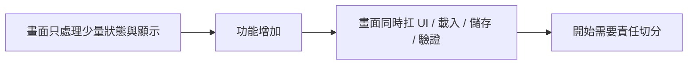
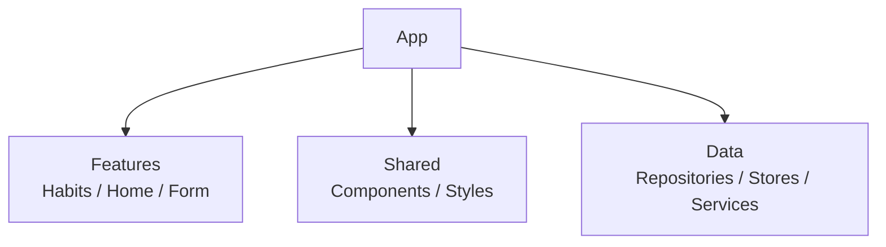
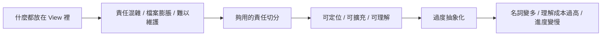

# 第 10 章 架構設計：從單檔案走向可維護專案

## 章首摘要

### 這章你會學到什麼

- 什麼訊號代表專案已經該從「功能先做出來」走向更清楚的結構。
- 畫面層、狀態層與資料層，分別適合承擔什麼責任。
- 如何用一套夠用的專案切分方式，讓功能擴充時不會越長越亂。
- 為什麼「夠用的架構」通常比「最大最全的架構」更適合中型 SwiftUI 專案。

### 你會完成哪一段功能

- 把主線專案整理成 Feature、Shared、Data 三個主要方向。
- 把資料讀寫與遠端載入責任從畫面層移出去。
- 建立一個可以支撐列表、表單、持久化與推薦內容的專案骨架。

### 需要的前置知識

- 已理解第 03 章的狀態與資料流。
- 已理解第 08、09 章的 service 與本地 store 分工。
- 已理解第 06 章的元件化與共用畫面邊界。

## 為什麼這一章重要

很多人一聽到「架構」，就會立刻出現兩種反應。

第一種反應是抗拒，覺得架構這件事太重，像是等到團隊很大、產品很複雜時才需要。第二種反應則剛好相反，一旦開始覺得專案有點亂，就想立刻找一套完整名詞與模式，期待它能一口氣把所有混亂整理掉。

但對這本書正在走的這條路來說，真正有用的架構思考通常比較中間。

我們現在的主線專案其實已經累積了不少東西：

- 列表與詳情頁
- 表單新增與編輯
- 共用元件與樣式
- 遠端推薦內容
- 本地持久化

這代表一個很重要的轉折已經發生了：專案不再只是幾頁可以單獨理解的畫面，而是開始有多條責任線同時存在。

如果這時還把所有東西都塞在畫面檔裡，最常出現的結果就是：

- View 同時在處理 UI、資料載入、儲存與錯誤
- 功能一加，檔案就立刻膨脹
- 類似的責任散落在不同畫面裡，各自長出自己的做法

這一章的目標，不是替讀者推銷某個架構名詞，而是幫他建立一個更根本的判斷：

`當專案開始有多條責任線時，哪些東西該留在畫面層，哪些該被整理出去？`

## 開場：什麼時候真的該談架構

在教學裡，架構最容易被談得太早。因為只要有一個畫面能動，很多人就會開始想問：

- 我要不要先做 ViewModel？
- 要不要先拆 Data、Domain、Presentation？
- 要不要從現在就把每件事都抽成 protocol？

但真正有價值的架構整理，通常不是因為「聽起來應該做」，而是因為你已經看到一些很明確的訊號：

- 同一份資料會被多個畫面共同使用
- 本地與遠端資料邏輯開始同時存在
- 某個 View 既要顯示畫面，又要處理儲存、載入、驗證與錯誤
- 檔案內容長到你每次改一點點都要先重新定位半天

這些訊號出現時，架構整理的價值就會開始非常具體。因為你不是為了「讓程式看起來像大專案」而整理，而是因為責任真的需要被拆開，否則接下來的每一步都會越走越重。

> **觀念提醒**
> 好的架構通常不是提早加上去的層，而是當責任已經開始打結時，幫你把線重新分開的方式。

**圖 10-1 架構需求通常來自責任開始打結，而不是來自名詞焦慮**



圖 10-1 想強調的是，架構需求通常是隨著責任複雜度自然長出來的，而不是一開始就必須硬套上去的框架。

## 第一個範例：把 Habit 功能整理成 Feature、Shared、Data

先看一個最小但完整的例子。這段範例不只是示意 code，而是示意一種夠用的切法：

- `Features` 放功能畫面與功能狀態
- `Shared` 放共用元件與共用樣式
- `Data` 放本地儲存與遠端 service

```swift
import SwiftUI
import Observation

struct Habit: Identifiable, Codable, Hashable {
    let id: UUID
    var name: String
    var weeklyTarget: Int
    var note: String
    var reminderEnabled: Bool
    var completedDates: [Date]

    init(
        id: UUID = UUID(),
        name: String,
        weeklyTarget: Int,
        note: String,
        reminderEnabled: Bool,
        completedDates: [Date] = []
    ) {
        self.id = id
        self.name = name
        self.weeklyTarget = weeklyTarget
        self.note = note
        self.reminderEnabled = reminderEnabled
        self.completedDates = completedDates
    }

    var isCompletedToday: Bool {
        completedDates.contains { Calendar.current.isDateInToday($0) }
    }
}

protocol HabitsRepository {
    func loadHabits() throws -> [Habit]
    func saveHabits(_ habits: [Habit]) throws
}

struct HabitLocalStore: HabitsRepository {
    private let fileURL = URL.documentsDirectory.appending(path: "habits.json")

    func loadHabits() throws -> [Habit] {
        guard FileManager.default.fileExists(atPath: fileURL.path) else {
            return []
        }

        let data = try Data(contentsOf: fileURL)
        let decoder = JSONDecoder()
        decoder.dateDecodingStrategy = .iso8601
        return try decoder.decode([Habit].self, from: data)
    }

    func saveHabits(_ habits: [Habit]) throws {
        let encoder = JSONEncoder()
        encoder.outputFormatting = [.prettyPrinted]
        encoder.dateEncodingStrategy = .iso8601
        let data = try encoder.encode(habits)
        try data.write(to: fileURL, options: .atomic)
    }
}

enum HabitsFeatureState {
    case idle
    case loading
    case ready
    case failed(String)
}

@MainActor
@Observable
final class HabitsFeatureModel {
    private(set) var habits: [Habit] = []
    private(set) var screenState: HabitsFeatureState = .idle
    var persistenceMessage: String?

    private let repository: HabitsRepository

    init(repository: HabitsRepository) {
        self.repository = repository
    }

    func loadIfNeeded() {
        guard case .idle = screenState else { return }
        load()
    }

    func load() {
        screenState = .loading

        do {
            habits = try repository.loadHabits()
            persistenceMessage = nil
            screenState = .ready
        } catch {
            screenState = .failed("目前無法讀取習慣資料，請稍後再試。")
        }
    }

    func addSampleHabit() {
        habits.append(
            Habit(
                name: "晨間散步",
                weeklyTarget: 5,
                note: "起床後先走 10 分鐘。",
                reminderEnabled: true
            )
        )
        persistChanges()
    }

    func markCompleted(_ id: UUID) {
        guard let index = habits.firstIndex(where: { $0.id == id }) else { return }

        if !habits[index].isCompletedToday {
            habits[index].completedDates.append(.now)
        }

        persistChanges()
    }

    func deleteHabits(at offsets: IndexSet) {
        habits.remove(atOffsets: offsets)
        persistChanges()
    }

    private func persistChanges() {
        do {
            try repository.saveHabits(habits)
            persistenceMessage = nil
        } catch {
            persistenceMessage = "資料已更新，但暫時無法寫回本地。"
        }
    }
}

struct HabitCardSurface: ViewModifier {
    func body(content: Content) -> some View {
        content
            .padding(16)
            .background(Color(uiColor: .secondarySystemBackground))
            .clipShape(RoundedRectangle(cornerRadius: 20, style: .continuous))
    }
}

extension View {
    func habitCardSurface() -> some View {
        modifier(HabitCardSurface())
    }
}

struct HabitsScreen: View {
    @State private var model: HabitsFeatureModel

    init(repository: HabitsRepository = HabitLocalStore()) {
        _model = State(initialValue: HabitsFeatureModel(repository: repository))
    }

    var body: some View {
        NavigationStack {
            Group {
                switch model.screenState {
                case .idle, .loading:
                    ProgressView("正在載入習慣資料…")

                case .ready:
                    List {
                        if let persistenceMessage = model.persistenceMessage {
                            Text(persistenceMessage)
                                .font(.subheadline)
                                .foregroundStyle(.secondary)
                        }

                        ForEach(model.habits) { habit in
                            HStack {
                                VStack(alignment: .leading, spacing: 4) {
                                    Text(habit.name)
                                        .font(.headline)

                                    Text("每週目標 \(habit.weeklyTarget) 次")
                                        .font(.subheadline)
                                        .foregroundStyle(.secondary)
                                }

                                Spacer()

                                Button(habit.isCompletedToday ? "已完成" : "完成") {
                                    model.markCompleted(habit.id)
                                }
                                .buttonStyle(.borderedProminent)
                                .tint(habit.isCompletedToday ? .green : .accentColor)
                            }
                            .habitCardSurface()
                            .listRowSeparator(.hidden)
                            .listRowBackground(Color.clear)
                        }
                        .onDelete(perform: model.deleteHabits)
                    }
                    .listStyle(.plain)

                case .failed(let message):
                    VStack(spacing: 12) {
                        Text(message)
                            .foregroundStyle(.secondary)

                        Button("重新載入") {
                            model.load()
                        }
                        .buttonStyle(.borderedProminent)
                    }
                }
            }
            .navigationTitle("習慣")
            .toolbar {
                ToolbarItem(placement: .topBarTrailing) {
                    Button("加入範例資料") {
                        model.addSampleHabit()
                    }
                }
            }
        }
        .task {
            model.loadIfNeeded()
        }
    }
}

#Preview {
    HabitsScreen()
}
```

這個範例最值得讀者注意的，不是它用了多少型別，而是責任終於開始往比較自然的位置移動。

- `Habit` 是資料模型
- `HabitLocalStore` 是資料讀寫
- `HabitsFeatureModel` 是功能狀態與使用者操作流程
- `HabitsScreen` 專心處理畫面顯示與互動入口
- `HabitCardSurface` 這類共用樣式則留在 `Shared`

換句話說，這裡真正被整理的不是「檔案數量」，而是「哪一層應該知道哪些事」。

> **延伸實戰**
> 試著把第 08 章的推薦習慣範本區塊也想成一個獨立 Feature。你不必立刻重寫它，只要先回答：它的資料來源、畫面狀態與共用元件，分別應該落在哪一層？

**圖 10-2 一個夠用的 SwiftUI 專案，至少要把功能、共用與資料分開**



圖 10-2 想強調的是，對中型 SwiftUI 專案來說，先把功能區、共用區與資料區分開，通常就已經能解掉大部分混亂。

## 從這個範例看見架構設計的核心

### 1. 架構不是把專案切得更碎，而是讓責任更容易定位

很多人會誤以為，架構的成果應該看起來像：

- 檔案變多
- 資料夾變深
- 名詞變完整

但真正好的架構成果，通常比較像這樣：

- 你知道資料讀寫該去哪裡找
- 你知道畫面狀態該去哪裡改
- 你知道共用按鈕和樣式應該去哪裡放
- 你知道某個錯誤到底屬於畫面問題，還是資料層問題

也就是說，架構真正帶來的價值，不是複雜，而是可定位。

> **觀念提醒**
> 一套架構值不值得存在，最簡單的檢驗不是它名詞多不多，而是你下次要改需求時，能不能更快找到應該下手的位置。

### 2. Feature 是整理功能最自然的起點

對這本書目前的專案規模來說，我最推薦的第一層切法通常不是先分 MVC、MVVM 或更大層級，而是先分 Feature。

原因很簡單。使用者不會用「元件層」、「頁面層」在理解 App；他會用：

- 習慣列表
- 習慣詳情
- 新增 / 編輯習慣
- 推薦內容

這些真正的功能在理解產品。

所以 Feature 切法最大的好處是，它很貼近讀者對產品本身的理解方式。你會更容易把：

- 該功能的畫面
- 該功能的狀態
- 該功能相關的輔助型別

先放在同一個相對靠近的位置，減少功能責任散落的情況。

### 3. Shared 應該收共用決策，不該收抽象垃圾

前一章談元件化時，我們已經慢慢長出一些共用東西，例如：

- 卡片表面樣式
- 狀態 badge
- 按鈕風格

到了這一章，這些東西就很適合有自己的地方，例如：

- `Shared/Components`
- `Shared/Styles`

但這裡也很值得提醒讀者：`Shared` 很容易變成專案裡最危險的一個資料夾。因為只要你不知道東西該放哪裡，就很容易把它丟進 `Shared`。

真正比較穩的做法是：

- 只有當它真的被多個 Feature 共用，而且代表一致決策時，才放進 `Shared`
- 如果它其實只屬於某個功能，就先留在該 Feature 裡

這樣 `Shared` 才會是共用語言，而不是失物招領箱。

> **常見陷阱**
> 很多專案後來難維護，不是因為 Feature 切錯，而是因為所有不知道該放哪裡的東西最後都被丟進 `Shared`，結果 `Shared` 變成最大、也最模糊的一層。

### 4. Data 層真正的價值，是隔開畫面與資料來源

到了第 08、09 章，我們其實已經自然長出了兩種資料來源：

- 遠端 service
- 本地 store

這時如果它們仍然散落在各個 View 裡，後面每新增一個資料來源，畫面層就會更重一次。所以第 10 章最值得做的整理，就是替這些東西留出一個明確位置，例如 `Data/Stores` 與 `Data/Services`，或者更進一步用 `Repository` 把它們收斂成畫面比較容易理解的介面。

在範例裡，`HabitsRepository` 的價值不是炫技，而是讓 `HabitsFeatureModel` 不需要知道自己最後到底是從 JSON 檔、資料庫還是別的來源取資料。它只需要知道：

- 能不能 load
- 能不能 save

這種程度的抽象通常就已經夠用了。

### 5. 畫面層不應該直接同時處理顯示、流程與資料細節

在前幾章的早期範例裡，讓 View 直接管資料讀寫，是為了讓讀者先把重點放在概念上。但一旦專案走到現在這個規模，繼續這樣做就會開始出現很明顯的重量。

這也是為什麼範例裡把一部分功能責任交給 `HabitsFeatureModel`：

- 載入何時開始
- 新增範例資料
- 打卡完成
- 刪除
- 寫回失敗時怎麼處理

而 `HabitsScreen` 本身就能回到比較單純的角色：

- 根據 `screenState` 顯示不同畫面
- 呈現資料
- 把按鈕操作送出去

這種分工的價值很高，因為它讓每一層都變得比較像自己應該做的事。

> **觀念提醒**
> 當一個 View 既要顯示畫面、又要處理資料存取、還要管理流程與錯誤時，通常就已經是在提醒你：這些責任該開始拆了。

### 6. 夠用的架構，通常比全能架構更能陪你走遠

這一章我刻意沒有直接把專案拉進更重的多層設計，例如：

- 很細的 domain 層
- 大量 protocol 對應
- 每個畫面都一個超完整抽象鏈

不是因為那些做法永遠沒價值，而是因為對目前這本書正在帶的這個中型專案來說，過早上重量，常常會讓讀者先學到抽象，卻還沒學會判斷問題。

對這個階段來說，更好的路徑通常是：

1. 先把責任分清楚
2. 再把重複責任集中
3. 最後才決定哪些抽象真的值得長期保留

這樣做的好處是，專案會有秩序，但不會一夜之間變成只有原作者看得懂的架構森林。

### 7. 架構設計也應該誠實說出「現在先不要做什麼」

我很希望這一章能讓讀者感受到一件事：成熟的架構判斷，不只包括「現在該做什麼」，也包括「現在先不要做什麼」。

對這本書目前的主線專案來說，我刻意先不做的事情包括：

- 不先做過多 domain abstraction
- 不把每個元件都配一個獨立 model
- 不為了測試而提早把所有東西都 protocol 化
- 不為了名詞完整而把檔案切得過細

這些選擇不是偷懶，而是一種節制。因為如果專案規模還沒大到需要那些重量，提早引進往往只會增加理解成本，而不會真正降低維護成本。

**圖 10-3 架構過輕會打結，過重也會讓專案提早背負成本**



圖 10-3 想傳達的是，好的架構通常不是往最重的方向走，而是停在剛好能支撐目前專案的位置。

## 接回主線專案：讓這個 App 不只功能完整，還開始有秩序

回到「習慣養成 App」這條主線，到了這一章，我們做的事情已經不是單純新增功能，而是替前面累積下來的功能建立秩序。

現在，這個專案不只具備：

- 列表與詳情
- 表單與編輯
- 動態回饋
- 遠端推薦內容
- 本地持久化

它也開始有了更清楚的分工方式：

- Feature 收功能
- Shared 收共用決策
- Data 收資料來源

這件事的價值會在後面幾章越來越明顯：

- 第 11 章做 Preview 與測試時，責任清楚會讓情境建得更準
- 第 12 章談除錯與效能時，也更容易知道問題落在哪一層
- 第 13 章整合完整專案時，讀者也比較能看懂一個中型專案為什麼能撐得住

> **延伸實戰**
> 試著畫出你自己的目前專案結構，不用追求漂亮，只要標出哪些檔案屬於 Feature、哪些屬於 Shared、哪些屬於 Data。你通常會很快看見：真正亂的地方，往往不是畫面太多，而是責任沒有站對位置。

## 本章重點整理

- 架構整理通常在責任開始打結時最有價值，而不是越早越好。
- 對中型 SwiftUI 專案來說，先分 Feature、Shared、Data，通常就已經很夠用。
- 架構的核心價值不是名詞，而是讓責任更容易定位。
- 畫面層不應該同時扛顯示、資料存取與流程控制全部責任。
- 成熟的架構判斷，也包括知道現在先不要做什麼。

## 本章小結

如果前一章讓你理解的是「資料開始擁有自己的生命週期」，那這一章要接著補上的就是：

`當責任越來越多時，專案也需要一個能容納這些責任的結構。`

好的架構不會讓你突然變成只會說名詞的工程師，它反而會讓你更誠實地面對每一層到底應該知道什麼、負責什麼、不要碰什麼。只要你開始從責任切分來看架構，而不是從模式崇拜來看架構，專案通常就會穩很多。

下一章我們會接著往下走，看看當專案開始有比較清楚的分工之後，怎麼用 Preview 與測試把這些功能真正守住。

## 練習題

1. 基礎題：把第 08 章的推薦內容功能，試著重新命名成一個 Feature，並列出它的 View、狀態與 service 各應該放在哪裡。
2. 進階題：替 `HabitsFeatureModel` 再加入一個 `refresh()` 行為，思考它和 `loadIfNeeded()` 的責任差在哪裡。
3. 延伸題：畫出一份你心目中的專案資料夾結構，並說明你刻意沒有拆出哪些層，為什麼現在先不拆。

## 寫作備註

- 可補一個小專欄：為什麼這章刻意選擇「夠用架構」，而不是直接帶讀者走完整模式名稱。
- 第 11 章可直接承接這裡的 `HabitsFeatureModel`，討論 Preview 與測試如何各自驗證不同責任。
- 這章最重要的不是教哪個模式，而是教責任切分。
