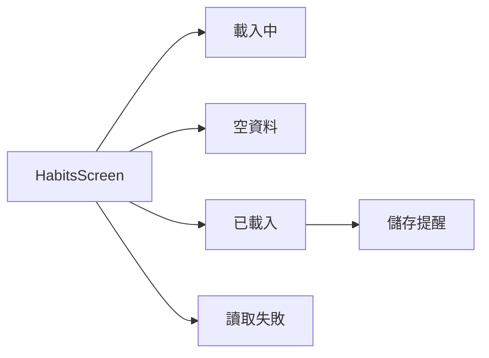
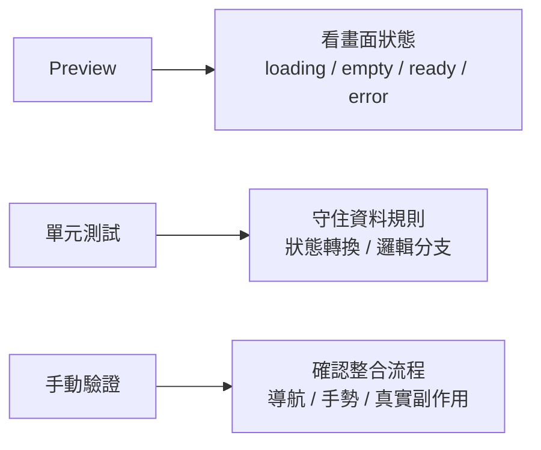
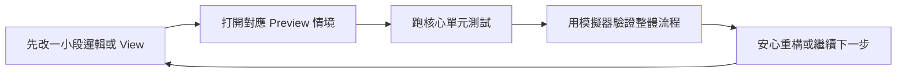

# 第 11 章 Preview、測試與開發節奏

## 章首摘要

### 這章你會學到什麼

- Preview 在 SwiftUI 專案裡真正扮演什麼角色。
- 哪些畫面狀態最值得先做成 Preview 情境。
- 如何替核心資料流程補上一個高價值測試，而不是把所有細節都硬塞進自動化。
- 怎麼把 Preview、單元測試與手動跑 App 排成一個更穩的開發節奏。

### 你會完成哪一段功能

- 為習慣列表畫面建立 `loading`、空資料、滿資料、讀取失敗與儲存提醒的 Preview 情境。
- 替 `HabitsFeatureModel` 補上一個保護資料規則的單元測試。
- 建立一套適合 SwiftUI 專案的小步快跑開發流程。

### 需要的前置知識

- 已理解第 03 章的狀態與資料流。
- 已理解第 08、09 章的載入、失敗與持久化狀態。
- 已理解第 10 章的責任切分與依賴注入。

## 為什麼這一章重要

很多人以為開發速度只和寫程式的速度有關，但真的進到專案裡之後，你會很快發現：真正拖慢進度的，往往不是打字，而是「改完之後要花多久才能確認自己沒有改壞」。

在 SwiftUI 裡，這件事尤其明顯。因為同一個畫面通常不只一種樣子，它可能同時有：

- 載入中
- 空資料
- 已載入
- 錯誤狀態
- 本地儲存提醒

如果每次只是開模擬器，重新點一輪流程來看結果，短期內或許還能忍，但功能一多，回饋速度就會開始明顯下降。你會越來越不想改動，因為每次調整都像在碰運氣。

這一章想建立的，不只是「怎麼寫 Preview」或「怎麼加測試」，而是一種更實際的開發方法感：

`哪些問題應該用 Preview 看，哪些問題應該用測試守，哪些事情最後還是要回到真機或模擬器確認。`

## 開場：穩定開發不是只靠肉眼點點點

在專案還很小的時候，很多事都可以靠手動操作解決。你改完畫面，就按一下執行；你改完按鈕，就點幾次看看；你改完資料流程，就順著功能走一遍。

但到了這本書目前這個階段，我們的主線專案已經不再只是單一畫面：

- 有列表與詳情
- 有新增與編輯表單
- 有遠端載入
- 有本地持久化
- 有成功、失敗與提醒訊息

這時如果仍然只靠手動點點點，你很容易遇到三個問題：

- 某些狀態很難重現，例如讀取失敗或儲存失敗
- 某些問題每次都要走一長段流程才看得到
- 一次改動之後，不確定自己有沒有把別的分支弄壞

所以從這一章開始，我希望讀者建立一個新的直覺：

`穩定開發的關鍵，不是每次都跑完整流程，而是把不同類型的風險，交給最適合的回饋工具。`

> **觀念提醒**
> 開發速度真正被拉高的，不是你打字更快，而是每改一小段程式後，能不能更快知道自己有沒有把事情改壞。

## 第一個範例：把 Preview 做成畫面狀態的驗證場

先看一個很實用的調整方式。下面範例刻意沿用第 10 章的 `HabitsFeatureModel`，只多加兩個很小但很有價值的能力：

- 一個能快速組出畫面狀態的 `preview()` 工廠方法
- 一個可以直接注入 model 的 `HabitsScreen` 初始化方式

這樣做的好處是，Preview 不需要真的碰本地檔案，也不需要真的跑載入流程，就能把畫面切成多種真實情境。

```swift
import SwiftUI
import Observation

private struct PreviewRepository: HabitsRepository {
    func loadHabits() throws -> [Habit] { [] }
    func saveHabits(_ habits: [Habit]) throws {}
}

extension HabitsFeatureModel {
    static func preview(
        habits: [Habit] = [],
        screenState: HabitsFeatureState = .ready,
        persistenceMessage: String? = nil
    ) -> HabitsFeatureModel {
        let model = HabitsFeatureModel(repository: PreviewRepository())
        model.habits = habits
        model.screenState = screenState
        model.persistenceMessage = persistenceMessage
        return model
    }
}

struct HabitsScreen: View {
    @State private var model: HabitsFeatureModel

    init(repository: HabitsRepository = HabitLocalStore()) {
        _model = State(initialValue: HabitsFeatureModel(repository: repository))
    }

    init(model: HabitsFeatureModel) {
        _model = State(initialValue: model)
    }

    var body: some View {
        NavigationStack {
            Group {
                switch model.screenState {
                case .idle, .loading:
                    ProgressView("正在載入習慣資料…")

                case .ready:
                    if model.habits.isEmpty {
                        VStack(spacing: 12) {
                            Image(systemName: "leaf")
                                .font(.largeTitle)
                            Text("還沒有習慣")
                                .font(.headline)
                            Text("先建立第一個想養成的習慣。")
                                .foregroundStyle(.secondary)
                        }
                    } else {
                        List {
                            if let persistenceMessage = model.persistenceMessage {
                                Text(persistenceMessage)
                                    .font(.subheadline)
                                    .foregroundStyle(.orange)
                            }

                            ForEach(model.habits) { habit in
                                VStack(alignment: .leading, spacing: 4) {
                                    Text(habit.name)
                                        .font(.headline)

                                    Text("每週目標 \(habit.weeklyTarget) 次")
                                        .font(.subheadline)
                                        .foregroundStyle(.secondary)
                                }
                            }
                        }
                        .listStyle(.plain)
                    }

                case .failed(let message):
                    VStack(spacing: 12) {
                        Image(systemName: "exclamationmark.triangle")
                            .font(.largeTitle)
                            .foregroundStyle(.orange)

                        Text(message)
                            .multilineTextAlignment(.center)
                            .foregroundStyle(.secondary)

                        Button("重新載入") {
                            model.load()
                        }
                        .buttonStyle(.borderedProminent)
                    }
                }
            }
            .navigationTitle("習慣")
        }
    }
}

private extension Habit {
    static let previewSamples: [Habit] = [
        Habit(
            name: "晨間散步",
            weeklyTarget: 5,
            note: "起床後先走 10 分鐘。",
            reminderEnabled: true,
            completedDates: [.now]
        ),
        Habit(
            name: "睡前閱讀",
            weeklyTarget: 7,
            note: "每天至少 15 分鐘。",
            reminderEnabled: false
        )
    ]
}

#Preview("載入中") {
    HabitsScreen(model: .preview(screenState: .loading))
}

#Preview("空資料") {
    HabitsScreen(model: .preview(habits: [], screenState: .ready))
}

#Preview("已載入") {
    HabitsScreen(model: .preview(habits: .previewSamples, screenState: .ready))
}

#Preview("儲存提醒") {
    HabitsScreen(
        model: .preview(
            habits: .previewSamples,
            screenState: .ready,
            persistenceMessage: "資料已更新，但暫時無法寫回本地。"
        )
    )
}

#Preview("讀取失敗") {
    HabitsScreen(
        model: .preview(
            screenState: .failed("目前無法讀取習慣資料，請稍後再試。")
        )
    )
}
```

這段範例最值得注意的，不是 Preview 寫法本身，而是背後那個更重要的訊號：

`當畫面狀態可以被明確組裝出來時，Preview 才會真正變成開發工具，而不只是展示功能。`

如果你現在回頭看第 10 章，會發現這裡其實是在吃到架構整理帶來的紅利。因為責任比較清楚之後，畫面不需要自己直接去碰資料檔案，你就可以很自然地替它準備多種狀態。

> **觀念提醒**
> 如果一個畫面很難做出空資料、失敗與滿資料三種 Preview，通常不是 Preview 太麻煩，而是畫面和資料來源還綁得太緊。

**圖 11-1 同一個畫面，應該能被排成多種真實狀態，而不是只展示最好看的那一張**



圖 11-1 想傳達的是，Preview 最有價值的地方，通常不是替一個畫面做出「完成圖」，而是讓同一個畫面最重要的幾種狀態能被並排檢查。

## 從這個範例看見 Preview 的真正角色

### 1. Preview 的第一任務是驗證狀態，不是展示成果

很多人做 Preview 時，會不自覺地只留下那個最好看的畫面版本。例如：

- 有完整資料
- 沒有錯誤
- 沒有任何提醒
- 版面最整齊

但這通常不是使用者真正最常遇到的現實。真實產品裡，比起「最好看的狀態」，更值得你反覆確認的反而是：

- 還在載入時，畫面會不會太空
- 沒資料時，使用者知不知道下一步要做什麼
- 出錯時，訊息會不會太抽象
- 有提醒文字時，版面會不會被擠壞

換句話說，Preview 的真正價值不是幫你證明畫面「很漂亮」，而是幫你提早看見畫面「在不同狀態下還站不站得住」。

### 2. 高價值 Preview，通常先從使用者真的會遇到的情境開始

如果你不知道要替某個畫面做哪些 Preview，我很建議先從這五類開始：

- 載入中
- 空資料
- 已載入
- 讀取失敗
- 額外提醒或警示訊息

這五類之所以重要，不是因為它們是某種固定規則，而是因為它們非常接近一個真實產品最常出現的狀態分支。

等這一層站穩之後，你再慢慢加第二層的壓力情境，例如：

- 文案特別長
- 動態字級較大
- 單列資料非常多
- 深色或淺色模式下對比不夠

這樣的順序通常會比較穩。因為你是先守住真正的產品狀態，再去擴大到視覺壓力測試，而不是一開始就把 Preview 做成漫無目的的展示牆。

### 3. 如果 Preview 很難寫，通常是在提醒責任還不夠清楚

這一點很值得讀者慢慢建立直覺。

如果某個畫面只能在真的跑網路、真的讀檔案、真的走完一大段流程之後，才能看見特定狀態，那通常代表兩件事至少有一件成立：

- 畫面直接知道太多資料來源細節
- 畫面狀態還沒有被整理成可以組裝的樣子

這也是為什麼我很喜歡把 Preview 當成結構檢查工具。因為它常常會誠實地暴露一件事：到底你的畫面是在「接收狀態」，還是在「自己扛全部責任」。

> **常見陷阱**
> 把 Preview 當成只用來拍漂亮截圖的地方，最後只留下「滿資料、最好看」那一張，真正最容易出錯的空狀態與失敗狀態反而完全沒被看過。

## 第二個範例：替核心流程補上一個高價值測試

Preview 很適合看畫面狀態，但它守不住所有事情。像下面這種規則，就更適合交給單元測試來保護：

`同一天重複點擊完成按鈕時，不應該再追加一筆新的完成日期。`

這是一個很典型的高價值測試目標。因為它：

- 不是純視覺問題
- 容易在重構時被不小心改壞
- 一旦出錯，會直接影響使用者資料正確性

以下範例用 `XCTest` 示意。這裡假設專案模組名稱叫做 `HabitApp`，重點不在框架名稱，而在測試邊界的選擇。

```swift
import XCTest
@testable import HabitApp

final class InMemoryHabitsRepository: HabitsRepository {
    var storedHabits: [Habit]

    init(storedHabits: [Habit] = []) {
        self.storedHabits = storedHabits
    }

    func loadHabits() throws -> [Habit] {
        storedHabits
    }

    func saveHabits(_ habits: [Habit]) throws {
        storedHabits = habits
    }
}

@MainActor
final class HabitsFeatureModelTests: XCTestCase {
    func testMarkCompletedDoesNotDuplicateSameDayRecord() throws {
        let habit = Habit(
            name: "晨間散步",
            weeklyTarget: 5,
            note: "起床後先走 10 分鐘。",
            reminderEnabled: true,
            completedDates: [.now]
        )

        let repository = InMemoryHabitsRepository(storedHabits: [habit])
        let model = HabitsFeatureModel(repository: repository)

        model.load()
        model.markCompleted(habit.id)

        XCTAssertEqual(model.habits[0].completedDates.count, 1)
        XCTAssertTrue(model.habits[0].isCompletedToday)
        XCTAssertEqual(repository.storedHabits[0].completedDates.count, 1)
    }
}
```

這個測試之所以值得，不是因為它寫起來很長，而是因為它剛好守住一條很容易回歸的資料規則。

而且你會發現，這裡同樣吃到的是第 10 章責任切分的紅利。因為 `HabitsFeatureModel` 不是直接綁死在真實 JSON 檔上，所以我們可以用一個記憶體中的 repository 替身來驗證流程，而不用真的去碰檔案系統。

> **觀念提醒**
> 如果某段邏輯要先開模擬器、點好幾步、還要製造特定資料狀態才看得出對錯，它通常就是高價值的測試候選。

## 從這個測試看見什麼值得測

### 1. 先測最容易造成回歸的資料規則

很多初學者一聽到測試，就會立刻想問：「是不是每個 View 都要測？」但更好的起點通常不是從畫面數量來想，而是從風險來想。

在這個主線專案裡，我會優先考慮的測試目標通常包括：

- 打卡是否重複追加資料
- 載入失敗時是否切到正確狀態
- 儲存失敗時是否留下提醒訊息
- 表單驗證是否真的擋住無效輸入

這些地方的共同特徵是：一旦壞掉，使用者不是只會「覺得怪怪的」，而是會真的遇到資料錯誤、流程中斷，或功能行為和預期不同。

### 2. 不要把每一個視覺細節都硬塞進單元測試

和上面那些高風險邏輯相比，下列東西通常不是這一階段最該優先自動化的目標：

- `VStack` 的間距是不是 12
- 字體粗細是不是剛好 `.semibold`
- 某個 icon 顏色是不是橘色

不是因為它們完全不重要，而是因為在這本書目前的教學脈絡裡，這些細節更適合交給 Preview 與手動檢查。若一開始就把大量視覺細節硬塞進單元測試，常見的結果是：

- 測試寫了很多
- 每次畫面微調都要改測試
- 但真正重要的資料規則反而還沒被守住

### 3. 用替身隔開真實副作用，測試才會快而穩

剛才範例裡的 `InMemoryHabitsRepository` 很重要，因為它讓我們把「資料規則」和「真實儲存工具」拆開來看。

這種做法的價值很高：

- 測試執行更快
- 不需要真的建立檔案
- 不容易受外部環境影響
- 失敗時更容易定位是規則錯，還是儲存工具錯

也就是說，好的測試不只是多寫一個檔案而已，它通常還會反過來要求你把責任切得更乾淨。

**圖 11-2 Preview、單元測試與手動驗證，各自守住不同風險**



圖 11-2 想強調的是，這三種回饋工具不是互相取代，而是各自處理不同風險。如果你把全部期待都壓在其中一個工具上，通常就會又慢又不準。

## Preview、單元測試與手動驗證的邊界

到了這裡，我很希望讀者能記住下面這三句話：

- Preview 主要回答的是：「這個畫面在某個狀態下，看起來是否合理？」
- 單元測試主要回答的是：「這條規則或狀態轉換，是否仍然正確？」
- 手動驗證主要回答的是：「整個互動流程串起來時，是否真的順？」

這個邊界一旦清楚，開發節奏就會穩很多。因為你不會再用很重的方法去檢查其實可以很輕地確認的事情。

例如：

- 想看空狀態版面，就先開 Preview，不必每次清空資料再跑一次 App
- 想守住打卡規則，就寫一個單元測試，不必每次都手動點好幾輪
- 想確認導航、手勢、鍵盤、系統權限與動畫整體感受，最後還是回模擬器或真機

這裡也要誠實說一句：Preview 很方便，但它不是完整真實環境。像下面這些事情，最後仍然很值得回模擬器確認：

- 導航堆疊來回切換
- 手勢和動畫一起發生時的節奏
- 鍵盤、通知、權限與 App 生命周期
- 真實網路延遲或失敗時的整體感受

> **常見陷阱**
> 一談測試就想把字體、顏色、間距、動畫時序全部自動化，往往會讓測試變得很脆弱，卻沒有先守住真正會造成資料錯誤或流程失敗的地方。

## 建立一套適合 SwiftUI 的開發節奏

如果把這一章壓縮成一套很實際的工作流程，我最推薦的節奏通常像這樣：

1. 先改一小段純邏輯或畫面狀態。
2. 立刻打開對應的 Preview，看主要情境有沒有站穩。
3. 跑幾個核心單元測試，確認資料規則沒有回歸。
4. 最後再回模擬器或真機，檢查導航、手勢與整合流程。

這套節奏的好處，不只是在於「比較快」，更在於它能降低你對改動的心理壓力。因為你不需要每次都把所有事情從頭檢查一遍，而是能用比較合理的成本逐層確認。

這種感受其實非常重要。很多專案之所以越做越不敢動，不一定是因為程式已經亂到不能改，而是因為每改一次都要用太重的方式確認結果，久了自然就會失去重構與整理的勇氣。

**圖 11-3 小步快跑的 SwiftUI 開發節奏，不是少檢查，而是把檢查放在對的地方**



圖 11-3 想傳達的是，好的開發節奏不是每一步都做最重的驗證，而是把不同層級的檢查放到對的位置，讓回饋又快又準。

## 接回主線專案：讓這個 App 不只可維護，也更容易安心修改

回到「習慣養成 App」這條主線，這一章完成之後，專案的成熟度會再往前走一大步。因為現在我們不只是在累積功能，還開始替這些功能建立回饋機制。

這件事的價值很直接：

- 列表畫面可以快速檢查空資料、滿資料與失敗狀態
- 資料規則可以用測試守住，不必每次手動重現
- 當你想重構 `HabitsFeatureModel` 或調整畫面結構時，心裡會更有底

而這章的成果也會直接接到下一章：

- 第 12 章談除錯時，Preview 和測試會幫你更快縮小問題範圍
- 第 12 章談效能時，也更容易看出哪裡是畫面更新、哪裡是資料流程
- 第 13 章整合完整專案時，這些回饋機制會變成你持續擴充功能的安全網

> **延伸實戰**
> 試著替習慣表單畫面再補兩個 Preview：一個是「新增模式、欄位全空」，另一個是「編輯模式、名稱太長且驗證失敗」。接著再替 `HabitsFeatureModel` 補一個測試，驗證讀取失敗時是否會切到 `.failed` 狀態。

## 本章重點整理

- Preview 的價值在於快速驗證畫面狀態，而不只是展示完成畫面。
- 高價值 Preview 通常先從載入中、空資料、已載入、失敗與提醒訊息開始。
- 單元測試應優先守住資料規則、狀態轉換與容易回歸的邏輯分支。
- Preview、單元測試與手動驗證各自處理不同風險，不應互相取代。
- 穩定的 SwiftUI 開發節奏，來自快速回饋，而不是每次都跑最重的檢查流程。

## 本章小結

如果第 10 章讓你理解的是「責任要站對位置」，那這一章接著補上的就是：

`當責任開始清楚之後，你也需要一套能持續驗證這些責任的工作方法。`

Preview 讓你更快看見畫面在不同狀態下是否站得住；測試讓你更安心地守住資料規則與狀態轉換；而手動跑 App 則幫你確認整個互動流程最後是否真的成立。當這三者開始分工合作，專案就不只比較穩，也會更容易被你持續整理與推進。

下一章我們會接著往下走，看看當專案逐漸變大之後，效能、除錯與常見陷阱該怎麼更有系統地處理。

## 練習題

1. 基礎題：替列表頁再新增一個「文案很長」的 Preview，確認提醒訊息與資料列是否仍然能保持可讀。
2. 進階題：替 `HabitsFeatureModel` 補一個測試，驗證當 repository 載入失敗時，畫面會切到 `.failed` 狀態。
3. 延伸題：替你的專案寫下一套「每次改功能前後會做哪些檢查」的小流程，並標出哪些步驟應該交給 Preview、哪些交給測試、哪些保留給手動驗證。

## 寫作備註

- 可補一個小專欄：為什麼 Preview 與測試本質上都是設計回饋工具，而不只是開發配件。
- 第 12 章可直接承接這裡的 Preview 與測試情境，討論如何更快定位除錯與效能問題。
- 這章最重要的不是某一個工具名稱，而是幫讀者建立穩定迭代的節奏感。
