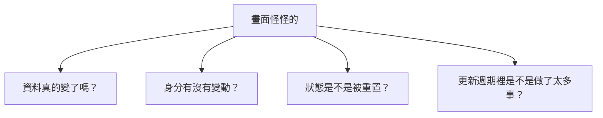
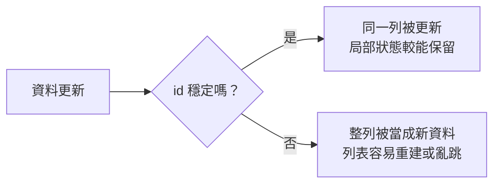
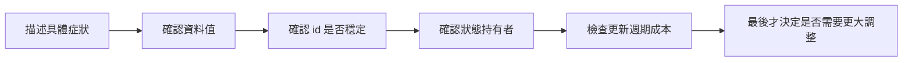

# 第 12 章 效能、除錯與常見陷阱

## 章首摘要

### 這章你會學到什麼

- 怎麼判斷眼前遇到的是效能問題、資料問題，還是身分與狀態問題。
- 列表更新異常時，應該先查資料、身分還是畫面結構。
- 為什麼很多看起來像 SwiftUI 壞掉的現象，其實是狀態位置與識別方式出了問題。
- 如何建立一套比較穩的除錯順序，避免問題還沒定位就先大改架構。

### 你會完成哪一段功能

- 替主線專案做一次「列表亂跳、狀態重置、畫面卡頓」的完整體檢。
- 修正一個列表身分不穩造成的更新異常案例。
- 修正一個狀態放錯位置造成的畫面重置案例。
- 整理出一份適合 SwiftUI 專案的除錯檢查順序。

### 需要的前置知識

- 已理解第 03 章的狀態與資料流。
- 已理解第 04 章的列表與導覽身分。
- 已理解第 10、11 章的責任切分、Preview 與測試節奏。

## 為什麼這一章重要

寫 SwiftUI 一段時間後，幾乎每個人都會遇到幾種讓人很挫折的時刻：

- 明明只是改一列資料，整個列表卻像重載一樣亂跳
- 明明資料有存進去，畫面卻又莫名回到原來狀態
- 明明看起來只是小畫面，操作起來卻越來越鈍

這些時候最危險的，不是 bug 本身，而是我們很容易在問題還沒看清楚之前，就先下結論：

- 「是不是 SwiftUI 很慢？」
- 「是不是我要重做架構？」
- 「是不是要把整個畫面拆掉重寫？」

但真實情況往往比較樸素。很多被誤認成效能問題的現象，最後其實是：

- 身分識別不穩
- 狀態放在不對的位置
- 把太多工作塞進畫面更新週期

所以這一章真正要教的，不是某幾個工具按哪裡，而是一種更有秩序的查問題方式：

`先把現象說清楚，再決定要查資料、查身分、查狀態，還是真的該進一步看效能。`

## 開場：不是每個卡頓都叫做效能問題

很多人只要一看到畫面怪怪的，就會立刻說「有沒有可能是效能問題」。這個反應很自然，因為在畫面上看到的症狀通常都長得像：

- 卡一下
- 跳一下
- 閃一下
- 重設一下

但這些表面現象，其實可能來自完全不同的原因。

例如：

- 如果列表整批被當成新資料，畫面就可能看起來像重刷
- 如果某段狀態放在會被重建的子 View 裡，它就可能反覆重置
- 如果把排序、過濾、格式化都塞在 `body` 裡，每次更新都會多做很多工作
- 如果真的是大量資料與高頻更新，才比較接近真正的效能壓力

也就是說，很多時候我們看到的是同一種症狀，但真正壞掉的位置根本不同。

> **觀念提醒**
> 「畫面怪怪的」只是一個現象描述，還不是問題定位。真正有幫助的除錯，第一步永遠是把現象翻譯成更具體的句子。

**圖 12-1 看起來都像卡頓，但真正的問題來源可能完全不同**



圖 12-1 想傳達的是，SwiftUI 問題常常不是只有「快或慢」這一條線，而是資料、身分、狀態與更新成本一起交織出來的結果。

## 第一個範例：列表更新時為什麼整排都像被重建

先看一個很常見、也很容易被誤判成「SwiftUI 列表很不穩」的例子。

下面這段程式想做的事情很合理：把 `Habit` 轉成列表列項需要的顯示資料，再交給 `List` 顯示。但它有一個非常關鍵的問題：每次重新計算 rows 時，都重新產生一組新的 `UUID()`。

```swift
import SwiftUI

struct HabitRowData: Identifiable {
    let id: UUID
    let name: String
    let weeklyTargetText: String
    let isCompletedToday: Bool
}

struct HabitsScreen: View {
    @State private var habits: [Habit] = Habit.samples
    @State private var sortByCompletion = false

    private var rows: [HabitRowData] {
        let source = sortByCompletion
            ? habits.sorted { lhs, rhs in
                if lhs.isCompletedToday != rhs.isCompletedToday {
                    return lhs.isCompletedToday && !rhs.isCompletedToday
                }

                return lhs.name < rhs.name
            }
            : habits

        return source.map { habit in
            HabitRowData(
                id: UUID(),
                name: habit.name,
                weeklyTargetText: "每週目標 \(habit.weeklyTarget) 次",
                isCompletedToday: habit.isCompletedToday
            )
        }
    }

    var body: some View {
        List(rows) { row in
            HStack {
                VStack(alignment: .leading, spacing: 4) {
                    Text(row.name)
                        .font(.headline)

                    Text(row.weeklyTargetText)
                        .font(.subheadline)
                        .foregroundStyle(.secondary)
                }

                Spacer()

                Image(systemName: row.isCompletedToday ? "checkmark.circle.fill" : "circle")
                    .foregroundStyle(row.isCompletedToday ? .green : .secondary)
            }
        }
        .toolbar {
            Button("切換排序") {
                sortByCompletion.toggle()
            }
        }
    }
}
```

這段程式很容易出現的症狀包括：

- 切換排序時，列表像整批重刷
- 某些列項動畫不連續
- 如果列項裡有局部狀態，例如展開或輸入中的值，也可能一起消失

原因不在 `List` 本身，而在於 SwiftUI 看到的是：

- 上一次的第一列 id：`A`
- 這一次的第一列 id：`Z`

也就是說，對系統而言，這不是「同一批資料位置變了」，而是「整批都是新資料」。

比較穩的寫法，是讓顯示資料沿用真正資料模型的身分。

```swift
import SwiftUI

struct HabitRowData: Identifiable {
    let id: UUID
    let name: String
    let weeklyTargetText: String
    let isCompletedToday: Bool
}

struct HabitsScreen: View {
    @State private var habits: [Habit] = Habit.samples
    @State private var sortByCompletion = false

    private var rows: [HabitRowData] {
        let source = sortByCompletion
            ? habits.sorted { lhs, rhs in
                if lhs.isCompletedToday != rhs.isCompletedToday {
                    return lhs.isCompletedToday && !rhs.isCompletedToday
                }

                return lhs.name < rhs.name
            }
            : habits

        return source.map { habit in
            HabitRowData(
                id: habit.id,
                name: habit.name,
                weeklyTargetText: "每週目標 \(habit.weeklyTarget) 次",
                isCompletedToday: habit.isCompletedToday
            )
        }
    }

    var body: some View {
        List(rows) { row in
            HStack {
                VStack(alignment: .leading, spacing: 4) {
                    Text(row.name)
                        .font(.headline)

                    Text(row.weeklyTargetText)
                        .font(.subheadline)
                        .foregroundStyle(.secondary)
                }

                Spacer()

                Image(systemName: row.isCompletedToday ? "checkmark.circle.fill" : "circle")
                    .foregroundStyle(row.isCompletedToday ? .green : .secondary)
            }
        }
        .toolbar {
            Button("切換排序") {
                sortByCompletion.toggle()
            }
        }
    }
}
```

修正之後，SwiftUI 就比較能理解：這些列項是同一批習慣，只是順序或部分內容改了，而不是整批都被替換。

> **觀念提醒**
> 在列表裡，穩定的 `id` 不是排版細節，而是 SwiftUI 判斷「這是不是同一個元素」的基礎。

**圖 12-2 穩定身分能保留同一列的連續性，不穩定身分則會讓系統把它當成全新列項**



圖 12-2 想強調的是，很多列表異常不是因為 SwiftUI 不會更新，而是因為我們提供給它的身分線索根本不穩。

## 從這個範例看見列表與身分的高風險點

### 1. 不要在顯示層隨手生成新的 `UUID()`

只要資料本身已經有穩定身分，就盡量沿用它。因為一旦你在畫面組裝階段重新配發新的 id，就等於主動切斷了「這筆資料和上一輪是同一個人」的線索。

這件事最容易發生在：

- 把 model 轉成 row view data 的時候
- 把資料分組後再包一層 wrapper 的時候
- 為了讓 `ForEach` 過得去，臨時補一個 `UUID()`

### 2. `\.self` 不一定錯，但它比看起來脆弱

很多教學一開始會用 `ForEach(tags, id: \.self)`，因為它很方便。但當資料是可變的、會排序的、會去重的，或內容本身可能改動時，`\.self` 很容易讓你在後面遇到難查的更新問題。

所以只要資料有真正代表自己的身分，例如 `id`，通常都比 `\.self` 更穩。

### 3. 「畫面整批跳動」常常不是效能，而是識別失敗

這裡很值得提醒讀者一件事：畫面看起來像卡頓，不代表 CPU 一定很忙。很多時候你感受到的「不順」，其實是因為系統把太多元素當成全新節點來處理，於是動畫、局部狀態與視覺連續性一起失守。

這也是為什麼第 04 章談列表與導覽時一直強調 `id`。因為對 SwiftUI 來說，身分識別不是附帶資訊，而是畫面連續性的核心。

> **常見陷阱**
> 畫面一亂跳就立刻去懷疑 SwiftUI 效能很差，結果真正的原因其實只是 `id` 在每次更新時都被重新生了一次。

## 第二個範例：狀態放錯位置，畫面就會莫名重置

再看另一種很常見的情況。這次問題不在列表，而在狀態擺放的位置。

假設我們想在統計區塊裡提供「本週 / 本月」切換。下面寫法乍看合理，但它很容易讓使用者剛切完範圍，畫面一刷新又回到預設值。

```swift
import SwiftUI

enum StatsRange: String, CaseIterable {
    case week = "本週"
    case month = "本月"
}

struct HabitInsightsPanel: View {
    let habits: [Habit]
    @State private var selectedRange: StatsRange = .week

    var body: some View {
        VStack(alignment: .leading, spacing: 12) {
            Picker("統計範圍", selection: $selectedRange) {
                ForEach(StatsRange.allCases, id: \.self) { range in
                    Text(range.rawValue).tag(range)
                }
            }
            .pickerStyle(.segmented)

            Text(selectedRange == .week ? "顯示本週統計" : "顯示本月統計")
                .font(.headline)
        }
    }
}

struct DashboardScreen: View {
    @State private var isRefreshing = false
    @State private var habits: [Habit] = Habit.samples

    var body: some View {
        VStack(spacing: 20) {
            if isRefreshing {
                ProgressView("正在更新資料…")
            } else {
                HabitInsightsPanel(habits: habits)
            }

            Button("重新整理") {
                isRefreshing = true

                Task {
                    try? await Task.sleep(for: .seconds(1))
                    isRefreshing = false
                }
            }
        }
        .padding()
    }
}
```

這段程式最大的問題是：`selectedRange` 雖然寫在 `HabitInsightsPanel` 裡，但它其實不是一個只屬於暫時子元件的狀態。它比較像整個 Dashboard 畫面的使用者選擇。

一旦 `DashboardScreen` 進入 `isRefreshing` 分支，`HabitInsightsPanel` 就會暫時消失；等它再出現時，`@State` 也會跟著回到初始值。

比較穩的做法，是把這個狀態提升到真正擁有它的畫面層，再透過 `Binding` 傳下去。

```swift
import SwiftUI

enum StatsRange: String, CaseIterable {
    case week = "本週"
    case month = "本月"
}

struct HabitInsightsPanel: View {
    let habits: [Habit]
    @Binding var selectedRange: StatsRange

    var body: some View {
        VStack(alignment: .leading, spacing: 12) {
            Picker("統計範圍", selection: $selectedRange) {
                ForEach(StatsRange.allCases, id: \.self) { range in
                    Text(range.rawValue).tag(range)
                }
            }
            .pickerStyle(.segmented)

            Text(selectedRange == .week ? "顯示本週統計" : "顯示本月統計")
                .font(.headline)
        }
    }
}

struct DashboardScreen: View {
    @State private var isRefreshing = false
    @State private var habits: [Habit] = Habit.samples
    @State private var selectedRange: StatsRange = .week

    var body: some View {
        VStack(spacing: 20) {
            if isRefreshing {
                ProgressView("正在更新資料…")
            } else {
                HabitInsightsPanel(
                    habits: habits,
                    selectedRange: $selectedRange
                )
            }

            Button("重新整理") {
                isRefreshing = true

                Task {
                    try? await Task.sleep(for: .seconds(1))
                    isRefreshing = false
                }
            }
        }
        .padding()
    }
}
```

這樣即使中間進入刷新狀態，`selectedRange` 仍然活在 `DashboardScreen` 這一層，不會因為子 View 被拿掉又放回來就重設。

> **觀念提醒**
> 判斷狀態該放哪裡時，最實用的問題不是「哪裡用得到它」，而是「哪一層應該對它的延續性負責」。

## 從這個範例看見狀態位置的判斷原則

### 1. 不是所有 `@State` 都應該留在畫面最小單位

很多人學 SwiftUI 之後，會自然形成一個直覺：只要哪個 View 會用到值，就把 `@State` 放在那裡。這個直覺在簡單情境常常沒問題，但一旦畫面有條件分支、切換流程或局部重建，它就會開始暴露限制。

比較穩的判斷方式通常是：

- 如果它只是局部暫時互動，例如按壓高亮、局部展開，可放在小 View
- 如果它代表整個畫面的使用者選擇、流程位置或模式，通常更適合留在上層

### 2. 狀態重置問題，常常長得像「畫面不穩」

這類 bug 最煩的地方在於，它的症狀很像隨機：

- 有時候重整後才發生
- 有時候切一次 tab 才發生
- 有時候只是某個條件分支剛好切換就發生

所以如果你只盯著表面現象，很容易以為是 SwiftUI 自己不可靠。但其實很多時候，問題只是狀態的生命週期和畫面結構沒有對齊。

### 3. 除錯時要先問：是值改了，還是持有者換了？

這是我很推薦讀者記住的一句話。

當你看到某個選擇、輸入或展開狀態莫名消失時，不要先問「為什麼 SwiftUI 又重算了」，而是先問：

- 這個值真的被改掉了嗎？
- 還是它原本的持有者根本不見了，現在是一個新的實例？

這兩種情況表面看起來都像「狀態跑掉」，但調查方向完全不同。

## 第三個高風險點：把太多工作塞進畫面更新週期

前面兩個例子比較偏結構與狀態。現在我們來看比較接近真正效能壓力的情況。

先看一個常見寫法：

```swift
import SwiftUI

struct HabitSummaryScreen: View {
    let habits: [Habit]

    private var weeklySummaryText: String {
        let completedCount = habits
            .flatMap(\.completedDates)
            .filter { Calendar.current.isDate($0, equalTo: .now, toGranularity: .weekOfYear) }
            .count

        let formatter = NumberFormatter()
        formatter.numberStyle = .spellOut

        return "本週已完成 \(formatter.string(from: completedCount as NSNumber) ?? "0") 次"
    }

    var body: some View {
        VStack(alignment: .leading, spacing: 12) {
            Text("本週摘要")
                .font(.title2.bold())

            Text(weeklySummaryText)
                .font(.headline)
        }
        .padding()
    }
}
```

這段範例本身不是大錯，但它提醒我們一件事：`body` 每次更新時，這些衍生計算與 formatter 建立也都可能再做一次。

在小型畫面裡，這也許不會立刻造成問題；但當你把：

- 排序
- 分組
- 日期格式化
- 大量過濾
- 文字組裝

全部都堆在畫面更新週期裡，畫面一有多筆資料或頻繁更新，就很容易開始變鈍。

更穩的方向通常是：

- 把昂貴或可重用的格式化器留在比較長壽命的位置
- 把衍生資料整理到 model 或 feature 層
- 讓畫面更專心接收已經準備好的顯示資料

這裡很值得再提醒一次：`body` 被重算，不等於有 bug；真正該注意的是，每次重算時你到底順手做了多少原本不必在那裡做的事。

> **常見陷阱**
> 一看到 `body` 常常被重新計算，就以為 SwiftUI 效能有問題；但更常見的真相是，我們把過多排序、格式化與資料組裝都塞在了更新週期裡。

## 建立一套比較穩的除錯順序

走到這一章，我最希望讀者帶走的，不是三十個零碎陷阱，而是一套能重複使用的調查順序。

當你看到畫面有異常時，可以先照這個順序往下查：

1. 先把症狀說成具體句子。
2. 確認資料值到底有沒有真的改變。
3. 確認元素的 `id` 是否穩定。
4. 確認狀態持有者是否被換掉。
5. 最後才檢查是不是更新週期真的做了太多工作。

這個順序之所以重要，是因為它會幫你避免一個很常見的浪費：還沒知道問題在哪裡，就先進行很大的重構。

例如：

- 列表亂跳，先查 `id`，不必先重做整個 UI 結構
- 篩選條件重置，先查狀態位置，不必先懷疑資料庫
- 畫面變鈍，先找是不是每次更新都在重新排序與格式化，不必先說 SwiftUI 不能做大型畫面

這時第 11 章建立的回饋機制就會很有幫助：

- 用 Preview 固定重現畫面狀態
- 用單元測試守住資料規則
- 用模擬器確認整合流程

當這三件事站穩之後，除錯就不再只是「靠感覺查」，而會慢慢變成一個有步驟的縮小範圍過程。

**圖 12-3 更穩的除錯流程，不是先改最多，而是先縮小範圍**



圖 12-3 想強調的是，好的除錯不是一開始就做最大改動，而是先把可能性一層層排掉，讓真正的原因自己浮出來。

## 接回主線專案：替這個 App 做一次真正的體檢

回到「習慣養成 App」這條主線，到了這一章，我們已經不只是在加功能，也開始練習用更成熟的方式面對問題。

現在你可以回頭檢查這個專案最值得留意的地方：

- 列表列項是否都沿用穩定 `id`
- 表單與統計選擇狀態是否放在正確層級
- 載入、失敗與提醒畫面是否能穩定重現
- 畫面是不是承擔了過多排序、組裝與格式化責任

這些檢查很有價值，因為它們剛好覆蓋了 SwiftUI 專案最常讓人誤判的三種來源：

- 看起來像效能問題，其實是身分問題
- 看起來像隨機 bug，其實是狀態生命週期問題
- 看起來像框架限制，其實是畫面更新週期塞了太多工作

而這章的成果也會直接接到下一章：

- 第 13 章整合完整專案時，會更容易看懂哪些設計真的能撐住實戰規模
- 第 13 章做最後整合時，也會更知道哪些地方已經有足夠的安全感可以擴充

> **延伸實戰**
> 回頭挑你的主線專案裡任一個列表畫面，檢查它的列項 `id` 來源是否真的穩定。再挑一個會被條件顯示的子 View，問自己：裡面的 `@State` 到底是局部暫時互動，還是其實應該由上層畫面負責延續？

## 本章重點整理

- 很多看起來像效能問題的現象，其實是身分或狀態問題。
- 列表更新異常時，應優先檢查 `id` 是否穩定。
- 狀態放在哪裡，應由它需要被誰延續來決定，而不只是由誰使用來決定。
- `body` 重算本身不是 bug，真正該警覺的是更新週期裡做了多少多餘工作。
- 更穩的除錯方式，是先縮小範圍，再決定是否需要大改。

## 本章小結

如果第 11 章讓你建立的是「如何用回饋機制守住改動」，那這一章接著補上的就是：

`當問題真的出現時，你要怎麼更快看出它到底壞在哪一層。`

很多 SwiftUI 專案真正困難的地方，不是功能做不出來，而是問題一出現時，很容易把資料、身分、狀態與效能全部混成同一團。只要你開始學會把這幾條線拆開來看，除錯就會從一種挫折，慢慢變成一種可以被訓練的判斷能力。

下一章我們會接著往下走，把前面累積的觀念與實作全部拉到同一個高度，整合成一個更接近真實產品的完整 SwiftUI 專案。

## 練習題

1. 基礎題：挑一個 `ForEach`，檢查它現在使用的是 `id`、`\.self`，還是臨時生成的身分，並說明這個選擇穩不穩。
2. 進階題：找一個會在條件分支中出現與消失的子 View，判斷它裡面的 `@State` 是否應該提升到上層。
3. 延伸題：替某個畫面列出一份除錯順序，依序回答資料、`id`、狀態持有者與更新週期成本四個問題。

## 寫作備註

- 可補一個小專欄：為什麼很多人把 SwiftUI 的「宣告式更新」誤會成「系統隨機重建」。
- 第 13 章可直接承接這裡的體檢觀點，回頭總整哪些設計讓主線專案撐得住。
- 這章最重要的不是列出所有坑，而是讓讀者學會一套比較穩的查問題順序。
