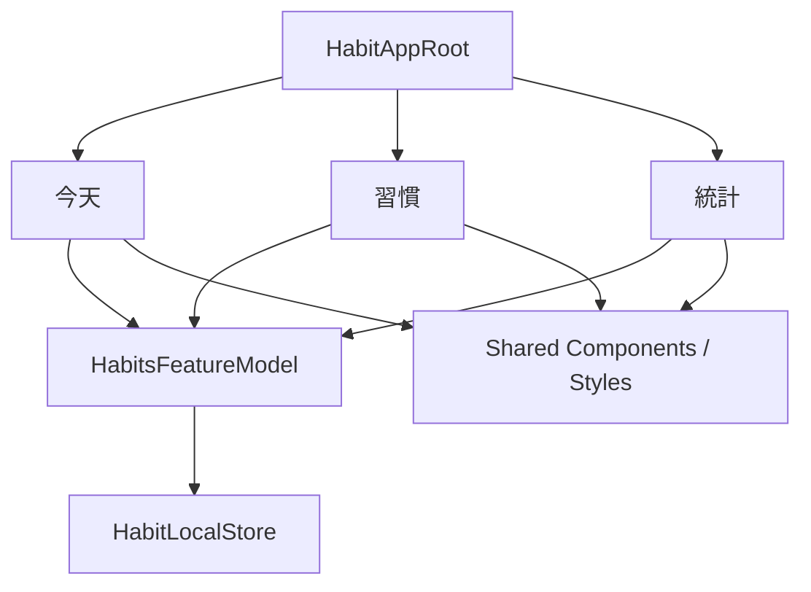
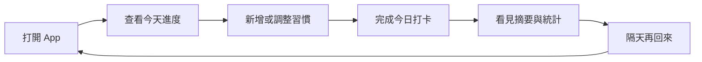
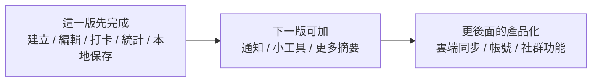

# 第 13 章 完整專案整合：做出一個像樣的 App

## 章首摘要

### 這章你會學到什麼

- 什麼叫做「功能做出來」和「真的像一個產品」之間的差別。
- 如何用一個 App Root，把前面各章的畫面層、資料層與互動層串成同一條主線。
- 怎麼判斷哪些功能是這個版本必須完成的，哪些則應該刻意延後。
- 如何用一段真實使用旅程，驗證整個 SwiftUI 專案是否已經站得住。

### 你會完成哪一段功能

- 整合「今天」、「習慣」與「統計」三個主要入口。
- 把習慣資料、打卡行為、摘要數字與統計內容接成一致資訊流。
- 替主線專案補上更像產品的今天頁（首頁入口）節奏與使用循環。
- 用一次完整走查，確認這個 App 已經不只是教學片段，而是產品原型。

### 需要的前置知識

- 已理解第 03 章的狀態與資料流。
- 已理解第 08、09 章的非同步資料與本地持久化。
- 已理解第 10、11、12 章的架構、回饋機制與除錯順序。

## 為什麼這一章重要

前面 12 章，其實已經替這本書累積了很多東西：

- 我們知道怎麼把畫面做出來
- 我們知道資料該怎麼流動
- 我們知道如何做表單、列表、動畫、持久化
- 我們也開始知道專案該怎麼整理、怎麼測、怎麼查問題

但到了這個階段，還有一個很關鍵的門檻沒有跨過去：

`這些能力目前是分別存在的，還是已經真的長成同一個 App？`

這個問題很重要，因為很多教學內容最後最大的遺憾就在這裡。讀者每一章都學到了東西，但走到後面時，手上留下的仍然比較像一堆局部範例，而不是一個真正能被理解、被使用、也能持續長大的產品原型。對我來說，這也是技術書最可惜的一種結尾：你明明學了很多，最後卻沒有一個真正能留下來的作品。

所以第 13 章要做的事，不是再多教幾個新 API，而是幫讀者看清楚一件事。我很希望這一章帶來的感覺，不是「再學最後幾招」，而是「前面的東西終於開始長在一起了」：

`一個像樣的 App，不是畫面數量比較多，而是它開始擁有清楚的主線、合理的範圍，以及可被重複完成的使用循環。`

## 開場：什麼叫做「像樣的 App」

很多人會用功能清單來判斷一個 App 像不像樣，例如：

- 有沒有清單
- 有沒有表單
- 有沒有統計
- 有沒有動畫
- 有沒有資料保存

這些當然都重要，但真正讓產品開始站起來的，通常不是功能數量，而是下面這幾件事有沒有同時成立：

- 使用者一打開 App，就知道今天該做什麼
- 同一份資料在不同畫面之間不會彼此打架
- 修改內容之後，其他相關畫面會自然同步
- 關掉再打開 App，前一天做過的事情仍然存在
- 整個流程有一個清楚的核心循環，而不是東一塊、西一塊的功能展示

對這本書的主線專案來說，那條核心循環其實非常明確：

1. 打開 App
2. 看今天要做哪些習慣
3. 新增或調整習慣
4. 完成今天的打卡
5. 看見摘要與統計回饋
6. 隔天再回來

這條線一旦清楚，你就會開始發現：真正的整合章，不是在證明自己會很多技巧，而是在證明前面學到的東西已經能一起服務同一個使用情境。一本實戰書能不能站穩，很多時候也就看這一章有沒有把那條主線真的收回來。

這裡也順手把一條全書命名線說清楚。前面幾章如果口語上提到「首頁」，原則上都是在指使用者打開 App 後最先承接主要任務的那個入口。到了整合章，我們正式把它命名成「今天頁」。所以如果後面看到「首頁」和「今天頁」，你可以把它們理解成同一個主要入口在不同階段的稱呼。

> **觀念提醒**
> 真正像樣的 App，通常不是功能最多的那個，而是主線最清楚、使用循環最完整的那個。

## 第一個範例：用一個 App Root 把前面各章成果接起來

先看一個整合後的最小骨架。這段範例不是要把整個專案所有細節一次攤開，而是要讓讀者看見：當專案開始變成一個完整產品時，根節點通常在負責什麼。

```swift
import SwiftUI
import Observation

enum RootTab: Hashable {
    case today
    case habits
    case insights
}

struct AppContainer {
    let habitsRepository: HabitsRepository

    static let live = AppContainer(
        habitsRepository: HabitLocalStore()
    )
}

@MainActor
@Observable
final class HabitAppModel {
    var selectedTab: RootTab = .today
    let habitsModel: HabitsFeatureModel

    init(container: AppContainer) {
        habitsModel = HabitsFeatureModel(repository: container.habitsRepository)
    }

    func loadInitialData() {
        habitsModel.loadIfNeeded()
    }

    var completedTodayCount: Int {
        habitsModel.habits.filter(\.isCompletedToday).count
    }

    var weeklyTargetCount: Int {
        habitsModel.habits.reduce(0) { partialResult, habit in
            partialResult + habit.weeklyTarget
        }
    }
}

@main
struct HabitApp: App {
    @State private var appModel = HabitAppModel(container: .live)

    var body: some Scene {
        WindowGroup {
            HabitAppRootView(appModel: appModel)
        }
    }
}

struct HabitAppRootView: View {
    @Bindable var appModel: HabitAppModel

    var body: some View {
        TabView(selection: $appModel.selectedTab) {
            TodayDashboardScreen(
                habits: appModel.habitsModel.habits,
                completedTodayCount: appModel.completedTodayCount,
                weeklyTargetCount: appModel.weeklyTargetCount,
                onMarkCompleted: appModel.habitsModel.markCompleted
            )
            .tabItem {
                Label("今天", systemImage: "sun.max")
            }
            .tag(RootTab.today)

            HabitsScreen(model: appModel.habitsModel)
                .tabItem {
                    Label("習慣", systemImage: "checklist")
                }
                .tag(RootTab.habits)

            InsightsScreen(habits: appModel.habitsModel.habits)
                .tabItem {
                    Label("統計", systemImage: "chart.bar")
                }
                .tag(RootTab.insights)
        }
        .task {
            appModel.loadInitialData()
        }
    }
}

struct TodayDashboardScreen: View {
    let habits: [Habit]
    let completedTodayCount: Int
    let weeklyTargetCount: Int
    let onMarkCompleted: (UUID) -> Void

    var body: some View {
        ScrollView {
            VStack(alignment: .leading, spacing: 16) {
                VStack(alignment: .leading, spacing: 8) {
                    Text("今天")
                        .font(.largeTitle.bold())

                    Text("已完成 \(completedTodayCount) 項，本週目標總數 \(weeklyTargetCount) 次")
                        .font(.subheadline)
                        .foregroundStyle(.secondary)

                    ProgressView(
                        value: Double(completedTodayCount),
                        total: Double(max(habits.count, 1))
                    )
                }
                .habitCardSurface()

                if habits.isEmpty {
                    VStack(alignment: .leading, spacing: 8) {
                        Text("還沒有習慣")
                            .font(.headline)

                        Text("先建立第一個想養成的習慣，這個主要入口才會開始有節奏。")
                            .foregroundStyle(.secondary)
                    }
                    .habitCardSurface()
                } else {
                    VStack(alignment: .leading, spacing: 12) {
                        Text("今日習慣")
                            .font(.headline)

                        ForEach(habits) { habit in
                            Button {
                                onMarkCompleted(habit.id)
                            } label: {
                                HStack {
                                    Text(habit.name)
                                        .foregroundStyle(.primary)

                                    Spacer()

                                    Image(systemName: habit.isCompletedToday ? "checkmark.circle.fill" : "circle")
                                        .foregroundStyle(habit.isCompletedToday ? .green : .secondary)
                                }
                            }
                            .buttonStyle(.plain)
                        }
                    }
                    .habitCardSurface()
                }
            }
            .padding()
        }
    }
}
```

這段範例最重要的，不是 `TabView` 本身，而是它所代表的整合意義。

你可以看見幾件很關鍵的事情已經發生：

- 根節點不再自己處理所有資料細節，而是負責組裝主要入口
- 「今天」、「習慣」與「統計」三個畫面，不是在各自養自己的資料
- 同一份習慣資料同時支撐清單、今天頁摘要與統計內容
- App 啟動時，資料會先被讀進來，而不是每個畫面各自偷偷做自己的初始化

這才是整合章真正的重點。因為當資料、畫面與入口開始站在同一條線上，這個專案才會從「很多功能」變成「一個產品」。

**圖 13-1 一個像樣的 App，不是畫面清單，而是同一份資料在多個入口之間流動**



圖 13-1 想傳達的是，整合一個中型 SwiftUI 專案時，真正重要的不是畫面多不多，而是同一份資料能不能穩定穿過多個功能入口。

## 從這個範例看見整合章真正的重點

### 1. 真正的產品不是畫面加總，而是一條可以重複完成的主線

很多人把整合想成「把幾個頁面串成 tab」。但那通常還不夠。因為畫面只是容器，真正構成產品感的，是使用者能不能自然地走完一條重複出現的路徑。

對這個習慣養成 App 來說，主線不是：

- 有今天頁入口
- 有清單
- 有統計

而是：

- 今天打開後知道要做什麼
- 沒有習慣時能順利建立第一筆
- 完成打卡後能立刻看到回饋
- 想調整時能快速回到編輯流程
- 隔天再回來時，資料還是延續的

這條線一旦成立，前面每一章學到的東西就不再是零碎技巧，而會開始變成這條使用循環裡的不同節點。

**圖 13-2 真正的產品主線，是一段可以被重複完成的使用循環**



圖 13-2 想強調的是，一個 App 真正的骨架通常不是頁面順序，而是使用者願不願意反覆走完同一條有價值的循環。

### 2. 今天頁（首頁入口）的價值，不是再做一個新畫面，而是把分散能力收成入口

在很多教學專案裡，今天頁入口很容易被做成一個純展示頁。它看起來完整，但沒有真正承擔入口角色。

這一章的今天頁設計刻意不是那種做法。`TodayDashboardScreen` 的責任比較清楚：

- 告訴使用者今天整體進度
- 讓使用者直接完成最常做的行為
- 在空資料時，把注意力導向建立第一筆習慣

也就是說，今天頁不是額外增加一個功能，而是把前面已經做好的功能，用更像產品的方式重新排成入口順序。

### 3. 同一份資料，要能穿過不同入口而不互相打架

到這一章，我很希望讀者已經開始有一個更成熟的直覺：

如果今天畫面上的摘要數字、習慣清單與統計頁看到的是不同版本的資料，那這個專案就算有再多功能，也還不算整合成功。

這也是為什麼範例裡讓：

- `TodayDashboardScreen` 看 `habitsModel.habits`
- `HabitsScreen` 看同一份 `habitsModel`
- `InsightsScreen` 也從同一份習慣資料推導統計

這種做法的價值非常高，因為它讓「完成一個習慣」這個行為，能自然地同步影響：

- 今天頁的進度
- 習慣列表的狀態
- 統計頁的數字

產品感有很大一部分，其實就來自這種「改一次，整體一起對起來」的連續性。

> **觀念提醒**
> 整合成功的一個重要訊號，就是使用者完成一個動作之後，相關畫面都會像同一個系統那樣自然更新，而不是各自活在不同世界。

### 4. 一致的空狀態、提醒與文案，會讓 App 從示範專案變成產品

前幾章我們談過很多局部狀態：

- 空資料
- 載入中
- 讀取失敗
- 儲存提醒

到了整合章，這些東西就不能再只是「某一頁剛好有做」。它們開始影響整個產品氣質。

例如：

- 首次打開 App 時，如果還沒有資料，今天頁和列表頁的空狀態語言是否一致？
- 如果資料載入失敗，使用者在主要入口是否都知道下一步？
- 如果寫回本地失敗，提醒訊息會不會只出現在某個角落，其他地方卻像什麼都沒發生？

這些看起來像文案與狀態小事，但它們其實很能決定產品是否讓人安心。因為對使用者來說，他不會把每個頁面分開理解；他只會感覺到這個 App 整體是不是清楚、是不是可靠。

### 5. 整合章真正的成熟，不只在於做了什麼，也在於刻意不做什麼

到了這個階段，很容易產生一種衝動：既然前面已經會很多東西了，那是不是可以順手再加：

- 通知提醒
- 小工具
- 成就系統
- 雲端同步
- 社群排行

這些想法都不一定不好，但第 13 章最重要的判斷，往往不是「我還能加什麼」，而是「什麼現在先不要加，才能讓主線更清楚」。

對這本書目前的主線來說，這一版最值得完成的核心通常是：

- 建立習慣
- 編輯與刪除習慣
- 完成每日打卡
- 看見今天頁摘要
- 看見統計回饋
- 關掉再打開時資料仍然存在

而像下面這些東西，則比較適合留給下一版：

- 排程通知
- 小工具或鎖定畫面入口
- 更多週期統計
- 更完整的推薦內容

更後面的產品化方向，例如：

- 雲端同步
- 帳號系統
- 社群功能
- 跨平台擴張

在這一版反而不一定該急著做。因為如果你連核心循環都還沒站穩，提早加這些重量，通常只會讓產品輪廓變得更模糊。

> **常見陷阱**
> 到整合章時什麼都想加，最後功能好像更多了，但主線反而被稀釋，讀者也更難看清楚這個 App 真正想解決什麼問題。

**圖 13-3 整合章要回答的不只是能不能做，而是這一版到底要守住什麼範圍**



圖 13-3 想傳達的是，整合章的成熟度不只來自技術整合，也來自產品範圍的節制。

## 走一遍真實使用流程：從第一次打開到第二天回來

如果要驗證這個 App 現在到底有沒有像一個產品，最好的方法之一不是繼續加功能，而是誠實地走一次真實使用旅程。

你可以試著照下面這條路走：

1. 第一次打開 App。
   這時如果沒有資料，今天頁和列表頁都應該明確告訴使用者下一步不是「發呆」，而是建立第一個習慣。

2. 建立第一個習慣。
   表單應該能清楚輸入名稱、目標次數與補充說明，而且取消與儲存要有明確差別。

3. 回到今天頁。
   使用者應該能立刻看到新習慣出現在今日入口，而不是還要再找一次。

4. 完成一次打卡。
   這個行為之後，今日進度、列表狀態與統計內容都應該自然更新。

5. 切到統計頁。
   使用者不必重新理解資料來源，就能直接看見打卡結果轉成摘要。

6. 關掉 App，再重新打開。
   這時前面做過的事情應該仍然存在，產品才會真正開始有「記得我」的感覺。

這條走查之所以重要，是因為它會非常誠實地告訴你：這個專案目前到底是「每個零件都各自成立」，還是「真的已經變成一個整體」。

## 哪些功能是必要，哪些是刻意不做

整合章還有一個很重要的任務，就是替讀者示範產品判斷。

### 這一版必須完成的

- 使用者能建立、編輯與刪除習慣。
- 使用者能在主要入口快速完成打卡。
- 打卡結果會反映到摘要與統計。
- 資料會被本地保存，不因 App 關閉而消失。
- 載入、空狀態與失敗狀態有基本說明能力。

### 可以留給下一版的

- 通知提醒與排程設定
- 更完整的推薦習慣模板
- 圖表更細的時間維度
- 更豐富的今天頁區塊

### 現在刻意不做的

- 雲端同步
- 帳號登入
- 社群互動
- 成就商城或複雜遊戲化系統

這樣的取捨不是保守，而是成熟。因為一個中型產品原型真正需要的，不是一次把所有未來可能性都搬進來，而是先證明核心使用循環真的成立。

> **延伸實戰**
> 試著替你的主線專案也寫出三份清單：這一版必須完成的、下一版可加的、現在刻意不做的。你通常會很快看見：真正讓產品變清楚的，往往不是新增功能，而是刪掉當下不該做的衝動。

## 接回主線專案：現在這真的像一個產品原型

回到「習慣養成 App」這條主線，到了這一章，我們終於可以比較有把握地說：它已經不只是一本 SwiftUI 書裡的示範畫面，而是開始具備產品原型該有的輪廓。

現在，這個專案至少已經有了下面幾條很關鍵的線：

- 有清楚的核心使用循環
- 有共享而一致的資料來源
- 有今天頁、清單與統計之間的資訊流
- 有本地保存帶來的延續性
- 有 Preview、測試與除錯節奏帶來的穩定感

更重要的是，這些東西現在不是並排擺在一起，而是開始彼此服務同一個使用情境。這就是整合真正的價值。

這件事也會讓下一章更自然。因為當你手上已經有一個站得住的產品原型，接下來談：

- 上架前還要補哪些整理
- 功能要怎麼演進
- 下一版應該先往哪裡長

才會有真正的依據，而不是憑想像列願望清單。

## 本章重點整理

- 一個像樣的 App，關鍵不在功能數量，而在主線是否清楚。
- App Root 的價值在於整合主要入口與共享資料，不在於自己承擔所有責任。
- 同一份資料若能穿過今天頁、清單與統計，自然同步，產品感就會大幅提升。
- 整合章的成熟，也包含知道這一版刻意不做什麼。
- 驗證整合是否成功，最好的方法之一就是誠實走一次真實使用旅程。

## 本章小結

如果前一章讓你學會的是「問題出現時怎麼查」，那這一章接著補上的就是：

`當前面所有能力都累積起來之後，它們到底有沒有真的長成同一個 App。`

這一章最重要的成果，不是一個更花俏的畫面，而是一種更完整的整體感。你會開始看見：宣告式 UI、資料流、元件化、非同步、持久化、架構、測試與除錯，其實並不是十幾個分開的主題，而是同一個產品從不同角度長出來的骨架。

下一章我們會接著往下走，走到最後一段路，看看當這個產品原型已經成立之後，上架前整理、版本演進與下一步該怎麼思考。

## 練習題

1. 基礎題：畫出你目前主線專案的三個主要入口，並說明它們是否共享同一份核心資料。
2. 進階題：替你的專案寫一段「第一次打開到第二天回來」的使用旅程，檢查這條路上有沒有任何斷點。
3. 延伸題：列出三個你很想加、但現在其實應該先不做的功能，並說明它們為什麼會稀釋目前主線。

## 寫作備註

- 可補一個小專欄：為什麼整合章真正要回答的是產品主線，而不是功能總數。
- 第 14 章可直接承接這裡的產品原型，討論上架前整理與版本演進。
- 這章最重要的不是展示更多技術，而是讓讀者感受到前面 12 章真的已經累積成一個完整作品。
