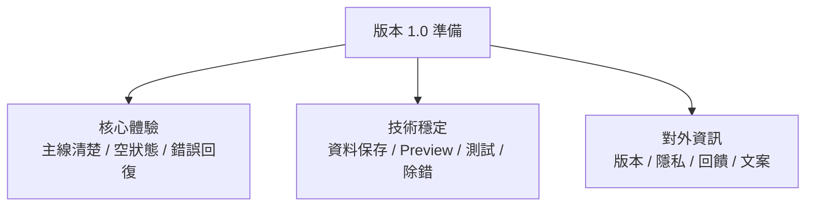
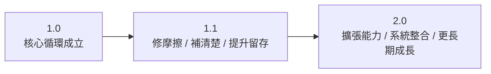
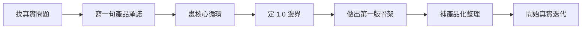

# 第 14 章 上架前整理、版本演進與下一步

## 章首摘要

### 這章你會學到什麼

- 什麼叫做從「作品心態」走向「產品心態」。
- 一個 SwiftUI App 在對外之前，還需要補齊哪些整理。
- 怎麼替 1.0 畫清楚邊界，避免把未來所有想法都塞進第一版。
- 學完這本書後，下一步最值得往哪些方向繼續鑽深。

### 你會完成哪一段功能

- 替主線專案補上更完整的設定與支援入口。
- 整理出一份版本 1.0 的發佈清單。
- 替這個 App 畫出 1.0、1.1 到 2.0 的演進方向。
- 建立一條從這本書走向你自己產品題目的下一步路線。

### 需要的前置知識

- 已理解前面 13 章的主線專案與整合方式。
- 已理解第 11、12 章的 Preview、測試與除錯節奏。
- 已理解第 13 章的產品主線與版本範圍判斷。

## 為什麼這一章重要

很多技術書在最後一章會停在一個很微妙的位置：讀者手上已經有作品了，但還不知道那個作品要怎麼真正走向外部世界。

這裡的差別其實很大。

作品心態比較像：

- 我已經把功能做出來了
- 我知道這個畫面能動
- 我大致理解技術怎麼串起來

產品心態則比較像：

- 如果今天交到別人手上，他能不能理解這個 App 在做什麼
- 如果他遇到錯誤、空狀態或資料問題，會不會知道下一步
- 如果第一版先上線，後面我能不能在不把專案打爛的情況下繼續長大

所以最後一章真正要補上的，不是再多一個新功能，而是幫讀者完成最後這個轉換：

`把「我做出來了」變成「這個東西可以被別人使用，而且我知道它接下來要怎麼繼續長」。`

## 開場：上架不是結束，而是迭代真正開始

很多人會把上架想成終點，像是一路跑到最後，終於可以鬆一口氣。但對產品來說，上架比較像是一個新階段的開始。

原因很簡單。只要 App 開始被別人使用，你就會第一次真正接收到外部世界的回饋：

- 使用者會不會卡在第一次進來的空狀態
- 哪個流程其實沒有你以為的那麼直覺
- 哪個功能明明技術上很完整，但在產品上其實優先順序沒那麼高
- 哪些你原本以為很小的細節，最後反而很影響信任感

也就是說，在上架之前，你比較像是在證明一個產品原型能成立；在上架之後，你才真的開始學習如何和真實使用情境一起長。

對這本書的主線專案來說，這個轉折可以被說得很具體：

- 前面 13 章，我們已經把習慣養成 App 做到有主線、有資料流、有持久化、有整體感
- 最後這一章，我們要做的是讓它更像一個可以交出去的東西，同時也替它的下一版畫出清楚方向

> **觀念提醒**
> 上架真正有價值的地方，不是證明專案結束了，而是你終於開始有機會拿到真實世界的回饋。

## 第一個範例：替 App 補上設定與支援入口

先看一個很實際的整理方向。很多教學專案到了整合章之後，畫面和資料都已經成形，但還少了一個很重要的訊號：

`這個 App 雖然能用，卻還不像一個準備對外的產品。`

最常見的原因不是功能不夠多，而是少了這些對外資訊：

- 版本資訊
- 隱私說明入口
- 意見回饋入口
- 資料重整或重設的明確位置

下面這段範例示意一個很適合放在 1.0 的設定頁。它做的事情不花俏，但非常產品化：讓使用者知道這是什麼版本、問題能去哪裡回報、資料操作在哪裡進行。

```swift
import SwiftUI

struct AppInfo {
    let version: String
    let build: String

    static var current: AppInfo {
        let version = Bundle.main.object(forInfoDictionaryKey: "CFBundleShortVersionString") as? String ?? "1.0"
        let build = Bundle.main.object(forInfoDictionaryKey: "CFBundleVersion") as? String ?? "1"
        return AppInfo(version: version, build: build)
    }
}

struct SettingsScreen: View {
    let appInfo: AppInfo
    let onReloadData: () -> Void
    let onResetData: () -> Void

    var body: some View {
        NavigationStack {
            List {
                Section("關於這個 App") {
                    LabeledContent("版本", value: "\(appInfo.version) (\(appInfo.build))")

                    Link(
                        "隱私權政策",
                        destination: URL(string: "https://example.com/privacy")!
                    )

                    Link(
                        "意見回饋",
                        destination: URL(string: "https://example.com/feedback")!
                    )
                }

                Section("資料") {
                    Button("重新載入資料") {
                        onReloadData()
                    }

                    Button("清除所有習慣", role: .destructive) {
                        onResetData()
                    }
                }

                Section("這一版的重點") {
                    Text("1.0 先聚焦在建立習慣、每日打卡、摘要統計與本地保存。")
                        .font(.subheadline)
                        .foregroundStyle(.secondary)
                }
            }
            .navigationTitle("設定")
        }
    }
}

extension HabitAppModel {
    func reload() {
        // 示意：可交給既有 feature model 重新讀取資料
    }

    func resetAppData() {
        // 示意：可交給資料層清空資料後，再重新載入
    }
}

struct HabitAppRootView: View {
    @Bindable var appModel: HabitAppModel
    @State private var isShowingSettings = false

    var body: some View {
        TabView(selection: $appModel.selectedTab) {
            TodayDashboardScreen(
                habits: appModel.habitsModel.habits,
                completedTodayCount: appModel.completedTodayCount,
                weeklyTargetCount: appModel.weeklyTargetCount,
                onMarkCompleted: appModel.habitsModel.markCompleted
            )
            .tabItem {
                Label("今天", systemImage: "sun.max")
            }
            .tag(RootTab.today)
        }
        .toolbar {
            ToolbarItem(placement: .topBarTrailing) {
                Button {
                    isShowingSettings = true
                } label: {
                    Image(systemName: "gearshape")
                }
            }
        }
        .sheet(isPresented: $isShowingSettings) {
            SettingsScreen(
                appInfo: .current,
                onReloadData: {
                    appModel.reload()
                },
                onResetData: {
                    appModel.resetAppData()
                }
            )
        }
    }
}
```

這段範例的重點，不在於多了一個齒輪圖示，而在於專案開始出現幾個更像產品的訊號：

- 使用者知道自己正在用哪個版本
- 有明確地方可以找到隱私與回饋入口
- 資料操作不再散落在奇怪的角落
- App 對自己的版本重點有清楚說法，而不是什麼都想做

這些細節很容易被忽略，因為它們不像動畫或複雜架構那樣醒目。但真實世界裡，很多產品感其實正是從這些地方長出來的。

**圖 14-1 上架前整理，不是最後補丁，而是把產品、技術與信任一起補齊**



圖 14-1 想傳達的是，上架前整理真正重要的，不只是把 bug 修完，而是讓產品體驗、技術穩定與信任感一起站起來。

## 從這個範例看見上架前真正該整理的東西

### 1. 使用者能不能在很短時間內理解這個 App 的價值

一個 App 進入 1.0 之前，第一個很值得自問的問題通常不是「還能不能多加一個功能」，而是：

`第一次打開的人，能不能在很短時間內理解這個 App 是做什麼的？`

對這個主線專案來說，你至少應該能回答：

- 今天頁（首頁入口）是不是能立刻說清楚今天要做什麼
- 沒資料時，下一步是否明確
- 打卡之後，回饋是否足夠直覺

如果這三件事還不穩，再多的新功能通常都只會讓焦點更模糊。

### 2. 邊界狀態要有說明能力，不要只照顧正常路徑

到了第 14 章，正常路徑當然要能走通，但真正會暴露產品成熟度的，通常是那些不完美情況：

- 第一次打開沒有資料
- 載入失敗
- 儲存失敗
- 文案很長
- 使用者中途取消編輯

這些狀態如果只在工程師腦中存在，而沒有被轉譯成清楚的畫面與文字，使用者就很容易感覺這個 App 很像示範專案，而不是產品。

### 3. 對外資訊不是附錄，而是信任感的一部分

前面的範例特別補了版本資訊、隱私入口與回饋入口，原因就在這裡。

對開發者來說，這些東西常常看起來像最後才補的文書工作；但對使用者來說，它們其實是在回答：

- 這個 App 有沒有在被維護
- 如果有問題，我能去哪裡反映
- 這個產品對自己的資料責任有沒有基本說明

也就是說，這些東西不是包裝，而是信任。

> **觀念提醒**
> 很多使用者不會用「架構好不好」來描述一個 App，但他會很直接地感受到：這個產品有沒有被好好對待。

## 版本 1.0 發佈清單：先把第一版站穩

如果把這一章壓縮成一份真正能拿來用的 1.0 清單，我會很推薦先看下面這幾條。

### 產品面

- 首次打開時，主線價值清楚。
- 空狀態、失敗狀態與提醒文案能說人話。
- 主要使用循環可以從頭到尾順走一次。
- 今天頁、列表與統計之間沒有彼此矛盾的資訊。

### 技術面

- 本地保存與重新開啟後的資料延續正常。
- 主要畫面有基本的 Preview 情境。
- 核心資料規則有至少幾個高價值測試守住。
- 沒有明顯的狀態重置、列表亂跳與資料同步問題。

### 對外面

- App 名稱、圖示、描述與畫面截圖已整理。
- 版本資訊與回饋入口可被找到。
- 隱私與資料相關說明有基本交代。
- 1.0 的範圍已經清楚，不會在最後一週繼續失控加功能。

這份清單的價值，不在於把事情做得多漂亮，而在於把第一版最重要的信號先站穩：

`這個 App 雖然還會繼續成長，但它現在已經是一個完整版本，而不是一個永遠在補洞的半成品。`

> **常見陷阱**
> 以為 1.0 一定要把所有未來想像都做完，結果最後沒有一條核心體驗真正站穩，連第一版也變得模糊。

## 版本演進：1.0、1.1 與 2.0 的差別

學會做產品的人，和只會一直堆功能的人，常常差在一個地方：他知道不同版本在回答不同問題。

對這個習慣養成 App 來說，我會很推薦這樣理解：

### 1.0 在回答的問題

- 核心循環成立了嗎？
- 使用者能不能建立、完成、看見回饋、明天再回來？
- 資料是否能被安全保留？

### 1.1 在回答的問題

- 哪些最常被遇到的摩擦值得先被修掉？
- 哪些小補強可以讓使用者更願意留下來？
- 哪些文案、入口與摘要需要更清楚？

### 2.0 在回答的問題

- 哪些新能力真的值得擴張產品邊界？
- 通知、小工具、同步或更多系統整合，是否已經有足夠基礎承接？
- 專案結構是否準備好支撐更長期的成長？

換句話說：

- `1.0` 是先證明產品活得起來
- `1.1` 是讓它用起來更順
- `2.0` 才是開始擴張它能做到什麼

**圖 14-2 好的版本演進，不是一直往上堆，而是每一版都在回答不同層次的問題**



圖 14-2 想傳達的是，版本演進最重要的不是功能變多，而是每一版都知道自己在解哪一層問題。

## 從這本書走向你自己的 App

走到最後一章，我很希望讀者不要只帶走「我跟著做完了一個習慣養成 App」，而是開始知道：

`接下來如果我要做自己的題目，我應該怎麼開始。`

我很推薦用下面這條路走：

1. 找一個你願意長期理解的真實問題。
   不一定要很大，但最好是會反覆出現、而且你真的在乎的情境。

2. 用一句話寫出產品承諾。
   例如：「幫我每天記住最重要的三件事」或「讓我更容易追蹤家裡植物澆水時間」。

3. 畫出核心使用循環。
   如果你說不清楚使用者打開 App、完成動作、得到回饋、下次再回來的這條線，產品通常也很難站穩。

4. 先定 1.0 邊界。
   不要一開始就把所有未來想做的同步、通知、社群與分析都搬進來。

5. 照這本書的順序去做第一版骨架。
   宣告式思維、資料流、列表表單、持久化、架構、Preview 與除錯，這些順序本來就是一條很穩的路。

6. 做完之後，再回頭補產品化整理。
   也就是這一章在談的版本資訊、支援入口、對外文案與版本演進規劃。

這條路之所以值得，是因為它會讓你開始感受到：這本書其實不是教你做一個特定題目的 App，而是在帶你學一套比較穩的造產品順序。

**圖 14-3 學完整本書後，下一步不是亂選題目，而是沿著一條穩定產品路徑往前走**



圖 14-3 想傳達的是，從學習到實戰之間，最需要的通常不是更多靈感，而是一條可被重複遵循的產品路徑。

## 學完這本書後，最值得往哪裡繼續鑽深

當你讀完這本書，下一步通常不必「全部都學」，而是可以根據你現在最卡的方向去選擇。

### 如果你最常卡在畫面與狀態

- 回頭深挖資料流與狀態生命週期
- 練習更複雜的父子畫面協作
- 練習把畫面狀態與資料狀態切開

### 如果你最常卡在產品完成度

- 練習更多空狀態、失敗狀態與引導設計
- 練習今天頁入口與版本範圍判斷
- 練習從使用旅程而不是畫面數量來看設計

### 如果你最常卡在擴張能力

- 往通知、小工具、系統整合與 App Intents 走
- 往更完整的本地資料與同步策略走
- 往模組化與團隊協作設計走

### 如果你最常卡在品質與穩定性

- 繼續深挖 Preview、測試與除錯節奏
- 補強可存取性、文案一致性與性能觀察
- 練習把每次迭代都變成有回饋機制的流程

這些方向沒有哪一條比較高級，它們只是在回答不同階段的卡點。真正重要的是：你已經有能力判斷自己現在卡在哪裡，而不是只能盲目追新的 API 名稱。

## 接回主線專案：這本書的專案，到這裡已經完成它的使命

回到「習慣養成 App」這條主線，到了最後一章，我們其實已經可以替它下很清楚的定位：

- 它不是商業產品的最終版
- 它也不是只會動幾頁畫面的課堂作業
- 它是一個範圍清楚、體驗完整、能繼續成長的產品原型

這個定位很重要。因為它剛好落在最有學習價值的位置：

- 它已經足夠真實，可以讓你看見 SwiftUI 專案如何從 0 長出整體感
- 它又不會大到讓你被商業複雜度淹沒，反而能看清楚每個設計決策為什麼存在

也就是說，這個專案真正完成的使命，不只是示範某幾頁怎麼做，而是陪你走過一段完整的成長路線：

- 從宣告式思維開始
- 到資料流、列表、表單與元件化
- 到非同步、持久化與架構
- 到 Preview、測試、除錯與整合
- 最後走到版本整理、產品演進與下一步

當你能把這條線看成同一件事，這本書真正想教的東西就已經到位了。

> **延伸實戰**
> 試著替你現在最想做的 App 寫一頁簡短規劃：一句產品承諾、一條核心循環、一份 1.0 清單、一份 1.1 清單。不要追求完美，只要讓自己第一次用產品而不是功能來思考。

## 本章重點整理

- 上架不是結束，而是第一次真正接收真實世界回饋的開始。
- 1.0 的重點不是功能最多，而是核心體驗、技術穩定與對外資訊都站穩。
- 版本演進應該讓 1.0、1.1、2.0 各自回答不同層次的問題。
- 從這本書走向自己的 App，最重要的是畫出產品承諾、核心循環與 1.0 邊界。
- 學完之後不必什麼都學，而要沿著自己目前最卡的方向繼續鑽深。

## 本章小結

如果第 13 章讓你看見的是「這些能力已經長成同一個 App」，那這一章最後補上的就是：

`這個 App 接下來怎麼被整理、被交出去，然後繼續長成下一個版本。`

對我來說，這本書最重要的收尾，不是讓讀者覺得 SwiftUI 很厲害，而是讓他真的相信：自己已經有能力用一套比較穩的思路，把一個產品從想法帶到第一版，然後再從第一版往後走。

這也是這本書真正想送給讀者的東西。不是一串 API 名字，而是一條可以反覆使用的造產品路徑。

## 練習題

1. 基礎題：替你的主線專案列一份 1.0 發佈清單，至少包含產品面、技術面與對外面三個區塊。
2. 進階題：替你的 App 畫出 1.0、1.1、2.0 三個版本各自要回答的問題，而不是只列功能名稱。
3. 延伸題：寫下一個你真正想做的 App 題目，並用「一句產品承諾 + 一條核心循環 + 一份 1.0 邊界」把它整理成一頁。

## 寫作備註

- 可補一個作者後記：談為什麼最後一章刻意收在產品思維，而不是更多 API。
- 若要延伸成系列內容，可從通知、小工具、同步與更完整資料架構接出去。
- 這章最重要的不是再教新技術，而是把讀者穩穩送到「我接下來真的能自己做了」的狀態。
