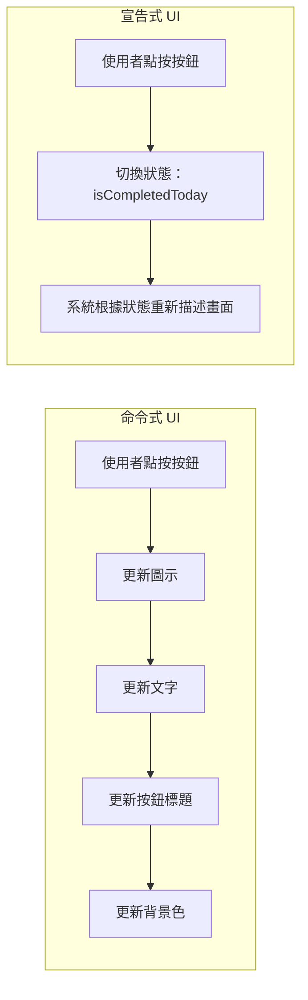
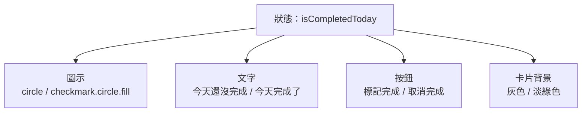
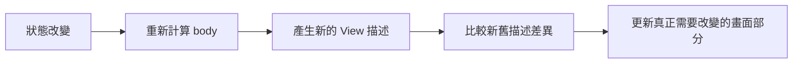

# 第 01 章圖解草稿

這份文件整理第 01 章可直接貼進書稿的 Mermaid 圖版，以及後續若要交給設計或排版時可以沿用的圖說與版型說明。

## 圖 1-1 命令式 UI 與宣告式 UI 的思考流程對照

### 正式 Mermaid 圖版



### 建議放置位置

- 放在「開場：當一個按鈕牽動整張畫面」之後。

### 這張圖要解決的問題

- 幫讀者快速看懂兩種 UI 思維最大的差異，不是在語法表面，而是在「先想步驟」還是「先想狀態與結果」。

### 視覺結構

- 左右雙欄對照。
- 左欄是命令式 UI，流程較長、節點較多。
- 右欄是宣告式 UI，流程較短，但狀態與結果的對應關係更強。

### 圖說建議

`命令式 UI 關注更新步驟；宣告式 UI 關注狀態改變後，畫面應呈現的結果。`

## 圖 1-2 狀態改變如何驅動畫面更新

### 正式 Mermaid 圖版



### 建議放置位置

- 放在「第一個範例：用狀態推導出畫面」之後。

### 這張圖要解決的問題

- 讓讀者看見，一個狀態的變化可以同時影響多個視覺元素，這些元素不是各自被命令更新，而是一起由狀態推導出來。

### 視覺結構

- 中央放一個狀態節點 `isCompletedToday`。
- 向外連到四個 UI 元素：圖示、說明文字、按鈕標題、卡片背景。
- 圖面上可用灰色表示 `false` 狀態，用綠色表示 `true` 狀態。

### 圖說建議

`在 SwiftUI 中，單一狀態可以同時決定多個畫面元素的呈現方式。`

## 圖 1-3 `body` 重算與實際畫面更新不是同一件事

### 正式 Mermaid 圖版



### 建議放置位置

- 放在「`body` 會重算，但這並不等於效能災難」之後。

### 這張圖要解決的問題

- 幫讀者拆開兩件常被混為一談的事：重新計算 View 描述，以及真正更新螢幕上的變動部分。

### 視覺結構

- 流程由左至右。
- 前半段強調「狀態改變」與「重新計算 `body`」。
- 後半段強調「比較差異」與「只更新需要更新的部分」。

### 圖說建議

`body 的重算屬於描述層的更新；真正的畫面刷新只會發生在有差異的部分。`

## 章內提示框建議格式

如果後續章節也要沿用同樣節奏，建議統一使用這三種提示框：

```md
> **觀念提醒**
> 用一句到兩句話提醒讀者真正要帶走的核心觀念。
```

```md
> **常見陷阱**
> 指出初學者最容易誤解或最常踩到的錯誤。
```

```md
> **延伸實戰**
> 補一個不需要太長、但能讓讀者自己動手延伸的小任務。
```

## 章首摘要版型草稿

### 建議放置位置

- 章名之後，正文之前。

### 版型方向

- 三塊卡片式資訊區。
- 第一塊：`這章你會學到什麼`
- 第二塊：`你會完成哪一段功能`
- 第三塊：`需要的前置知識`

### 視覺建議

- 使用淡米白底搭配青綠色標題線。
- 每塊資訊區不超過四行，避免章首變得過重。
- 可在章首頁右上角加一個小型專案進度標記，例如：`主線專案進度 1/14`。

## 插圖風格建議

- 線條不要太科技感，偏清楚、克制、教材型即可。
- 色彩只保留一個主強調色，建議使用青綠或藍綠，避免整章太花。
- 圖解重點應放在關係與流程，不需要模擬真實 iPhone 畫面到非常細。
