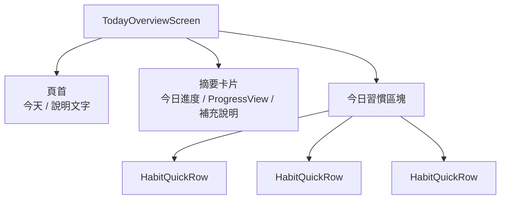
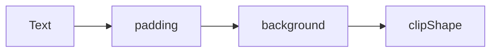
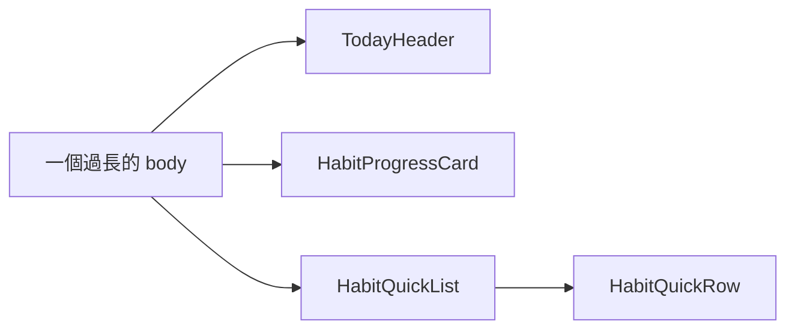

# 第 02 章圖解草稿

這份文件整理第 02 章可直接貼進書稿的 Mermaid 圖版，以及後續若要交給設計或排版時可沿用的圖說與用途說明。

## 圖 2-1 先用 Stack 建立閱讀路徑，再補上卡片表面

### 正式 Mermaid 圖版



### 建議放置位置

- 放在「第一個範例：先用 Stack 搭出首頁骨架」之後。

### 這張圖要解決的問題

- 幫讀者理解首頁不是先做漂亮表面，而是先把頁首、摘要與列表的閱讀順序搭出來。

### 圖說建議

`版面建立的第一步通常不是美化，而是先替使用者決定一條自然的閱讀路徑。`

## 圖 2-2 modifier 是一層包一層，順序不同，包住的範圍就不同

### 正式 Mermaid 圖版



### 建議放置位置

- 放在「modifier 的順序不是裝飾，而是結果的一部分」之後。

### 這張圖要解決的問題

- 幫讀者建立 modifier 像一層一層往外包的直覺，理解順序不同就會改變可見結果。

### 圖說建議

`在 SwiftUI 裡，modifier 很像一層一層往外包的結構。順序改變時，畫面被包住的範圍也會跟著改變。`

## 圖 2-3 拆分子視圖不是把程式分散，而是替畫面群組建立名字與邊界

### 正式 Mermaid 圖版



### 建議放置位置

- 放在「第二個範例：把過長的 `body` 拆成有語意的畫面區塊」之後。

### 這張圖要解決的問題

- 幫讀者看懂拆分子視圖的核心不是行數，而是替原本混在一起的群組建立可讀邊界。

### 圖說建議

`當畫面群組開始有清楚名字時，你才不只是把程式拆開，而是開始建立自己的版面語言。`

## 章內提示框建議格式

後續章節若要維持一致節奏，可沿用這三種提示框：

```md
> **觀念提醒**
> 用一句到兩句話提醒讀者，這裡真正要建立的是閱讀路徑、群組能力或版面節奏直覺。
```

```md
> **常見陷阱**
> 指出用 `Spacer` 補結構、過早美化，或把整頁塞進同一個 `body` 的常見問題。
```

```md
> **延伸實戰**
> 補一個能讓讀者回頭調整區塊順序、間距或子視圖拆分的小任務。
```
