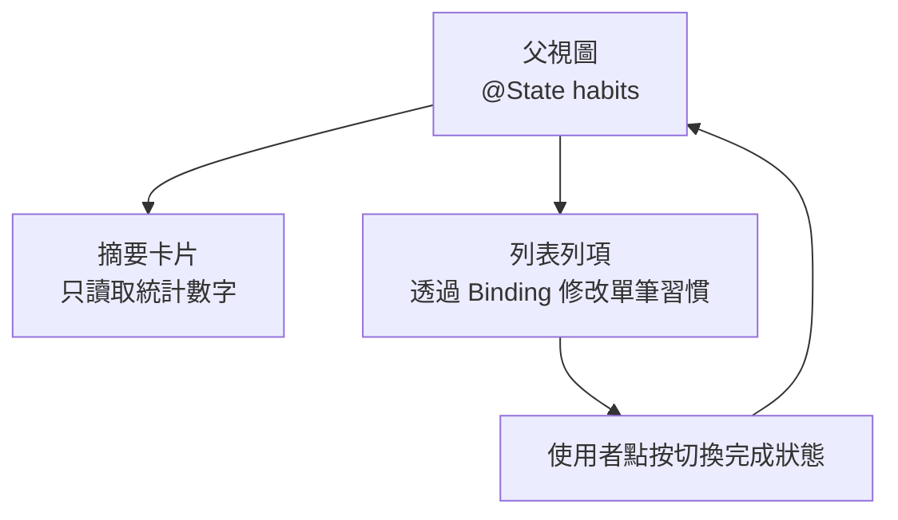
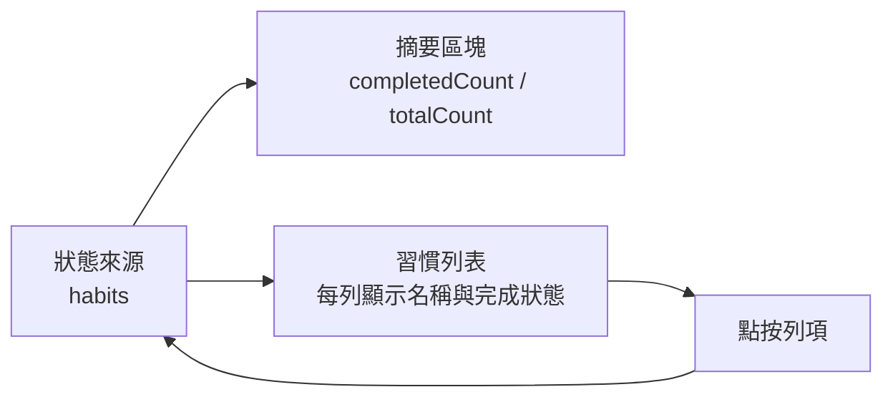

# 第 03 章圖解草稿

這份文件整理第 03 章可直接貼進書稿的 Mermaid 圖版，以及後續若要交給設計或排版時可沿用的圖說與用途說明。

## 圖 3-1 父視圖持有狀態，子視圖依責任接收資料

### 正式 Mermaid 圖版



### 建議放置位置

- 放在「開場：為什麼一個勾選會牽動兩個地方」之後。

### 這張圖要解決的問題

- 幫讀者先看懂誰是資料擁有者，誰只是讀取資料，誰負責修改資料。

### 圖說建議

`當父視圖持有真正的狀態時，摘要與列表不需要彼此通知，而是一起依附在同一份資料上。`

## 圖 3-2 單一狀態如何同時驅動多個畫面區塊

### 正式 Mermaid 圖版



### 建議放置位置

- 放在「第一個範例：讓清單與統計一起更新」之後。

### 這張圖要解決的問題

- 讓讀者理解摘要與列表是共同讀取同一份資料，而不是在兩個區塊之間手動同步。

### 圖說建議

`清楚的資料流會讓多個畫面區塊自然同步；你不需要替每個區塊分別維護一份資料副本。`

## 圖 3-3 狀態放錯位置時，畫面容易產生兩份真相

### 正式 Mermaid 圖版

```mermaid
flowchart TD
    A["父視圖<br/>habits"]
    B["子視圖<br/>@State isCompletedToday"]
    A --> C["摘要區塊顯示父層統計"]
    B --> D["列項圖示顯示子層狀態"]
    C -.不同步. D
```

### 建議放置位置

- 放在「狀態放錯地方，畫面就會開始互相背叛」之後。

### 這張圖要解決的問題

- 幫讀者具象化「兩份真相」的後果，也就是父層與子層各存一份相似狀態後，畫面開始不同步。

### 圖說建議

`同一個意思的資料若同時存在父層與子層，畫面就很容易出現彼此背離的結果。`

## 章內提示框建議格式

後續章節若要維持一致節奏，可沿用這三種提示框：

```md
> **觀念提醒**
> 用一句到兩句話提醒讀者真正要帶走的核心判斷。
```

```md
> **常見陷阱**
> 指出初學者最常出現的誤放狀態、重複保存或資料不同步問題。
```

```md
> **延伸實戰**
> 補一個不需要很長、但能讓讀者動手驗證資料流理解的小任務。
```
