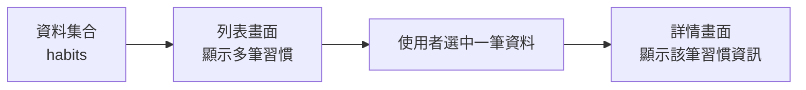
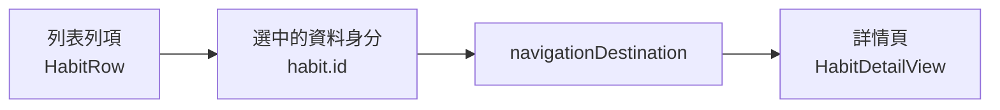
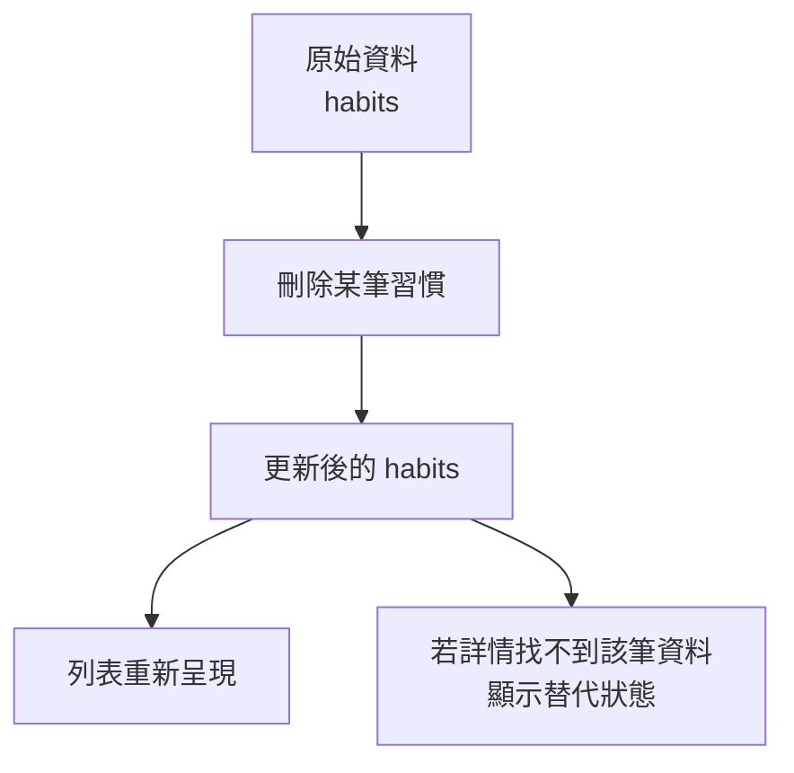

# 第 04 章圖解草稿

這份文件整理第 04 章可直接貼進書稿的 Mermaid 圖版，以及後續若要交給設計或排版時可沿用的圖說與用途說明。

## 圖 4-1 列表、選擇與詳情其實是一條資訊流

### 正式 Mermaid 圖版



### 建議放置位置

- 放在「開場：為什麼列表點進去，不能只想成『跳頁』」之後。

### 這張圖要解決的問題

- 幫讀者把「列表 -> 點選 -> 詳情」看成一條連續的資訊流，而不是零散的畫面切換。

### 圖說建議

`導航之所以成立，不是因為畫面彼此相連，而是因為使用者沿著某筆資料往更深一層閱讀。`

## 圖 4-2 導航攜帶的不是畫面指令，而是資料身分

### 正式 Mermaid 圖版



### 建議放置位置

- 放在「第一個範例：從習慣列表進入習慣詳情」之後。

### 這張圖要解決的問題

- 強調導航真正往下傳遞的是資料身分，而不是某個列項的畫面表象。

### 圖說建議

`當導航綁定的是穩定的資料身分時，列表更新、重排與刪除都比較容易維持正確對應。`

## 圖 4-3 資料刪除後，列表與導覽會一起回到正確狀態

### 正式 Mermaid 圖版



### 建議放置位置

- 放在「刪除列表項目時，UI 為什麼會自然更新」之後。

### 這張圖要解決的問題

- 幫讀者理解刪除不是單純少一列，而是資料來源改變後，相關畫面與導航都必須一起回到正確狀態。

### 圖說建議

`列表刪除成功的本質，不是列項消失得漂亮，而是整條資料路徑都回到一致狀態。`

## 章內提示框建議格式

後續章節若要維持一致節奏，可沿用這三種提示框：

```md
> **觀念提醒**
> 用一句到兩句話提醒讀者該如何做關鍵判斷。
```

```md
> **常見陷阱**
> 指出列表、導航與資料識別最常見的誤解或踩坑。
```

```md
> **延伸實戰**
> 補一個能讓讀者動手驗證導航與資料流理解的小任務。
```
