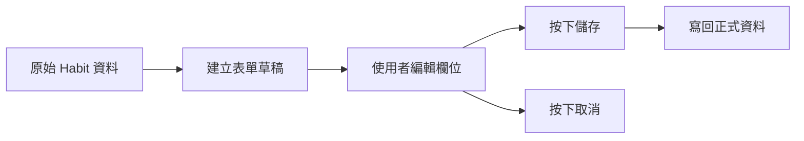
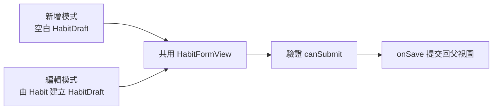
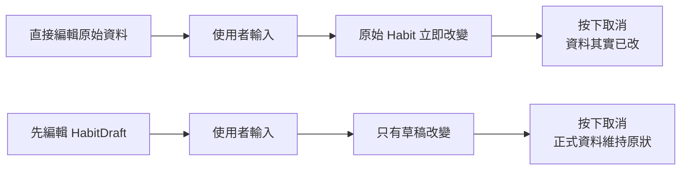

# 第 05 章圖解草稿

這份文件整理第 05 章可直接貼進書稿的 Mermaid 圖版，以及後續若要交給設計或排版時可沿用的圖說與用途說明。

## 圖 5-1 表單其實在處理兩層資料：草稿與正式資料

### 正式 Mermaid 圖版



### 建議放置位置

- 放在「開場：為什麼『取消』其實很考驗資料設計」之後。

### 這張圖要解決的問題

- 讓讀者先理解表單流程通常會多出一層草稿，而不是直接碰正式資料。

### 圖說建議

`當表單多了一層草稿，取消與儲存才會成為兩個真正不同的動作。`

## 圖 5-2 新增與編輯共用同一份表單，只是起點不同

### 正式 Mermaid 圖版



### 建議放置位置

- 放在「第一個範例：用一份草稿同時支援新增與編輯」之後。

### 這張圖要解決的問題

- 幫讀者理解新增與編輯很多時候共用的是同一份表單邏輯，只是初始值和提交目的地不同。

### 圖說建議

`新增與編輯未必要拆成兩套表單；真正不同的，往往只是表單一開始拿到什麼資料。`

## 圖 5-3 直接編輯原始資料與先編輯草稿，取消結果完全不同

### 正式 Mermaid 圖版



### 建議放置位置

- 放在「先把提交流程做好，再慢慢擴充即時反饋」之前或之後都可以。

### 這張圖要解決的問題

- 把「取消是否真的取消」這件事具象化，讓讀者更容易理解草稿模式的價值。

### 圖說建議

`表單設計的關鍵，不只是能不能存，而是取消時資料到底有沒有被偷改。`

## 章內提示框建議格式

後續章節若要維持一致節奏，可沿用這三種提示框：

```md
> **觀念提醒**
> 用一句到兩句話提醒讀者該如何判斷表單中的資料層次。
```

```md
> **常見陷阱**
> 指出直接改原始資料、驗證散落或共用表單失控的常見問題。
```

```md
> **延伸實戰**
> 補一個能讓讀者動手驗證表單流程與提交邏輯的小任務。
```
