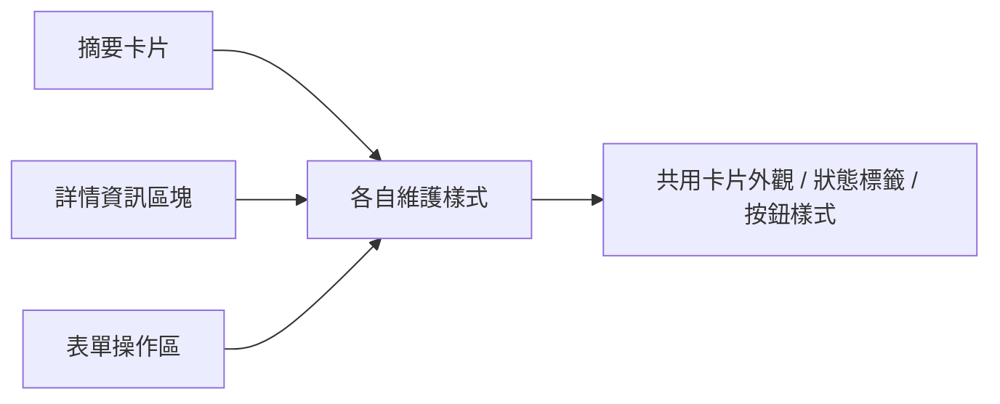
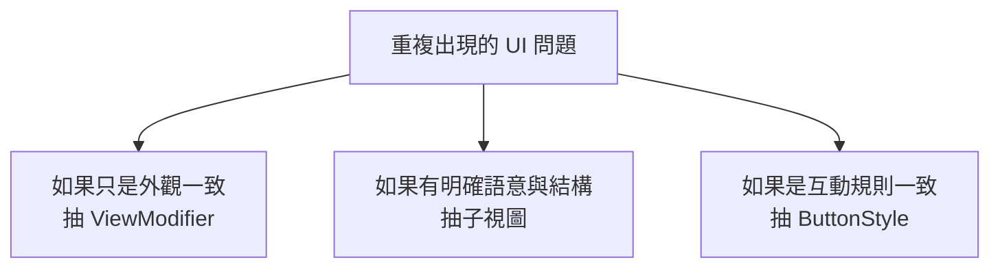
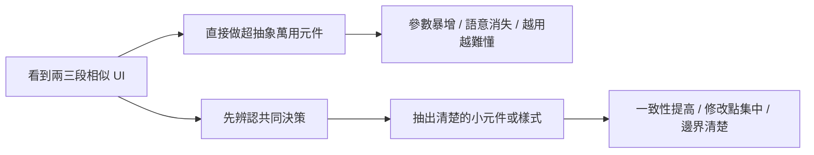

# 第 06 章圖解草稿

這份文件整理第 06 章可直接貼進書稿的 Mermaid 圖版，以及後續若要交給設計或排版時可沿用的圖說與用途說明。

## 圖 6-1 從零散重複走向一致元件，不是為了少打字，而是為了一起改

### 正式 Mermaid 圖版



### 建議放置位置

- 放在「開場：真正讓專案變亂的，通常不是重複，而是不一致」之後。

### 這張圖要解決的問題

- 讓讀者理解元件化的主要價值，在於讓多個地方共享同一個設計決策，而不是單純少寫幾行程式。

### 圖說建議

`元件化的核心收益，不只是減少重複，而是讓未來的樣式與結構修改可以集中發生。`

## 圖 6-2 抽結構、抽樣式、抽互動，其實是三種不同決策

### 正式 Mermaid 圖版



### 建議放置位置

- 放在「第一個範例：把卡片外觀、狀態標籤與主要按鈕整理出來」之後。

### 這張圖要解決的問題

- 幫讀者分辨元件化的不同層級，避免把所有可重用內容都用同一種方法抽象。

### 圖說建議

`樣式、結構與互動規則雖然都能重用，但它們通常不該被用同一種方式整理。`

## 圖 6-3 抽太早容易變成萬用黑盒；抽得準才會變成清楚系統

### 正式 Mermaid 圖版



### 建議放置位置

- 放在「先整理穩定重複，再整理例外情境」之後。

### 這張圖要解決的問題

- 把兩種元件化路線對照出來，讓讀者看到過度抽象化與清楚抽象化之間的差別。

### 圖說建議

`好的元件化不是把所有相似畫面塞進同一個黑盒，而是讓共同決策被清楚命名。`

## 章內提示框建議格式

後續章節若要維持一致節奏，可沿用這三種提示框：

```md
> **觀念提醒**
> 用一句到兩句話提醒讀者如何判斷某段 UI 是否值得被抽象。
```

```md
> **常見陷阱**
> 指出過早抽象、過度萬用或責任混雜的常見問題。
```

```md
> **延伸實戰**
> 補一個能讓讀者動手驗證元件化判斷的小任務。
```
