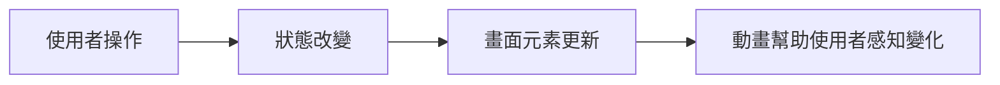
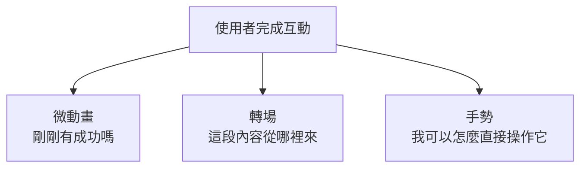
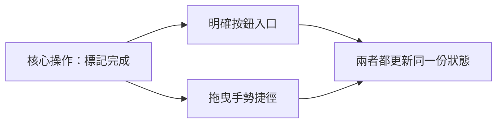

# 第 07 章圖解草稿

這份文件整理第 07 章可直接貼進書稿的 Mermaid 圖版，以及後續若要交給設計或排版時可沿用的圖說與用途說明。

## 圖 7-1 狀態改變先發生，動畫只是把它說清楚

### 正式 Mermaid 圖版



### 建議放置位置

- 放在「開場：打卡完成這件事，值得被看見」之後。

### 這張圖要解決的問題

- 幫讀者建立動畫與狀態之間的先後關係，避免把動畫誤解成獨立存在的裝飾層。

### 圖說建議

`在 SwiftUI 中，動畫通常不是憑空出現的特效，而是狀態改變後，幫助使用者理解變化的一種可視化手段。`

## 圖 7-2 微動畫、轉場與手勢，其實分別在回答不同問題

### 正式 Mermaid 圖版



### 建議放置位置

- 放在「第一個範例：完成切換、卡片展開與拖曳手勢」之後。

### 這張圖要解決的問題

- 幫讀者分辨三種動態回饋的責任，不把所有會動的東西都視為同一類技巧。

### 圖說建議

`動態回饋不是單一工具箱；微動畫、轉場與手勢各自補強的是不同層次的理解。`

## 圖 7-3 手勢不應該直接取代按鈕，而應該成為更流暢的捷徑

### 正式 Mermaid 圖版



### 建議放置位置

- 放在「一致的元件基礎，會讓動態回饋更自然」之前或之後皆可。

### 這張圖要解決的問題

- 讓讀者理解手勢的角色通常是補強核心操作，而不是讓操作被藏進只有熟手才知道的入口。

### 圖說建議

`好的手勢通常讓熟悉產品的人更快，而不是讓第一次使用的人更困惑。`

## 章內提示框建議格式

後續章節若要維持一致節奏，可沿用這三種提示框：

```md
> **觀念提醒**
> 用一句到兩句話提醒讀者動態回饋該服務哪種理解需求。
```

```md
> **常見陷阱**
> 指出動畫過量、轉場不交代來源或手勢搶走核心操作的常見問題。
```

```md
> **延伸實戰**
> 補一個能讓讀者動手驗證動態節奏與手勢門檻的小任務。
```
