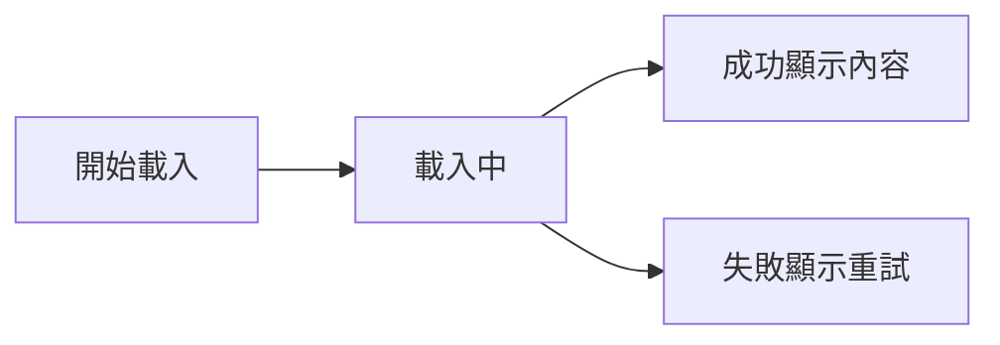
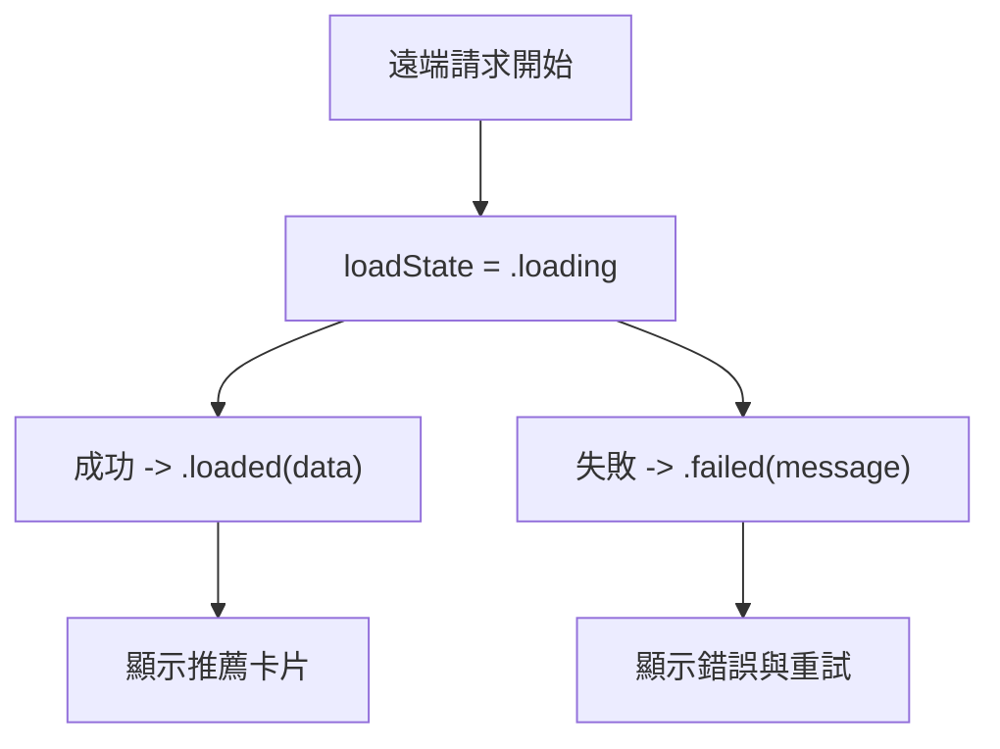
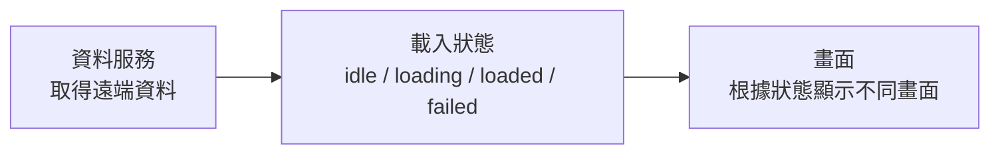

# 第 08 章圖解草稿

這份文件整理第 08 章可直接貼進書稿的 Mermaid 圖版，以及後續若要交給設計或排版時可沿用的圖說與用途說明。

## 圖 8-1 非同步載入最少會把畫面推進三種狀態

### 正式 Mermaid 圖版



### 建議放置位置

- 放在「開場：一塊遠端內容，就足以改變首頁的節奏」之後。

### 這張圖要解決的問題

- 幫讀者先建立最基本的非同步 UI 流程感：畫面至少要面對載入中、成功、失敗三種狀態。

### 圖說建議

`對畫面層來說，遠端載入不是一條只有成功終點的路線，而是一段可能進入不同狀態的流程。`

## 圖 8-2 畫面真正管理的，不是請求本身，而是請求結果對應的 UI 狀態

### 正式 Mermaid 圖版



### 建議放置位置

- 放在「第一個範例：推薦習慣範本的載入流程」之後。

### 這張圖要解決的問題

- 幫讀者把非同步流程重新翻譯成畫面狀態，而不是停留在「有打一個 API」這種技術描述。

### 圖說建議

`畫面真正需要理解的，不是請求用了哪個函式，而是請求結果會把 UI 推向哪一種狀態。`

## 圖 8-3 資料服務、載入狀態與畫面顯示，三者最好分層

### 正式 Mermaid 圖版



### 建議放置位置

- 放在「等待中的畫面，也是一種產品體驗」之前或之後都可以。

### 這張圖要解決的問題

- 幫讀者理解資料取得、狀態切換與畫面顯示最好各有自己的位置，避免全部混進單一畫面。

### 圖說建議

`當資料服務、狀態與畫面責任分層後，非同步邏輯通常會比把所有事情塞進同一個畫面更穩。`

## 章內提示框建議格式

後續章節若要維持一致節奏，可沿用這三種提示框：

```md
> **觀念提醒**
> 用一句到兩句話提醒讀者非同步流程真正服務的是哪一種畫面理解。
```

```md
> **常見陷阱**
> 指出重複請求、只處理成功或把請求塞進 `body` 的常見問題。
```

```md
> **延伸實戰**
> 補一個能讓讀者動手驗證載入節奏與狀態切換的小任務。
```
