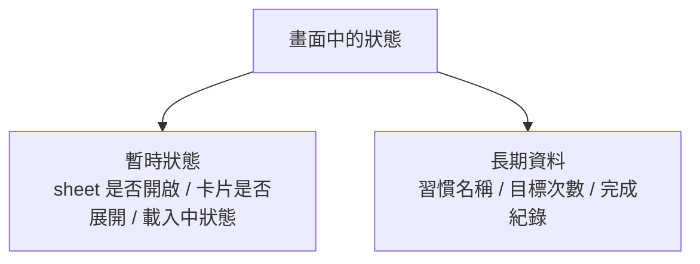
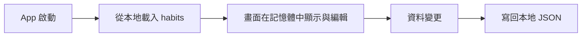
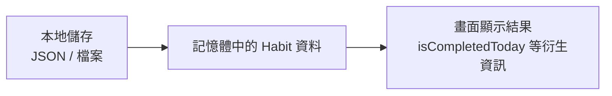

# 第 09 章圖解草稿

這份文件整理第 09 章可直接貼進書稿的 Mermaid 圖版，以及後續若要交給設計或排版時可沿用的圖說與用途說明。

## 圖 9-1 暫時畫面狀態與長期資料不要混成一團

### 正式 Mermaid 圖版



### 建議放置位置

- 放在「開場：App 關掉之後，哪些東西應該留下來」之後。

### 這張圖要解決的問題

- 幫讀者先建立一條很重要的判斷線：哪些值只屬於當下畫面，哪些值才真的值得被持久化。

### 圖說建議

`持久化不只是把狀態存起來，而是先判斷哪些資料真正代表產品長期想記住的內容。`

## 圖 9-2 啟動載入、記憶體編輯、寫回本地，是一條完整循環

### 正式 Mermaid 圖版



### 建議放置位置

- 放在「第一個範例：把習慣資料寫進本地 JSON 檔」之後。

### 這張圖要解決的問題

- 幫讀者理解本地持久化不是單次存檔，而是一條從載入、編輯到再次寫回的循環。

### 圖說建議

`本地資料的處理流程，通常不是『存一次就結束』，而是讀進來、修改、再寫回去的完整閉環。`

## 圖 9-3 儲存層、記憶體狀態與畫面顯示，最好各有自己的位置

### 正式 Mermaid 圖版



### 建議放置位置

- 放在「長期資料與畫面模型，最好不要完全混成同一件事」之後。

### 這張圖要解決的問題

- 幫讀者理解保存格式、記憶體資料與畫面顯示不一定是同一層責任。

### 圖說建議

`保存資料、記憶體中的工作資料，以及畫面真正拿來顯示的結果，往往是同一條線上的不同層次。`

## 章內提示框建議格式

後續章節若要維持一致節奏，可沿用這三種提示框：

```md
> **觀念提醒**
> 用一句到兩句話提醒讀者哪些資料應該被長期保存，哪些只屬於暫時畫面狀態。
```

```md
> **常見陷阱**
> 指出把 UI 狀態一起存下來、把畫面綁死儲存細節或太早綁定工具的常見問題。
```

```md
> **延伸實戰**
> 補一個能讓讀者動手驗證保存資料模型與畫面模型差異的小任務。
```
