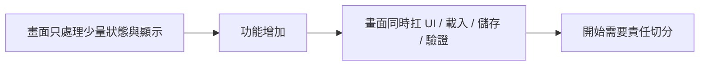
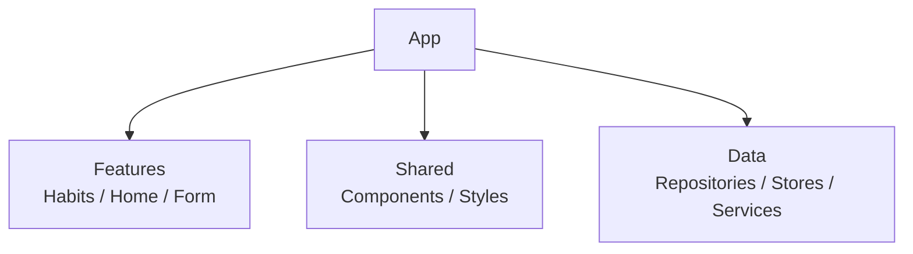
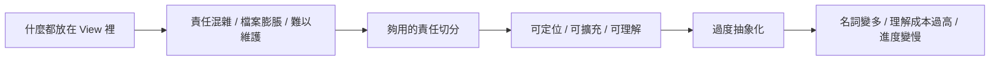

# 第 10 章圖解草稿

這份文件整理第 10 章可直接貼進書稿的 Mermaid 圖版，以及後續若要交給設計或排版時可沿用的圖說與用途說明。

## 圖 10-1 架構需求通常來自責任開始打結，而不是來自名詞焦慮

### 正式 Mermaid 圖版



### 建議放置位置

- 放在「開場：什麼時候真的該談架構」之後。

### 這張圖要解決的問題

- 幫讀者理解架構通常不是先驗信仰，而是當責任已經打結時，才開始真正有必要被整理。

### 圖說建議

`架構需求往往不是因為你先學會了某個名詞，而是因為專案中的責任線真的開始互相糾纏。`

## 圖 10-2 一個夠用的 SwiftUI 專案，至少要把功能、共用與資料分開

### 正式 Mermaid 圖版



### 建議放置位置

- 放在「第一個範例：把 Habit 功能整理成 Feature、Shared、Data」之後。

### 這張圖要解決的問題

- 幫讀者建立對中型 SwiftUI 專案最實用的第一層結構感，而不是一開始就掉進過重分層。

### 圖說建議

`對許多 SwiftUI 專案來說，先把功能、共用與資料來源分開，就已經足以支撐相當多真實需求。`

## 圖 10-3 架構過輕會打結，過重也會讓專案提早背負成本

### 正式 Mermaid 圖版



### 建議放置位置

- 放在「架構設計也應該誠實說出『現在先不要做什麼』」之後。

### 這張圖要解決的問題

- 幫讀者看見架構不是越重越成熟，而是在太亂與太重之間找到目前專案真正需要的位置。

### 圖說建議

`好的架構不是一路往更重的方向走，而是停在剛好能支撐目前專案的重量。`

## 章內提示框建議格式

後續章節若要維持一致節奏，可沿用這三種提示框：

```md
> **觀念提醒**
> 用一句到兩句話提醒讀者該如何用責任切分來判斷架構。
```

```md
> **常見陷阱**
> 指出把所有東西都留在 View 裡，或過早抽象化的常見問題。
```

```md
> **延伸實戰**
> 補一個能讓讀者動手整理自己專案責任分層的小任務。
```
