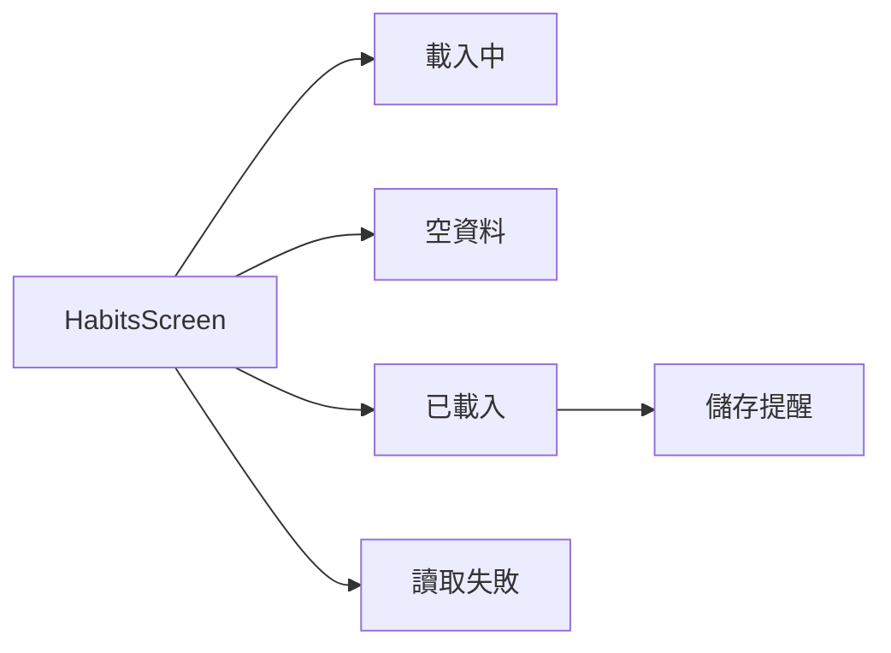
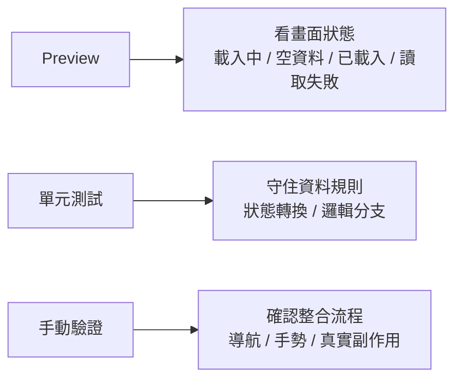
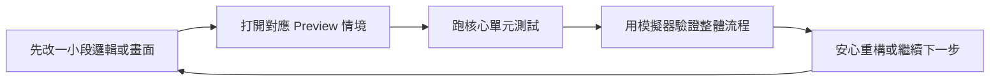

# 第 11 章圖解草稿

這份文件整理第 11 章可直接貼進書稿的 Mermaid 圖版，以及後續若要交給設計或排版時可沿用的圖說與用途說明。

## 圖 11-1 同一個畫面，應該能被排成多種真實狀態，而不是只展示最好看的那一張

### 正式 Mermaid 圖版



### 建議放置位置

- 放在「第一個範例：把 Preview 做成畫面狀態的驗證場」之後。

### 這張圖要解決的問題

- 幫讀者理解 Preview 的重點是把同一個畫面的多種真實狀態並排出來，而不是只留下最漂亮的完成圖。

### 圖說建議

`真正有價值的 Preview，不是展示單一完成畫面，而是讓同一個畫面的關鍵狀態都能被快速檢查。`

## 圖 11-2 Preview、單元測試與手動驗證，各自守住不同風險

### 正式 Mermaid 圖版



### 建議放置位置

- 放在「從這個測試看見什麼值得測」之後。

### 這張圖要解決的問題

- 幫讀者建立 Preview、單元測試與手動驗證的邊界感，理解這三者不是互相取代，而是在處理不同風險。

### 圖說建議

`當你把不同風險交給不同回饋工具處理，開發流程通常會比把所有期待壓在單一工具上更快也更準。`

## 圖 11-3 小步快跑的 SwiftUI 開發節奏，不是少檢查，而是把檢查放在對的地方

### 正式 Mermaid 圖版



### 建議放置位置

- 放在「建立一套適合 SwiftUI 的開發節奏」之後。

### 這張圖要解決的問題

- 幫讀者看見高效率開發不是把檢查省掉，而是把 Preview、測試與手動驗證排成一個合理順序。

### 圖說建議

`穩定的開發節奏，來自快速而分層的回饋，而不是每次都重跑最重的整體流程。`

## 章內提示框建議格式

後續章節若要維持一致節奏，可沿用這三種提示框：

```md
> **觀念提醒**
> 用一句到兩句話提醒讀者，這裡真正要建立的是哪一種開發判斷。
```

```md
> **常見陷阱**
> 指出只看漂亮畫面、過度自動化視覺細節，或混淆回饋工具邊界的常見問題。
```

```md
> **延伸實戰**
> 補一個能讓讀者替自己畫面加 Preview 或替核心流程加測試的小任務。
```
