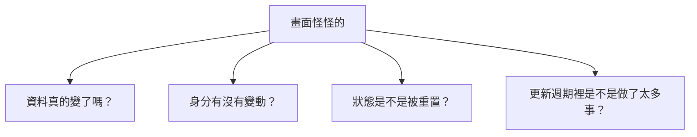
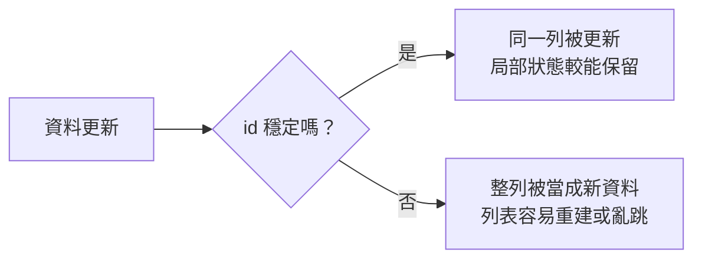
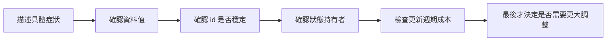

# 第 12 章圖解草稿

這份文件整理第 12 章可直接貼進書稿的 Mermaid 圖版，以及後續若要交給設計或排版時可沿用的圖說與用途說明。

## 圖 12-1 看起來都像卡頓，但真正的問題來源可能完全不同

### 正式 Mermaid 圖版



### 建議放置位置

- 放在「開場：不是每個卡頓都叫做效能問題」之後。

### 這張圖要解決的問題

- 幫讀者理解 SwiftUI 裡許多看似相同的畫面異常，背後其實可能來自不同層的問題來源。

### 圖說建議

`同樣是畫面不順，真正該查的方向可能是資料、身分、狀態，也可能才是更新成本本身。`

## 圖 12-2 穩定身分能保留同一列的連續性，不穩定身分則會讓系統把它當成全新列項

### 正式 Mermaid 圖版



### 建議放置位置

- 放在「第一個範例：列表更新時為什麼整排都像被重建」之後。

### 這張圖要解決的問題

- 幫讀者看懂列表更新異常的核心常常不是畫面本身，而是 SwiftUI 根本無法辨認哪一列和上一輪是同一個元素。

### 圖說建議

`只要身分不穩，系統就很難把這一輪畫面和上一輪正確對應起來，於是更新看起來就像整批重建。`

## 圖 12-3 更穩的除錯流程，不是先改最多，而是先縮小範圍

### 正式 Mermaid 圖版



### 建議放置位置

- 放在「建立一套比較穩的除錯順序」之後。

### 這張圖要解決的問題

- 幫讀者建立可重複使用的問題定位流程，避免問題還沒確定就直接進入大改。

### 圖說建議

`好的除錯不是從最大改動開始，而是先用一套穩定順序把可能性一層層排掉。`

## 章內提示框建議格式

後續章節若要維持一致節奏，可沿用這三種提示框：

```md
> **觀念提醒**
> 用一句到兩句話提醒讀者，這裡真正要建立的是哪一種定位問題的判斷。
```

```md
> **常見陷阱**
> 指出把所有異常都歸咎給 SwiftUI、在問題未定位前就大改，或把更新重算誤判成效能 bug 的常見問題。
```

```md
> **延伸實戰**
> 補一個能讓讀者回頭檢查列表 id、狀態位置或更新週期成本的小任務。
```
