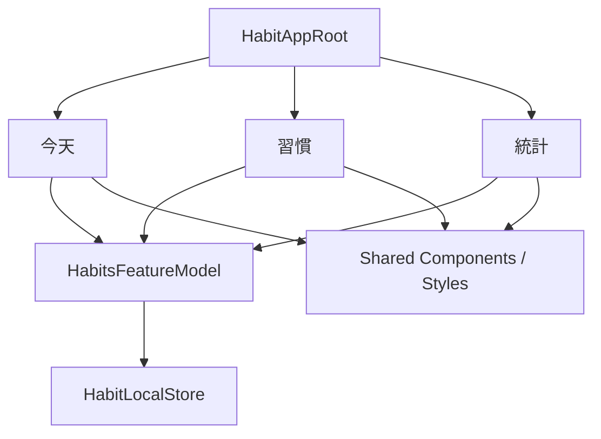
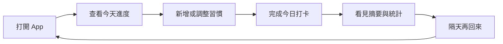
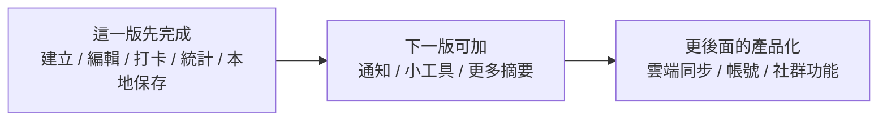

# 第 13 章圖解草稿

這份文件整理第 13 章可直接貼進書稿的 Mermaid 圖版，以及後續若要交給設計或排版時可沿用的圖說與用途說明。

## 圖 13-1 一個像樣的 App，不是畫面清單，而是同一份資料在多個入口之間流動

### 正式 Mermaid 圖版



### 建議放置位置

- 放在「第一個範例：用一個 App Root 把前面各章成果接起來」之後。

### 這張圖要解決的問題

- 幫讀者看見整合章真正重要的不是入口數量，而是主要入口是否能共享同一份核心資料與一致的共用決策。

### 圖說建議

`當今天頁、清單與統計都在看同一份核心資料時，專案才會開始真正像一個完整產品。`

## 圖 13-2 真正的產品主線，是一段可以被重複完成的使用循環

### 正式 Mermaid 圖版



### 建議放置位置

- 放在「真正的產品不是畫面加總，而是一條可以重複完成的主線」之後。

### 這張圖要解決的問題

- 幫讀者理解產品骨架通常不是畫面順序，而是使用者是否願意反覆完成一條有價值的核心循環。

### 圖說建議

`真正能站得住的 App，通常都有一條清楚而可重複的使用循環，而不只是很多彼此分離的畫面。`

## 圖 13-3 整合章要回答的不只是能不能做，而是這一版到底要守住什麼範圍

### 正式 Mermaid 圖版



### 建議放置位置

- 放在「整合章真正的成熟，不只在於做了什麼，也在於刻意不做什麼」之後。

### 這張圖要解決的問題

- 幫讀者建立版本邊界感，理解一個完整產品原型不需要一次容納所有未來功能。

### 圖說建議

`範圍清楚，往往比功能更多更能讓產品站穩。整合章的成熟，也包含知道這一版刻意不做什麼。`

## 章內提示框建議格式

後續章節若要維持一致節奏，可沿用這三種提示框：

```md
> **觀念提醒**
> 用一句到兩句話提醒讀者，這裡真正要建立的是產品主線或版本邊界判斷。
```

```md
> **常見陷阱**
> 指出把整合誤解成功能拼貼、什麼都想加，或忽略使用循環斷點的常見問題。
```

```md
> **延伸實戰**
> 補一個能讓讀者回頭檢查入口設計、使用旅程或版本取捨的小任務。
```
