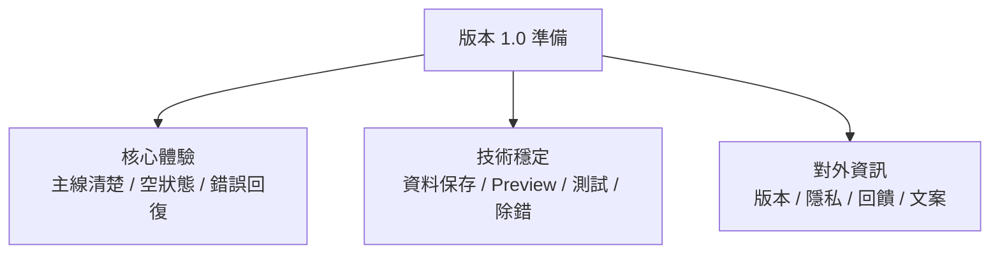
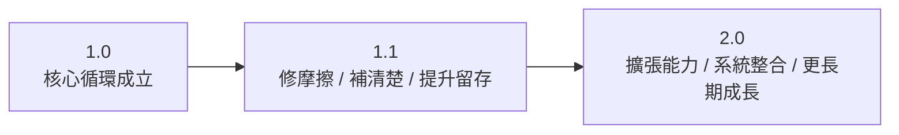

# 第 14 章圖解草稿

這份文件整理第 14 章可直接貼進書稿的 Mermaid 圖版，以及後續若要交給設計或排版時可沿用的圖說與用途說明。

## 圖 14-1 上架前整理，不是最後補丁，而是把產品、技術與信任一起補齊

### 正式 Mermaid 圖版



### 建議放置位置

- 放在「第一個範例：替 App 補上設定與支援入口」之後。

### 這張圖要解決的問題

- 幫讀者理解上架前整理不是最後幾個零碎待辦，而是產品體驗、技術穩定與信任感同時成立的一次總整理。

### 圖說建議

`真正準備進入 1.0 的 App，不是只有功能做完，而是核心體驗、技術穩定與對外資訊都已經開始站穩。`

## 圖 14-2 好的版本演進，不是一直往上堆，而是每一版都在回答不同層次的問題

### 正式 Mermaid 圖版



### 建議放置位置

- 放在「版本演進：1.0、1.1 與 2.0 的差別」之後。

### 這張圖要解決的問題

- 幫讀者建立版本感，理解不同版本不只是功能多少差異，而是在回答不同層次的產品問題。

### 圖說建議

`成熟的版本規劃，不是把所有功能一股腦往後堆，而是讓每一版都知道自己在解哪一層問題。`

## 圖 14-3 學完整本書後，下一步不是亂選題目，而是沿著一條穩定產品路徑往前走

### 正式 Mermaid 圖版


### 建議放置位置

- 放在「從這本書走向你自己的 App」之後。

### 這張圖要解決的問題

- 幫讀者把學習成果轉成可執行路徑，避免讀完整本書後只剩一堆零碎技能，卻不知道如何開始自己的題目。

### 圖說建議

`學會 SwiftUI 的真正落點，不是記住更多名詞，而是能沿著一條穩定路徑，把自己的產品第一版做出來。`

## 章內提示框建議格式

後續章節若要維持一致節奏，可沿用這三種提示框：

```md
> **觀念提醒**
> 用一句到兩句話提醒讀者，這裡真正要建立的是產品心態、版本邊界或成長路線判斷。
```

```md
> **常見陷阱**
> 指出把上架誤認成結束、把 1.0 做成萬能版本，或學完之後不知道如何落到自己題目的常見問題。
```

```md
> **延伸實戰**
> 補一個能讓讀者替自己 App 寫版本清單、產品承諾或下一步路線的小任務。
```
